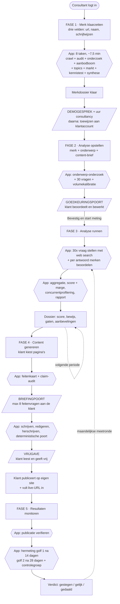
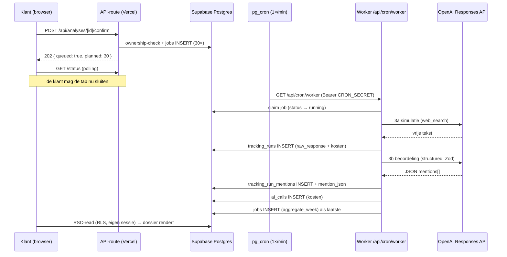

# GEO Tracker, App Flow Documentatie

> **Doel van dit document.** Eén gedeeld beeld van hoe de applicatie vandaag werkt, voor drie
> lezersgroepen tegelijk: hoofdstuk 1 voor sales en management, hoofdstuk 2 voor developers,
> hoofdstuk 3 voor de AI-specialist. Bedoeld als werkdocument voor de teammeeting waarin we het
> huidige proces evalueren en verbeterpunten verzamelen.
>
> **Bron.** Geverifieerd tegen de code op branch `main`, peildatum **8 augustus 2026**
> (t/m migratie `0045`). Waar dit document afwijkt van de code, is de code leidend.
> Achtergrond en historie: `docs/architecture.md`, `docs/logbook.md`, `CLAUDE.md`.
>
> ⚠️ **Fase 1 is op 3–4 augustus 2026 volledig vervangen.** Het product ging van self-serve naar
> sales-led: de onboarding vraagt nog drie velden in plaats van elf, en er draait een
> onderzoekspijplijn van acht taken achter. Wie dit document kent van vóór die datum leest
> hoofdstuk 1.2 en 2.3 opnieuw. Het waarom staat in `docs/logbook.md` §15.

---

# 1. Executive Overview & Customer Journey

*(voor Sales & Management)*

## 1.1 Wat het product doet

Een MKB-ondernemer wil weten of ChatGPT hem noemt wanneer een potentiële klant vraagt
*"welke fysiotherapeut in Tilburg is goed bij rugklachten?"*. GEO Tracker meet dat, laat zien wie
er wél genoemd wordt en waarom, schrijft de pagina's die dat gat moeten dichten, en meet weken
later of het gewerkt heeft.

Het onderscheidende punt is niet het meten maar de **gesloten lus**: meten → verklaren → maken →
publiceren → hermeten met controlegroep. De app doet geen uitspraak over effect zonder die laatste
stap.

## 1.2 De vijf fases

| # | Fase | Wat de klant doet | Wat de app doet | Wat het oplevert |
|---|---|---|---|---|
| **1** | **Merk klaarzetten** | Vult **drie velden** in: webadres, bedrijfsnaam, andere schrijfwijzen. In het sales-led model doet de consultant dit vóór het demogesprek. | Draait acht taken in ~7,5 minuut (~$0,25): tot 150 pagina's crawlen en harde feiten oogsten, technische audit mét entiteitsconsistentie, merkonderzoek, aanbodboom, 5–8 core topics, marktonderzoek, LLM-kennistest, synthese | Een merkdossier met aanbodboom, kennistest en gespreksagenda, **hergebruikt door alle latere analyses**. Eenmalig werk, blijvend profijt. |
| **2** | **Analyse opstellen** | Kiest een merk + vult een onderwerp in ("wasmachines", "herenkapsel"), optioneel een content-brief | Onderzoekt wat de site over dít onderwerp zegt, wie de concurrenten hier zijn, en genereert 30 realistische koopvragen (10 per funnelfase) + een volume-inschatting | Een concreet, leesbaar meetplan. **Geen black box:** de klant ziet en bewerkt élke vraag vóór er één euro aan meetkosten gemaakt wordt. |
| **3** | **Analyse runnen** | Klikt één keer op *"Bevestig en start meting"* | Stelt alle 30 vragen aan een AI-assistent mét live web search, beoordeelt elk antwoord per merk, aggregeert tot een score met foutmarge, profileert de concurrenten en schrijft een jargonvrij rapport | Het cijfer met betrouwbaarheidsband, de trendlijn, wie er wint en **waarop**, plus concrete gemiste vragen. |
| **4** | **Content genereren** | Kiest welke aanbevolen pagina's geschreven worden, beantwoordt max. 8 korte feitenvragen, geeft de tekst vrij en publiceert hem | Bouwt een feitenkaart, controleert welke beweringen de pagina nodig heeft en niet onderbouwd kunnen worden, schrijft de pagina op het duurste model, laat hem redigeren, herschrijft en keurt hem deterministisch | Publicatieklare pagina's (Markdown, meta-tags, FAQ, JSON-LD) waarin **elke bewering over het bedrijf herleidbaar is tot een bevestigd feit**. |
| **5** | **Resultaten monitoren** | Vult de live-URL in en kijkt terug | Verifieert dat de pagina echt staat, hermeet na 14 en 28 dagen precies de doelvragen **plus een controlegroep**, en velt een statistisch verdict. Maandelijks draait de hele meting opnieuw | Een verdedigbare uitspraak: *"op de vragen waarvoor je publiceerde +18, op de rest +3"*. Geen losse "je score steeg". |

## 1.3 Waarde per fase, in verkooptaal

- **Fase 1**, *"Eén keer je merk vastleggen, altijd profijt."* Het profiel is accountbreed;
  analyse nummer drie voor dezelfde klant is aanzienlijk goedkoper en sneller dan nummer één.
- **Fase 2**, *"Je ziet precies wat we gaan meten, vóórdat we meten."* De goedkeuringspoort is
  een verkoopargument: geen black box, geen kosten zonder akkoord.
- **Fase 3**, *"Een cijfer met een eerlijke marge."* De app toont de onzekerheid en telt vragen
  waarbij de AI géén enkele aanbieder noemt apart (niet als verlies). Dat maakt het cijfer
  verdedigbaar in plaats van indrukwekkend.
- **Fase 4**, *"Content die niets verzint."* De feitenkaart is een gesloten lijst: staat een feit
  er niet op, dan komt het niet in de tekst. Dat is de belangrijkste bron van vertrouwen bij een
  ondernemer die zijn naam onder de pagina zet.
- **Fase 5**, *"We tonen of het gewerkt heeft, ook als het niet zo is."* De controlegroep maakt
  het verschil tussen marketing en meten.

## 1.4 Procesflow, klantreis



**Twee bewuste stops.** De pijplijn draait volledig op de server en stopt maar op twee plekken op
de klant: de **goedkeuringspoort** (fase 2 → 3) en de **briefingpoort** (fase 4). Alles daarbuiten
loopt door als de klant zijn browser sluit.

## 1.5 Wat dit kost per klant

| Post | Orde van grootte | Opmerking |
|---|---|---|
| Profielonderzoek | eenmalig, enkele centen | Hergebruikt door alle analyses van dat merk |
| Meetronde (30 vragen) | **~$0,40** geschat op GPT-5.6-tarieven | ~95% zit in de meting zelf, waarvan het leeuwendeel in `web_search`. Nog niet nagerekend tegen `ai_calls` op productie. |
| Meetronde mét herhalingen | ~$0,40 + 8 zwaarste vragen × 3 | Verhoogt de betrouwbaarheid waar het gewicht zit |
| Contentpagina | enkele dubbeltjes | Enige post op het duurste model (`gpt-5.6-sol`); ~5× duurder dan op de vorige modelgeneratie |

De kostenknop is `WEB_SEARCH_ENABLED` / `MEASURE_WEB_SEARCH`. Uit = centen in plaats van dollars,
maar de meting is dan niet representatief.

---

# 2. Technische Architectuur & Segmentatie

*(voor Software Developers)*

## 2.1 Techstack

| Laag | Keuze |
|---|---|
| Runtime | Node.js ≥ 20, Next.js 15 (App Router, RSC-first), React 19, TypeScript |
| Styling | Tailwind v4 (`@theme inline`), tokens in `app/globals.css` |
| Data & auth | Supabase, Postgres, Auth, RLS, `pg_cron` |
| Hosting | Vercel (deploy op push naar `main`) |
| LLM | OpenAI **Responses API**, GPT-5.6-familie, drie tiers vast in code |
| Validatie | Zod, alle modeloutput via `lib/schemas/` |
| Mail | Resend, standaard uit (`EMAILS_ENABLED`) |

## 2.2 Systeemoverzicht, welke map doet wat

```
app/(app)/           Ingelogde UI
  profielen/         Merkbeheer: onboarding (3 velden), dossier, aanbodboom, kennistest,
                     topics, gespreksnotities, entiteiten, feitenvragen, beheer
  analyses/[id]/     HET DOSSIER: 4 hoofdstukken op één streamende pagina
    _chapters/       01 stand · 02 bewijs · 03 werk · 04 resultaat
    _editors/        Conceptscherm: onderzoek, prompts, content-brief, bevestigen
    _work/           Actieknoppen: genereren, alles genereren, off-site
    bibliotheek/     De geschreven pagina's + vrijgave/publicatie
    briefing/        De feitenvragen vóór het schrijven
    concept/         De goedkeuringspoort
app/(auth)/          Login/registratie via server actions
app/api/             Alle schrijfacties + poll-endpoints + 3 cron-routes
components/          Gedeelde UI-primitieven (kaarten, chips, rail, skeletons)

lib/pipeline/        Elke pijplijnstap als eigen module (44 bestanden)
lib/jobs/            De achtergrondwachtrij: types, queue, worker, handlers
lib/openai/          Client, structured output, modellen, sampling, pricing, ledger
lib/schemas/         Zod-contracten: één bestand per AI-output
lib/entities/        Merknaam-normalisatie en -matching (dedupe)
lib/audit/           robots.txt / AI-crawlertoegang
lib/offsite/         Off-site aanwezigheid (bronnenlandschap, Wikidata/Wikipedia)
lib/stats/           Onzekerheidsmarges
supabase/migrations/ 0001–0044 (0033 gereserveerd, nooit gedraaid, vervangen door 0039)
scripts/             test-unit (416) · test-chain (25) · test-openai · eval-mention
```

### Twee architectuurregels die alles verklaren

1. **Zwaar werk loopt nooit in een request.** Een API-route zet alleen een taak in de wachtrij
   (`enqueue`) en antwoordt direct. De werker (`/api/cron/worker`, elke minuut aangeroepen door
   Supabase `pg_cron`) voert hem uit. Reden: serverless-tijdslimieten, en het werk moet doorlopen
   als de klant zijn tab sluit.
2. **Schrijven loopt nooit rechtstreeks vanaf de client.** Lezen gaat direct via de Supabase-client
   met de sessie van de gebruiker (RLS is **select-only**, gefilterd op `user_id`). Schrijven gaat
   altijd via een API-route met de service-role key **plus** een expliciete ownership-check
   (`getOwnedAnalysis` / `getOwnedProfile`). `jobs` en `ai_calls` hebben nul leespolicies.

### De jobwachtrij

Bron: `lib/jobs/{types,queue,worker,handlers,pending}.ts`.

- **23 taaksoorten.** De onboarding: `profile_discover`, `profile_research`, `profile_offering`,
  `propose_topics`, `profile_market`, `profile_llm_baseline`, `profile_synthesis`,
  `technical_audit`. De analyse: `prepare_analysis`, `generate_prompts`, `calibrate_volumes`,
  `measure_prompt`, `aggregate_week`, `profile_competitors`, `generate_report`. De content:
  `content_brief`, `content_draft`, `content_revise`, `verify_publication`, `measure_impact`,
  `compute_impact`, `offsite_scan`.
- **De onboardingketen hangt aan één `enqueue`** vanuit `POST /api/profiles`. `profile_discover`
  plant `technical_audit` én `profile_research` in; vanaf daar ketent elke stap zijn opvolger.
  `profile_offering` plant `profile_market` **onvoorwaardelijk** in, niet via `propose_topics`,
  want die keert vroeg terug als er geen aanbodboom is, en dan zou juist bij klanten met een magere
  crawl de hele staart van de keten stil verdwijnen.
- **Eén taak = hooguit één zware AI-aanroep.** Daarom is de meting per prompt opgeknipt en
  contentgeneratie in twee taken. Een nieuwe zware stap wordt een nieuw jobtype.
- **Ketening:** elke handler plant zijn eigen vervolgtaak in. Het werk hangt aan de server.
- **Dedupe:** elke `enqueue` krijgt een sleutel; een partiële unieke index op `(dedupe_key)` voor
  status `queued|running` negeert dubbele inserts.
- **Retries:** max 4 pogingen, backoff 2/4/8/16 minuten. Definitief falen van de laatste
  `measure_prompt` triggert alsnog de vervolgketen (`scheduleFollowUpAfterFailure`), zodat een
  analyse niet blijft hangen op een voortgangsscherm.
- **Tijdbudget:** route `maxDuration` 300 s → werkerbudget 240 s → reservering zware taak 220 s →
  totaalbudget per AI-aanroep 105 s → timeout per poging 100 s. Deze rij hoort bij elkaar; wie één
  getal verhoogt moet de rest doorrekenen.
- **Gearchiveerd werk valt buiten de crons** (migratie `0044`, `lib/archive.ts`). Zonder dat filter
  plant `/api/cron/tracking` elke maand een betaalde meetronde in voor een merk dat in de app niet
  meer zichtbaar is.

## 2.3 Stap-voor-stap tech flow per fase

### Fase 1, Merk klaarzetten

| | |
|---|---|
| **Frontend** | `/profielen/nieuw` (`onboarding-wizard.tsx`, **één scherm, drie velden**) → `/profielen/[id]`: eerst `profile-progress`, daarna het dossier met `research-steps-strip` |
| **API** | `POST /api/profiles` (aanmaken + `enqueue profile_discover`) · `POST /api/profiles/[id]/research` (retry) · `POST /api/profiles/[id]/deep-research` (onderzoek opnieuw) · `GET /api/profiles/[id]/status` (poll, incl. stappen) · `PATCH /api/profiles/[id]` (bewerken + herkomst vastleggen) · `GET/POST /api/profiles/[id]/assign` (toewijzen, beheerder) · `POST /api/profiles/[id]/topics` · `POST /api/profiles/[id]/strategy` · de bestaande dossier-, feiten-, inventaris- en entiteitenroutes |
| **Jobs** | `profile_discover` (crawl, **nul AI**) → `technical_audit` + `profile_research` → `profile_offering` → `propose_topics` + `profile_market` → `profile_llm_baseline` → `profile_synthesis` |
| **Pipeline** | `discover.ts` (crawl → `structured-data.ts` + `text-facts.ts` → `inventory-quality.ts`) → `audit/{robots,ai-crawlers,entity-consistency,store}.ts` → `prepare-profile.ts` + `profile-research.ts` (mét `field-merge.ts`) → `offering.ts` (+ `quote-check.ts`, `topic-link.ts`) → `propose-topics.ts` → `market.ts` → `llm-baseline.ts` (+ `baseline-verdict.ts`) → `synthesis.ts`. Budgetpoort: `onboarding-budget.ts` |
| **Tabellen** | `profiles`, `profile_pages`, `profile_facets`, `profile_offerings`, `profile_field_sources`, `profile_topics`, `profile_strategy`, `profile_llm_baseline`, `technical_audits`, `brand_documents`, `brand_facts`, `fact_requests`, `entities` |
| **Statusmachine** | `profiles.status`: `bezig` → `klaar` \| `mislukt`. ⚠️ Gaat op `klaar` ná stap 3 van 8, de klant hoeft niet op de aanbodboom te wachten om zijn merk te zien. De strip toont wat er nog binnenkomt. |
| **Kosten** | Gemeten op productie in drie ronden: **$0,2438 / $0,2463 / $0,2495** van een plafond van $2,15. Duurste post: `profile_synthesis` op Sol ($0,127, 52%), niet de web-zoekacties. |

**De acht stappen, en wat elk oplevert:**

| # | Taak | AI | Wat het toevoegt |
|---|---|---|---|
| 1 | `profile_discover` |, | Tot 150 pagina's, JSON-LD/OpenGraph geoogst, telefoon/adres/e-mail/KvK uit de lopende tekst van de canonieke pagina's, inventariskwaliteit, renderbaarheid. **Nul kosten**, en de context waar de rest op leunt. |
| 2 | `technical_audit` |, | `robots.txt` tegen AI-crawlers + vier entiteitschecks (naamconsistentie, `sameAs`, schemadekking, Wikidata). |
| 3 | `profile_research` | luna + web_search | Merk, branche, bedrijfsmodel, bereik en werkgebied, tone-of-voice, persona's, concurrenten, `proofPoints`, `styleSamples`, op álle gecrawlde pagina's, niet op de homepage. |
| 4 | `profile_offering` | luna | Het aanbod als boom, per bedrijfsmodel een andere briefing. Een knoop zonder gecrawlde bron-URL vervalt; het citaat bepaalt de zekerheid. |
| 5 | `propose_topics` | luna | 5–8 core topics uit de aanbodboom, elk gekoppeld aan de knopen waar ze uit volgen (id én naam). |
| 6 | `profile_market` | luna + web_search | Per concurrent wáárom die wint, plus het bronnenlandschap van de markt. |
| 7 | `profile_llm_baseline` | luna, deels web_search | Vijf blokken. `kent` stelt **zes** formuleringen en levert een verhouding; `categorie` stelt drie merkneutrale koopvragen en scoort ze deterministisch. Oordelen worden in code geveld, nooit door het model over zichzelf. |
| 8 | `profile_synthesis` | **sol** | Dossier, gespreksagenda en `brand_facts`, alleen feiten waarvan het citaat letterlijk op de bronpagina staat. |

Kernprincipe: **klant leidend, AI vult aan.** Scalars die de klant invulde blijven staan, lijsten
worden een unie, lege velden vult het model.

### Fase 2, Analyse opstellen

| | |
|---|---|
| **Frontend** | `/analyses/new` → `/analyses/[id]` (`prepare-progress`) → `/analyses/[id]/concept` (goedkeuringspoort) |
| **API** | `POST /api/analyses` · `POST /api/analyses/[id]/prepare` · `GET /api/analyses/[id]/status` · `PATCH /api/analyses/[id]/topic-research` · `POST /api/analyses/[id]/prompts` · `PATCH/DELETE /api/analyses/[id]/prompts/[promptId]` · `PATCH /api/analyses/[id]` |
| **Jobs** | `prepare_analysis` → ketent naar `generate_prompts` → ketent naar `calibrate_volumes` |
| **Pipeline** | `prepare.ts` (orchestratie) → `topic-research.ts` → `prompts.ts` → `volume.ts` (band uit ruwe schatting) |
| **Tabellen** | `analyses`, `topic_research`, `prompts` |
| **Statusmachine** | `analyses.status`: `bezig` → `concept_klaar` (**stop, wacht op klant**) |

Waarom drie taken en niet één: samen passen ze niet binnen één werker-aanroep, en tussen het
onderzoek en de prompts wordt niets tussentijds bewaard. Dus liep elke retry tegen dezelfde muur.

### Fase 3, Analyse runnen

| | |
|---|---|
| **Frontend** | `concept/confirm-bar.tsx` → `/analyses/[id]` met `measure-progress` / `report-progress`, daarna het dossier (4 hoofdstukken) |
| **API** | `POST /api/analyses/[id]/confirm` (de enige overgang `concept_klaar` → `meten`) · `POST /api/analyses/[id]/measure` (retry) · `POST /api/analyses/[id]/report` (retry) · `GET /api/analyses/[id]/status` · `GET /api/analyses/[id]/costs` · `GET /api/analyses/[id]/results/export` |
| **Jobs** | `measure_prompt` × N (N ≈ 30 + herhalingen) → laatste plant `aggregate_week` → `profile_competitors` → `generate_report` → (`offsite_scan`) |
| **Pipeline** | `measure.ts` (3a simulatie, 3b beoordeling, 3c aggregatie) · `classify-entities.ts` · `question-share.ts` · `position.ts` · `stats/uncertainty.ts` · `competitor-intel.ts` · `report.ts` (B1 gap + B2 rapport) · `evidence.ts` · `validate-claims.ts` · `period-change.ts` |
| **Tabellen** | `tracking_runs`, `tracking_run_mentions`, `entities`, `visibility_scores`, `competitor_breakdown`, `reports`, `ai_calls` |
| **Statusmachine** | `meten` → `gemeten` (score zichtbaar, na aggregatie) → `gereed` (rapport klaar) \| `mislukt` |

Drie kwaliteitsregels in deze fase:

- **Meetbaarheid.** Vragen waarbij de AI géén enkele aanbieder noemt (bij Van der Valk 17 van 30)
  tellen niet als gemist maar als *niet-winbaar*; ze staan als eigen cijfer in de UI.
- **Gelaagd hermeten.** De 8 zwaarstwegende vragen worden 3× gemeten. Alle aggregatie telt per
  **vraag**, met gewicht `1 / aantal metingen van die vraag` (`question-share.ts`), zodat die
  vragen niet zwaarder gaan wegen.
- **Claimvalidatie.** Na B2 verwijdert een deterministische validator elke concurrentnaam die niet
  in het bewijsdossier van díe vraag staat; wat eruit gaat wordt bewaard in
  `reports.stripped_claims_json`.

### Fase 4, Content genereren

| | |
|---|---|
| **Frontend** | Hoofdstuk 03 (`_chapters/werk.tsx`) → `_work/generate-button` \| `generate-all-button` → `/analyses/[id]/briefing` → `/analyses/[id]/bibliotheek/[pieceId]` (de content-editie: context, zoekresultaat-preview, artikel, kwaliteitscontrole, editor met titel/tekst/meta/FAQ en een Bewerken/Voorbeeld-toggle, versiegeschiedenis met verschilweergave, vrijgave, publicatie) |
| **API** | `POST /api/analyses/[id]/generate` · `POST /api/analyses/[id]/generate-all` · `POST /api/analyses/[id]/briefing` (antwoorden + start schrijven) · `GET /api/analyses/[id]/content?title=` (poll) · `PATCH /api/analyses/[id]/content/[pieceId]` (klant bewerkt titel, tekst, meta of FAQ; herbouwt `schema_jsonld` op een FAQ-pagina) · `POST` idem (herschrijven met feedback) · `POST .../approve` (vrijgeven) · `POST/DELETE .../publish` · `GET .../diff?met=` (verschil met een eerdere versie, lazy) |
| **Jobs** | `content_brief` → **stop, wacht op klant** → `content_draft` → (indien nodig) `content_revise` |
| **Pipeline** | `briefing.ts` · `factbase.ts` · `factcard.ts` · `factstore.ts` · `fact-atomise.ts` · `page-relevance.ts` · `fact-merge.ts` · `briefing-select.ts` · `content.ts` · `content-gate.ts` · `claim-extract.ts` · `source-analysis.ts` · `redact.ts` · `schema-jsonld.ts` |
| **Tabellen** | `content_pieces`, `content_piece_targets`, `fact_requests`, `brand_facts`, `brand_documents` |
| **Statusmachine** | `content_pieces.status`: `briefing` → `draft` → `ready` → `published`. Daarnaast `needs_review = true` = *nog niet vrijgegeven*, met `reviewed_at`/`reviewed_by` als bewijs dát iemand keek. |

**Versiebeheer.** Per (analyse, titel) via `version` / `is_current` / `supersedes_id`. Een
`briefing`-rij die voor het eerst geschreven wordt hergebruikt dezelfde rij; een expliciete
`regenerate` maakt een nieuwe rij met versie +1 en zet de oude op `is_current = false`.

### Fase 5, Resultaten monitoren

| | |
|---|---|
| **Frontend** | `bibliotheek/[pieceId]/publish-box.tsx` → hoofdstuk 04 (`_chapters/resultaat.tsx`), `components/results-panel.tsx`, `trend-chart.tsx` |
| **API** | `POST /api/analyses/[id]/content/[pieceId]/publish` · `PATCH /api/analyses/[id]/tracking` (tracking aan of uit) · `PATCH /api/analyses/[id]/offsite/[taskId]` · `GET /api/cron/tracking` · `GET /api/cron/reminders` |
| **Jobs** | `verify_publication` · `measure_impact` (golf 1 na 14 d, golf 2 na 28 d, ingepland met toekomstige `scheduled_for`) → `measure_prompt` (purpose `impact` + `control`) → `compute_impact` |
| **Pipeline** | `publish.ts` · `publish-check.ts` · `impact.ts` · `impact-math.ts` · `trend.ts` · `results.ts` · `offsite/scan.ts` |
| **Tabellen** | `content_pieces` (publicatievelden), `tracking_runs` (`purpose`, `content_piece_id`, `impact_wave`), `content_impact`, `source_landscape`, `offsite_tasks` |

De impactmeting draait bewust **naast** de zichtbaarheidsscore: `purpose != 'periodic'` telt niet
mee in `visibility_scores`, anders zou een meting van drie vragen als score het dashboard op gaan.

## 2.4 State & data handling, hoe data door het systeem beweegt



**Zes regels die de dataflow bepalen:**

1. **Alles bewaren.** Elke AI-call slaat zijn volledige ruwe JSON op (`raw_json`, `mention_json`,
   `gap_analysis_raw_json`, `critique_raw_json`, `source_raw_json`) náást de uitgesplitste kolommen.
   Volledige audit-trail, ook als de parsing later verandert.
2. **Idempotentie vóór elke dure call.** Elke pijplijnstap kijkt eerst of zijn resultaat al bestaat.
   Bij de meting is de sleutel `(analyse, prompt, periode, herhaling)`, is 3a eenmaal geslaagd,
   dan wordt hij nooit opnieuw gedaan; een mislukte 3b draait wél opnieuw, op de opgeslagen tekst.
3. **Onbekend > verkeerd.** Onbruikbare modeloutput wordt `null`, nooit `0` en nooit een gok. Een
   meting zonder eigen-merk-oordeel telt als *onbeoordeeld*, niet als "niet genoemd".
4. **Bevriezen op meetmoment.** `prompt_weight`, `prompt_text_snapshot`, `prompt_category_snapshot`
   en `briefing_snapshot_json` worden vastgelegd, zodat een latere wijziging de historie niet met
   terugwerkende kracht verandert.
5. **Deterministisch vangnet onder elke prompt-instructie.** Voorbeelden:
   `mention_role: m.mentioned ? m.role : null`, `normalizePosition()`, `checkContentGate()`,
   `validateReportClaims()`, `verifyAtoms()`, `isSupported()`. Een prompt is een intentie, code is
   een garantie.
6. **Statuswaarden zijn afgeleid, niet gestuurd door de UI.** De browser start niets meer: de
   aggregatietaak zet `gemeten`, de rapporttaak zet `gereed`.

**Rechten samengevat**

| Object | Lezen | Schrijven |
|---|---|---|
| `profiles`, `analyses`, `prompts`, `tracking_*`, `reports`, `content_*` | RLS select-only op `user_id` | Service-role via API-route + ownership-check |
| `jobs` | geen enkele policy | Alleen de werker |
| `ai_calls` | geen enkele policy (exploitatiedata) | Ledger, best-effort |
| Cron-routes |, | `Authorization: Bearer <CRON_SECRET>` |

---

# 3. AI & API Integration Deep-Dive

*(voor de AI Specialist)*

## 3.1 De aanroeplaag

**Belangrijke correctie op de gangbare aanname:** de app gebruikt **niet** `chat/completions` maar
de **OpenAI Responses API**, via één centraal aanroeppunt `lib/openai/structured.ts`:

- `callStructured()` → `openai.responses.parse()` met `zodTextFormat(schema, schemaName)`,
  structured output afgedwongen door een Zod-contract uit `lib/schemas/`.
- `callPlain()` → `openai.responses.create()`, vrije tekst, uitsluitend voor de meting (3a).
- Web search via de tool-constante `WEB_SEARCH_TOOL = { type: "web_search_preview" }`.

Elke aanroep die `meta` meekrijgt wordt automatisch geregistreerd in `ai_calls` (model, tokens,
geschatte kosten, `kind`, analyse-/profiel-ID, `openai_response_id`), best-effort, een mislukte
logregel mag nooit een meting laten falen.

### Modellen

| Constante | Model | Tarief (in/uit per 1M) | Waarvoor |
|---|---|---|---|
| `MODELS.volume` | `gpt-5.6-luna` | $0,20 / $1,20 | Mention-beoordeling (3b) |
| `MODELS.quality` | `gpt-5.6-luna` | $0,20 / $1,20 | Onderzoek, prompts, kalibratie, simulatie (3a), classificatie, gap, rapport, audit, redactie |
| `MODELS.content` | `gpt-5.6-sol` | $5 / $30 | **Uitsluitend** content schrijven/herschrijven |

Vast in code (`lib/openai/models.ts`), géén env-override. `volume` en `quality` wijzen naar
hetzelfde model; het onderscheid zit sinds GPT-5.6 in de **redeneerinspanning**.

### Soort werk → parameters (`lib/openai/sampling.ts`)

Aanroepplekken geven geen temperatuur meer op, maar een `work`-soort. `resolveTuning()` vertaalt:

| `work` | effort | temperature | Waarom |
|---|---|---|---|
| `deterministic` | `none` | 0 | Classificeren/beoordelen, reproduceerbaarheid boven alles; enige stand waarin temperatuur nog mag |
| `analytical` | `low` |, | Onderzoek/rapport; niet `medium` omdat deze stappen óók web_search doen (20–40 s) binnen een timeout van 100 s |
| `creative` | `none` | 0,8 | Promptgeneratie, variatie ís het product; redeneren maakt de vragen juist gelijkvormig |
| `content` | `medium` |, | Schrijven; niet `high` omdat één schrijfcall binnen 100 s moet passen |
| `simulation` |, |, | Halte 3a: bewust níéts meegeven, we meten wat een assistent op standaardinstellingen doet |

**Vangnet.** GPT-5.6 accepteert `temperature` alleen bij effort `none`. Weigert de API hem toch,
dan herhaalt `structured.ts` die ene call zonder temperatuur en zet de vlag voor de rest van het
proces uit, een zelfherstellende hik in plaats van een meetronde die halverwege omvalt.

**Tijdbudget.** `TIMEOUT_MS` 100 s per poging; `CALL_BUDGET_MS` 105 s als `AbortSignal` over *alle*
pogingen heen (SDK `maxRetries = 3` herhaalt ook timeouts. Zonder dit budget was de echte
bovengrens 400 s en klopte geen enkele reservering in de werker meer).

## 3.2 API call mapping

Vijfentwintig AI-acties, in pijplijnvolgorde. Alle calls gaan via `POST /v1/responses`.

⚠️ **De onboarding leverde er zeven bij op 3–4 augustus 2026.** Naast `profile_research` hieronder
draaien nu ook `profile_offering`, `propose_topics`, `profile_market`, `profile_llm_baseline`
(vier tot acht korte aanroepen) en `profile_synthesis`. Wat ze doen en wat ze kosten staat in de
stappentabel bij fase 1 (§2.3); die is de actuele bron en wordt hieronder niet herhaald.

---

### ① `profile_research`, Merk- en marktonderzoek

| | |
|---|---|
| **Doel** | Eenmalig per merk: branche, kernproducten, tone-of-voice, persona's, waardeproposities, 3–5 concurrenten, bedrijfsmodel, plus de **schrijfgrondslag** (`proofPoints`, `styleSamples`) |
| **Model / tuning** | `gpt-5.6-luna` · `work: analytical` (effort `low`) · **web_search aan** (`WEB_SEARCH_ENABLED`) |
| **Payload** | *System:* rol "merk- en marktanalist" + regels voor canonieke merknaam, bedrijfsmodel (gesloten enum), **bereik en werkgebied**, schrijfgrondslag (uitsluitend letterlijk uit sitetekst), grounding-regel. *User:* alle gecrawlde pagina's (~60.000 tekens, niet de homepage-6.000 van vóór 3 augustus) + de geoogste harde feiten + het intake-blok van de klant |
| **Output** | Zod `ProfileResearch`, `brandName`, `industry`, `businessModel`, `serviceScope` (`onbekend\|lokaal\|landelijk\|internationaal`, 'onbekend' staat vooraan omdat structured output bij twijfel de eerste enum-waarde kiest), `serviceRegions`, `marketLanguage`, producten, waardeproposities, persona's, concurrenten, tone-of-voice, `proofPoints[]`, `styleSamples[]` |
| **Parsing** | `prepare-profile.ts`: **klant leidend**, ingevulde scalars blijven staan, lijsten worden een unie, lege velden komen van de AI. Daarbovenop `field-merge.ts`: wat een MENS zette (`profile_field_sources.source` = `klant`/`gesprek`) overleeft een herhaalronde. `resolveScope()` maakt 'lokaal zonder regio' tot `null` in plaats van een halve waarde. |
| **Bestemming** | `profiles.*` + `profiles.research_raw_json`; status → `klaar` |

---

### ② `topic_research`, Onderwerp-onderzoek (A1′)

| | |
|---|---|
| **Doel** | Per analyse: wat zegt de site over *dít* onderwerp, en wie zijn de concurrenten voor dit onderwerp (niet per se de algemene) |
| **Model / tuning** | `gpt-5.6-luna` · `analytical` · web_search aan |
| **Payload** | *System:* "het bedrijf heeft al een profiel; onderzoek ALLEEN het onderwerp X". *User:* merk, URL, branche, algemene concurrenten, onderwerp, optionele content-brief + max. 40 gecrawlde pagina's (`url, titel: 400 tekens`) |
| **Output** | Zod `TopicResearch`, `contentSummary`, `competitors[]` |
| **Parsing** | Direct opgeslagen; voedt de promptgeneratie en later de feitenkaart |
| **Bestemming** | `topic_research` (incl. `raw_json`) |

---

### ③ `prompts`, Promptgeneratie (A2)

| | |
|---|---|
| **Doel** | 30 realistische koopvragen: 10 per funnelfase, merk- én concurrentneutraal |
| **Model / tuning** | `gpt-5.6-luna` · `work: creative` (effort `none`, **temperature 0,8**) · geen web_search |
| **Structuur** | **3 parallelle calls**, één per funnelfase. Eén grote call leverde herhaling op. Per fase max. `MAX_TOPUP_ATTEMPTS` bijvulronden. |
| **Payload** | *System:* "bedenk vragen die een echte koper aan ChatGPT stelt" + **harde neutraliteitsregel** (nooit eigen merknaam, domein of concurrentnaam). *User:* contextblok (URL, merknaam "NIET gebruiken", onderwerp, branche, producten, concurrenten, werkgebied/regio's, samenvatting) + funnelfase-briefing + optionele content-brief + geo-regel bij lokale bedrijven |
| **Output** | Zod `PromptSet`, per prompt `text`, `intent`, `intentType`, `specificity`, `purchaseIntent`, `cluster`, `volumeEstimate` |
| **Parsing** | **Deterministisch filter** `containsForbidden()` gooit elke prompt met een verboden naam weg; het tekort wordt **bijgevuld** in een vervolgcall met de reden en de al bestaande vragen erbij. `volumeEstimate` wordt genegeerd (voorlopig 50), kalibratie volgt in ④. Nul bruikbare prompts = harde fout (anders hangt de analyse eeuwig op een leeg voortgangsscherm). |
| **Bestemming** | `prompts` (30 rijen) + `source_raw_json` per fase |

---

### ④ `volume_calibration`, Zoekvolume relatief kalibreren

| | |
|---|---|
| **Doel** | De 30 vragen onderling rangschikken op populariteit, consistenter dan losse per-prompt-schattingen |
| **Model / tuning** | `gpt-5.6-luna` · `analytical` · geen web_search |
| **Payload** | *System:* "zoekgedrag-analist, gebruik de VOLLE schaal 0-100, relatief t.o.v. elkaar". *User:* genummerde lijst van alle prompts |
| **Output** | Zod `VolumeCalibration`, `weights[] { index, volume }` |
| **Parsing** | Geclampt op 0–100 en teruggekoppeld op index; **faalt de call, dan neutrale 50 voor alles** (blokkeert de analyse niet). `bandFromEstimate()` zet het getal om in een band `hoog\|midden\|laag`, alleen de band weegt en verschijnt in de UI, het ruwe getal blijft als audit-trail staan |
| **Bestemming** | `prompts.volume_estimate` + `prompts.volume_band` |

---

### ⑤ `measure_simulate`, Halte 3a: de vraag stellen

| | |
|---|---|
| **Doel** | Simuleren wat een AI-assistent een échte gebruiker antwoordt op deze vraag. Dit ís de meting. |
| **Model / tuning** | `gpt-5.6-luna` · **`work: simulation`, géén temperatuur, géén effort** · **web_search aan** (`MEASURE_WEB_SEARCH`) · `callPlain()` (vrije tekst) |
| **Payload** | *System:* "Je bent een behulpzame AI-assistent (zoals ChatGPT)… gebruik web search… noem concrete merken… antwoord in het Nederlands". *User:* **letterlijk de prompttekst**, verder niets |
| **Output** | Vrije tekst (`output_text`) |
| **Parsing** | **< 40 tekens = meetfout, geen nulscore** → exception, rij wordt niet opgeslagen (of een oude lege rij wordt verwijderd) en de wachtrij probeert opnieuw. Reden: een leeg antwoord zou door 3b terecht als "niet genoemd" beoordeeld worden en zo de score stilletjes verlagen. |
| **Bestemming** | `tracking_runs`, `raw_response`, `prompt_weight` (bevroren), `model_used`, `openai_response_id`, `tokens_used`, `cost_usd`, `purpose`, `repeat_index` |
| **Kosten** | Verreweg de grootste post: de web-zoekactie kost een vast bedrag per call, de tokens zijn verwaarloosbaar |

---

### ⑥ `measure_mention`, Halte 3b: het antwoord beoordelen

**De meest load-bearing prompt van het product.** Hij bepaalt `mentioned`, `position`, `role` en
`citedSources`, en daaraan hangt élk cijfer, élke gap en élke aanbeveling. Daarom staat hij apart
in `lib/openai/mention-prompt.ts`, **zonder imports**, zodat `scripts/eval-mention.ts` exact de
productieprompt evalueert.

| | |
|---|---|
| **Doel** | Per antwoord: wordt het eigen merk genoemd, op welke positie, in welke rol, en welke andere merken staan erin |
| **Model / tuning** | `gpt-5.6-luna` (volume-tier) · `work: deterministic` (effort `none`, temp 0) · geen web_search |
| **Payload** | *System:* "analyseer secuur en feitelijk, uitsluitend op wat er in de tekst staat". *User:* eigen merk + aliassen, vier genummerde opdrachten (1: altijd oordelen over het eigen merk, ook bij niet-genoemd · 2: **pure ontdekking**, elk ánder merk dat daadwerkelijk in de tekst staat · 3: positie **tellend vanaf 1** · 4: rol uit gesloten enum) + het ruwe antwoord tussen `"""` |
| **Ontwerpkeuze** | Er gaat **géén vooraf bedachte concurrentenlijst** mee (migratie 0026). Die zorgde ervoor dat elke bedachte naam in élke meting terugkwam op 0%, en richtte het model op die namen in plaats van op de tekst. |
| **Output** | Zod `Mention`, `mentions[] { entity, isOwnBrand, mentioned, position, role, citedSources[] }` |
| **Parsing / vangnetten** | `mention_role: m.mentioned ? m.role : null` (structured output vulde bij 10 van 27 niet-genoemde merken tóch een rol in, bij twijfel kiest het de eerste enum-waarde) · `normalizePosition()` (0 en −1 kwamen voor) · delete-then-insert voor idempotente retries · **`mention_json` wordt als laatste gezet**, want dat veld is voor de rest van de app het bewijs dat de meting beoordeeld is |
| **Bestemming** | `tracking_run_mentions` (één rij per entiteit) + `tracking_runs.mention_json` |

---

### ⑦ `classify_entities`, Wat is dit merk eigenlijk?

| | |
|---|---|
| **Doel** | Onderscheid tussen echte concurrent, marktplaats/vergelijker, brancheorganisatie, eigen product en ruis. Zonder dit zouden Bol.com, Marktplaats en de ANWB als "concurrent" het aandeel van de klant drukken. |
| **Model / tuning** | `gpt-5.6-luna` · `deterministic` · geen web_search · in batches |
| **Payload** | *System:* rollenuitleg. *User:* de namen uit de meting + merkcontext (eigen merk, eigen producten, branche) |
| **Output** | Zod `EntityClassification`, `entities[] { name, role, reason }` |
| **Parsing** | Eigen merk en eigen producten worden **vóór de call** afgevangen (scheelt kosten en voorkomt dat het model het eigen merk als concurrent bestempelt). Terugkoppeling op **genormaliseerde** naam. Geen oordeel gekregen → blijft `onbepaald` en de volgende aggregatie probeert opnieuw; stil op `concurrent` laten staan zou precies de vervuiling opleveren die deze stap moet voorkomen. |
| **Bestemming** | `entities.entity_role`, `role_source = 'ai'`, `exclude_reason`. Alleen rol `concurrent` telt in `share_of_voice`. |

---

### ⑧ `competitor_intel`, Waarom winnen die concurrenten?

| | |
|---|---|
| **Doel** | Uit de antwoordfragmenten destilleren op wélke eigenschap een concurrent genoemd wordt (prijs, locatie, specialisatie, …) |
| **Model / tuning** | `gpt-5.6-luna` · `deterministic` · geen web_search · één call voor max. 8 concurrenten (≥ 2 vermeldingen) |
| **Payload** | Per concurrent de letterlijke fragmenten uit de gemeten antwoorden |
| **Output** | Zod `CompetitorProfileSet`, per concurrent `attributes[] { attribute (gesloten enum), evidence (letterlijk citaat) }` + `summary` |
| **Parsing** | Terugkoppeling op genormaliseerde naam; ontbrekende matches worden overgeslagen |
| **Bestemming** | `competitor_breakdown.attributes_json` + `why_summary` |
| **Faalgedrag** | **Verrijking, geen voorwaarde.** De handler vangt de fout en ketent hoe dan ook door naar het rapport, de klant houdt zijn cijfers, alleen zonder "waarom"-laag. |

---

### ⑨ `gap_analysis`, B1

| | |
|---|---|
| **Doel** | Waar winnen concurrenten, met bewijs uit de database |
| **Model / tuning** | `gpt-5.6-luna` · `analytical` · geen web_search |
| **Payload** | *System:* GEO-analist + **BEWIJSREGEL**: "noem een concurrent alleen bij een specifieke vraag als die naam ONDER DIE VRAAG in het dossier staat; staat er dat er geen enkel bedrijf genoemd werd, dan is dát je bevinding". *User:* analyse, profiel, onderwerp-onderzoek, `visibility_scores`, `competitor_breakdown` én het **deterministisch opgebouwde bewijsdossier** (`evidence.ts`: per gemiste vraag welke bedrijven in dát antwoord stonden) |
| **Output** | Zod `GapAnalysis`, `gaps[] { competitor, cluster, evidence, evidenceRunIds[], citedSourcesForCompetitor[] }`, `strengths[]` |
| **Parsing** | Bewijs als **ID-verwijzing** naar `tracking_runs.id`, niet als losse tekst |
| **Bestemming** | Gaat als input naar B2; ruwe output in `reports.gap_analysis_raw_json` |

---

### ⑩ `report`, B2

| | |
|---|---|
| **Doel** | Het jargonvrije rapport plus concrete aanbevelingen en feitenvragen |
| **Model / tuning** | `gpt-5.6-luna` · `analytical` · geen web_search |
| **Payload** | *System:* "schrijf voor een ondernemer zonder SEO-achtergrond, geen vaktermen" + dezelfde bewijsregel + prioriteer op zwaarwegende vragen + kies per aanbeveling `nieuw` of `verbeteren` (met URL uit de paginalijst) + **wijs met codes V1, V2… aan welke gemiste vragen deze pagina moet winnen** + vraag in `factRequests` om concrete feiten. *User:* score, B1-output, max. 150 pagina-URL's, bewijsdossier, en het **deterministisch berekende** periodeverschil (`period-change.ts`. Het model vergelijkt niet zelf twee periodes, het verwoordt alleen) |
| **Output** | Zod `Report`, `headlineScore`, `summary`, `gaps[]`, `recommendations[] { title, type, targetIntent, why, priority, action, existingUrl, targetQuestions[] }`, `factRequests[]` |
| **Parsing** | `resolveTargets()` zet V-codes om naar echte prompt-/run-ID's · **`validateReportClaims()`** verwijdert elke concurrentnaam die niet in het bewijs van díe vraag staat · ontbreekt de opgeslagen rij, dan gooit de code (anders meldt de analyse zich "gereed" met een leeg rapporttabblad) |
| **Bestemming** | `reports`, `summary`, `gaps_json`, `recommendations_json`, `stripped_claims_json`, `change_json`, `raw_json`; status → `gereed`; optioneel rapportmail |

---

### ⑪ `fact_atomise`, Sitetekst omzetten in citeerbare feiten

| | |
|---|---|
| **Doel** | Uit de relevante gecrawlde pagina's de losse zinnen halen die een hard feit bevatten |
| **Model / tuning** | `gpt-5.6-luna` · `deterministic` · geen web_search |
| **Payload** | Merk, onderwerp, doelvragen + de door `page-relevance.ts` (géén AI) geselecteerde pagina's |
| **Output** | Zod `FactAtoms`, `atoms[] { sentence, pageIndex }` |
| **Parsing** | `verifyAtoms()` controleert dat de zin **letterlijk** in de brontekst voorkomt; wat dat niet haalt vervalt |
| **Bestemming** | Feitenkaart (bron `site`) en `brand_facts` via `factstore.ts` |
| **Faalgedrag** | Zacht, lege lijst, de kaart valt terug op proof points en achtergrondblokken |

---

### ⑫ `dossier_extract`, Feiten uit door de klant geplakt materiaal

| | |
|---|---|
| **Doel** | Uit een geplakte tarievenpagina, brochure of interne tekst vraag-antwoordparen destilleren |
| **Model / tuning** | `gpt-5.6-luna` · `deterministic` · geen web_search |
| **Payload** | *System:* zes harde regels, antwoord moet **letterlijk teken-voor-teken** in de tekst staan, letterlijke bronzin verplicht, vraag in klanttaal, alleen harde feiten, `perishable` markeren, "liever tien scherpe dan veertig vage". *User:* merk + het aangeleverde materiaal (afgekapt) |
| **Output** | Zod `DossierFacts`, `facts[] { question, answer, sourceSentence, perishable }` |
| **Parsing** | `verifyDossierFacts()` gooit elk antwoord weg dat niet letterlijk in de brontekst staat |
| **Bestemming** | `brand_facts` (scope merk of analyse) + `brand_documents.facts_extracted/facts_rejected` |

---

### ⑬ `claim_audit`, De contentbriefing

**De belangrijkste stap van fase 4.** Niet alleen als rem op verzinsels, maar omdat de klant
interne kennis heeft die nergens op zijn site staat. Precies het materiaal dat zijn content laat
verschillen van de generieke vergelijkers die nu wél genoemd worden.

| | |
|---|---|
| **Doel** | Welke beweringen hebben de gekozen pagina's nodig, en welke daarvan kan de feitenkaart niet dekken? |
| **Model / tuning** | `gpt-5.6-luna` · `deterministic` · geen web_search · **één call voor de hele batch** pagina's |
| **Payload** | *System:* acht harde regels, verzin geen beweringen, markeer alleen gedekt bij een concreet F-nummer **plus letterlijk `supportQuote`**, "MAG JE NIET BEWEREN" dekt niets, elke ongedekte bewering wordt een vraag die in 30 seconden te beantwoorden is, één vraag per onderwerp. *User:* per pagina de doelvraag + max. 700 tekens van het **winnende AI-antwoord**, de genummerde feitenkaart, en de lijst al gestelde vragen |
| **Output** | Zod `ClaimAudit`, `claims[] { claim, supported, sourceRef, supportQuote, questionIfMissing, suggestedAnswer, importance, neededFor }` |
| **Parsing** | **Het model mag zichzelf niet vrijpleiten.** Dekking wordt in code bepaald: `isSupported(sourceRef, facts, supportQuote)`. Zegt het model `supported: true` zonder geldig F-nummer, dan telt de claim als onbewezen (en wordt dat geteld en gelogd). Daarna ontdubbelen en selecteren tot **max. 8 vragen**, waarvan één slot gereserveerd voor de positioneringsvraag. |
| **Bestemming** | `fact_requests` (status `open`) + `content_pieces` met status `briefing` en `briefing_snapshot_json`. **De pijplijn stopt hier bewust** en wacht op de klant. |

---

### ⑭ `source_analysis`, De lat bepalen

| | |
|---|---|
| **Doel** | De pagina's die de AI wél citeerde analyseren, zodat de schrijver weet waar hij overheen moet |
| **Model / tuning** | `gpt-5.6-luna` · `analytical` · geen web_search (de bronnen worden zelf gecrawld) · `SOURCE_ANALYSIS`-schakelaar |
| **Payload** | Doelvragen + de gecrawlde brontekst, met **concurrentnamen er vooraf uit geredigeerd** (`redact.ts`). Die analyse gaat straks de schrijfprompt in, waar een harde regel geldt dat er nooit een concurrent bij naam op de klantpagina komt |
| **Output** | Zod `SourceAnalysis`, per bron `answersQuestions[]`, `format`, `concreteFacts[]` + `whatIsMissing` |
| **Parsing** | Omgezet naar een tekstblok "DE LAT" dat in de schrijfprompt landt |
| **Bestemming** | Contextblok in de content-call; faalt zacht |

---

### ⑮ `content_draft`, De pagina schrijven

**De duurste aanroep van het product**, en de enige waarvan de klant de uitkomst letterlijk
publiceert.

| | |
|---|---|
| **Model / tuning** | **`gpt-5.6-sol`** · `work: content` (effort `medium`) · web_search alleen als vangnet bij < 3 proof points (`FACT_FINDING_ADDENDUM`, uitsluitend voor **markt**feiten, nooit voor bedrijfsclaims) |
| **Payload, systeem** | Acht harde regels: (1) nooit een concurrent bij naam · **(2) de feitenkaart is de ENIGE toegestane bron van concrete beweringen, staat het er niet op, dan bestaat het niet; per bewering het F-nummer plus het letterlijke dekkende fragment** · (3) schrijf in de stijl van de meegegeven voorbeeldzinnen · (4) beantwoord de doelvraag letterlijk in de **eerste twee zinnen** · (5) noem het bedrijf **expliciet bij naam** in plaats van "wij"/"ons", een AI die "wij" leest weet niet wie hij moet noemen · (6) elke sectie bevat minstens één **losstaand begrijpelijke** zin (de eenheid waarin een assistent knipt) · (7) beantwoord de logische vervolgvragen · (8) geldige schema.org JSON-LD |
| **Payload, user** | Doelvragen + waarom, type-specifieke instructie (`faq`/`landing`/`article`/`comparison`), merkcontext en stijlvoorbeelden, de genummerde feitenkaart inclusief "MAG JE NIET BEWEREN", en het bronnenblok uit ⑭ |
| **Output** | Zod `ContentPiece`, `title`, `metaTitle` (≤ 60), `metaDescription` (≤ 160), `bodyMarkdown`, `faq[]`, `schemaJsonLd`, `targetIntent`, `cluster`, `claims[] { claim, factRef, quote }` |
| **Parsing** | **Direct wegschrijven vóór de redactieronde**, schrijven en beoordelen zijn twee calls, en bij afkappen was anders de hele dure schrijfronde weg |
| **Bestemming** | `content_pieces` (versie, `briefing_snapshot_json`, `claims_json`, `source_coverage`) |

---

### ⑯ `content_critique`, De redacteur (2× per pagina)

| | |
|---|---|
| **Doel** | Redactioneel én GEO beoordelen; de uitkomst stuurt de herschrijfronde en de kwaliteitspoort |
| **Model / tuning** | `gpt-5.6-luna` · `deterministic` · geen web_search. Draait **na ⑮ én na ⑰** |
| **Payload** | *System:* "strenge eindredacteur én GEO-specialist"; scoor 0-100 redactioneel; `followsRules = false` bij een genoemde concurrent, verzonnen feiten of geen answer-first; beoordeel de vijf GEO-criteria **streng en apart**, "bij twijfel: false". *User:* de geschreven pagina + doelvragen + merknaam |
| **Output** | Zod `Critique`, `qualityScore`, `followsRules`, `issues[]`, `geo { … booleans }` |
| **Parsing, kernpunt** | De zelfrapportage is **niet** het oordeel. `checkContentGate()` (`content-gate.ts`, pure module) rekent de GEO-criteria deterministisch na en **zijn oordeel wint**: in de contentronde van 31 juli gaven de vijf zelfbeoordeelde booleans 100/100 op alle tien pagina's, óók op de pagina waarvan dezelfde call in zijn eigen verbeterpunten schreef dat de hoofdvraag niet beantwoord werd. Daarnaast markeert `assessClaims()` zinnen die iets over het bedrijf beweren zonder F-nummer. |
| **Bestemming** | `content_pieces`, `quality_score`, `geo_score`, `geo_json { zelfrapportage, deterministisch }` (bewust naast elkaar, zodat zichtbaar is wánneer die twee gingen afwijken), `review_notes`, `needs_review`, `critique_raw_json` (beide rondes) |

---

### ⑰ `content_revise`, Herschrijven

| | |
|---|---|
| **Doel** | De verbeterpunten uit ⑯ verwerken, plus wat de klant zelf vroeg (`revisionNote`) |
| **Model / tuning** | `gpt-5.6-sol` · `content` · zelfde vangnet-regels als ⑮ |
| **Payload** | De volledige oorspronkelijke opdracht + de bestaande tekst + de genummerde issues + de klantnotitie |
| **Output** | Zod `ContentPiece` (identiek schema) |
| **Parsing** | Poort opnieuw draaien. Dit is de **eindstand**, er volgt geen derde ronde. Bronnendekking wordt opnieuw berekend (de dekking van de vorige versie zou over een tekst gaan die niet meer bestaat). Blijft er iets open, dan `needs_review = true` en de pagina wacht op een mens. |
| **Bestemming** | `content_pieces`, status `ready`, `body_markdown`, `claims_json`, `source_coverage`, `review_notes` |

---

### ⑱ `source_presence`, Off-site aanwezigheid

| | |
|---|---|
| **Doel** | Staat het merk op de externe domeinen die in deze markt gezaghebbend zijn? |
| **Model / tuning** | `gpt-5.6-luna` · `deterministic` · **web_search verplicht aan**. Zonder grounding wordt deze controle overgeslagen (raden of een lokale ondernemer op een platform staat levert altijd een fout antwoord) |
| **Payload** | Merk, website, branche, werkgebied + de lijst domeinen in **één call** (tien domeinen los controleren kost tien zoekacties) |
| **Output** | Zod `SourcePresence`, `results[] { domain, present: 'ja'\|'nee'\|'onbekend', url }` |
| **Parsing** | Drie waarden, geen boolean: "niet vast te stellen" is een echt antwoord en mag niet als "nee" getoond worden. Faalt zacht → `own_present` blijft `null` = "niet gecontroleerd". |
| **Bestemming** | `source_landscape` + `offsite_tasks` (concrete, afvinkbare taken) |

---

### Bewust géén AI

| Stap | Waarom |
|---|---|
| Contentinventaris (`crawler.ts`) | robots.txt → sitemap (recursief) → homepage-links. Deterministisch en gratis. |
| Technische GEO-audit (`audit/`) | robots.txt vergelijken met bekende AI-crawlers. Feitelijk, niet interpretatief. |
| Pagina-relevantie (`page-relevance.ts`) | Termmatching op het onderwerp. |
| Entiteitscontrole (`offsite/entity-presence.ts`) | Wikidata/Wikipedia hebben gratis open API's, een model laten raden wat je exact kunt opzoeken is geld uitgeven aan een slechter antwoord. |
| Publicatiecontrole (`publish-check.ts`) | Pagina ophalen en tekst vergelijken. |
| Aggregatie & impact (`measure.ts` 3c, `impact-math.ts`) | Rekenkunde hoort in een pure, testbare module. |
| Periodeverschil (`period-change.ts`) | Het model verwoordt het verschil; het berekent het niet. Dat ging mis. |
| Fase 0 van de onboarding (`discover.ts`) | Crawl + JSON-LD/OpenGraph oogsten + telefoon/adres/KvK uit de lopende tekst + inventariskwaliteit + renderbaarheid. Een model vragen wat het adres is terwijl het letterlijk in de HTML staat, is geld uitgeven aan een slechter antwoord. |
| Entiteitsconsistentie (`audit/entity-consistency.ts`) | Heet het bedrijf overal hetzelfde? Tekstvergelijking. |
| Het oordeel over de kennistest (`baseline-verdict.ts`) | Het model vragen of zijn eigen antwoord klopt is de meting aan de gemetene vragen, in dit project drie keer misgegaan. |
| Structurele gap-analyse (`structure-gap.ts`) | Aanbodboom tegen gecrawlde pagina's, met de matcher van `page-relevance.ts`. |
| Duplicatie en leesbaarheid (`similarity.ts`, `readability.ts`) | Jaccard op vijf-grammen en vier gemeten grootheden. Geen verzonnen score. |

## 3.3 Kostenverdeling per meetronde

| Post | Aandeel | Knop |
|---|---|---|
| `measure_simulate` incl. web_search | ~95% van een ronde | `MEASURE_WEB_SEARCH`, `REPEATED_PROMPT_COUNT`, `MEASURE_REPEATS` |
| `measure_mention` | enkele procenten |, |
| Onderzoek, prompts, gap, rapport | enkele procenten | `WEB_SEARCH_ENABLED` |
| `content_draft` + `content_revise` (Sol) | enige duurdere post per pagina, buiten de meetronde | modelkeuze in `models.ts` |

**De onboarding apart, gemeten op productie (3 ronden, augustus 2026): $0,2438 / $0,2463 / $0,2495.**

| Post | Aandeel |
|---|---|
| `profile_synthesis` (Sol) | $0,127, **52%**, de duurste post; schakelaar `SYNTHESIS_PREMIUM` |
| `llm_baseline_categorie` (3× web_search) | $0,044, 18% |
| `profile_market`, `profile_research`, `citeert`, `verwarring` | elk ~$0,015 |
| `profile_offering`, `propose_topics`, `llm_baseline_kent` (6×) | samen < $0,01 |
| `profile_discover`, `technical_audit` | $0,00 |

Registratie per call in `ai_calls`; uitsplitsing per stap op te vragen via
`GET /api/analyses/[id]/costs` (per `kind`, plus het profielonderzoek apart omdat dat over meerdere
analyses gedeeld wordt).

---

# 4. Aandachtspunten, en wat ermee gebeurd is

Dit hoofdstuk was het startpunt voor de teammeeting van 1 augustus. **Die meeting heeft
plaatsgevonden en vier van de acht punten zijn afgehandeld**; ze staan hieronder met de uitkomst
erbij, zodat het document niet blijft vragen wat al beslist is. De beslissingen zelf staan in
`docs/logbook.md` §15.

**Engine-dekking.** ✅ *Afgehandeld, deels.* De enginelaag staat er (`lib/engines/`), de
Gemini-adapter is geschreven, en `tracking_runs.engine` zit sinds migratie `0041` in de
idempotentiesleutel. Zonder dat zou een Gemini-meting de OpenAI-meting van dezelfde vraag als "al
gedaan" zien en zichzelf overslaan, zonder foutmelding. Wat er nog niet is: een `GEMINI_API_KEY`, en
uitwaaieren per engine in de meetplanning. Dat laatste is een bewuste volgorde: de aggregatie telt
alle runs van een periode ongeacht engine, dus per engine inplannen zou elke vraag dubbel laten
meetellen. Stappenplan in `lib/jobs/queue.ts`.

**Meetbetrouwbaarheid vs. kosten.** De 95%-band was ±18 punten bij 30 vragen × 1 meting; de huidige
mix (30 vragen, 8 daarvan 3×) is een compromis. De vraag voor de meeting is of we het budget willen
verschuiven naar méér vragen, méér herhalingen of méér engines, alle drie kunnen niet.

**De twee poorten kosten conversie.** Goedkeuringspoort en briefingpoort zijn bewuste stops en
verkoopargumenten, maar het zijn ook twee plekken waar een klant kan afhaken. Waard om te meten hoe
vaak dat gebeurt.

**Zelfrapportage van modellen is structureel onbetrouwbaar.** Drie keer opgelost met een
deterministisch vangnet (`content-gate`, `validate-claims`, `isSupported`). Vraag: waar staat het
volgende vangnet nog niet, en welke stappen vertrouwen nu nog op wat het model over zichzelf zegt?

**Kostencijfers zijn geschat, niet nagerekend.** ⚠️ *Half afgehandeld.* De ONBOARDING is
nagerekend: drie volledige ronden op productie kwamen uit op $0,2438 / $0,2463 / $0,2495, 11% van
het plafond van $2,15, en de duurste post bleek de synthese op Sol en niet `web_search`. De
MEETRONDE is nog steeds een schatting (~$0,40); zie `roadmap.md` punt 0.

**E-mail staat uit.** `EMAILS_ENABLED` is standaard `false` en de reminder-cron staat uit
`vercel.json`. Rapporten en publicatieherinneringen bereiken de klant dus alleen als hij zelf
inlogt, een gemiste retentie-haak.

**Documentatiedrift.** ✅ *Afgehandeld op 4 augustus.* De taaksoortenlijst is bijgewerkt naar 23,
de peildatum naar migratie `0044`, en fase 1 is volledig herschreven na Onboarding 2.0. De les
eronder blijft staan en is inmiddels twee keer bevestigd op een andere manier: een component die
netjes compileert maar nergens gerenderd wordt, is dezelfde soort drift. Dat gebeurde op 3 en op
4 augustus met in totaal zes componenten (`docs/logbook.md`, "drie panelen die nooit op het scherm
stonden").

**Nieuw sinds de meeting: het product is sales-led.** De grootste wijziging in dit document staat
in fase 1 en volgt niet uit een van de punten hierboven, maar uit een strategische keuze: de
onboarding ging van elf velden naar drie, met een onderzoekspijplijn van acht taken erachter, en het
profielscherm is een demo-scherm geworden dat een consultant deelt. `docs/logbook.md` §15.
