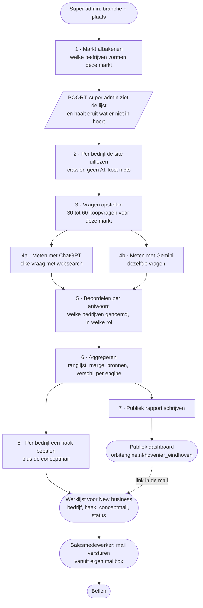

# Acquisitiemodule: een publiek GEO-marktrapport plus een persoonlijke openingsmail

**Status: bespreekstuk, geen bouwopdracht.** Dit document legt vast wat ORBIT ENGINE vandaag doet en
beschrijft een nieuwe module: een super admin laat een GEO-analyse draaien over een hele markt
(branche plus plaats) in plaats van over één merk. Dat levert twee dingen op. Een publiek dashboard
op een eigen adres, bijvoorbeeld `orbitengine.nl/hovenier_eindhoven`, dat voor iedereen toegankelijk
is. En per bedrijf dat in dat rapport voorkomt een gepersonaliseerde e-mail die een salesmedewerker
vanaf zijn eigen adres verstuurt als eerste contactmoment, gevolgd door een telefoontje.

**Niets hierin is gebouwd.** Wat de module precies moet tonen en hoe hij eruit komt te zien,
bespreken we aan de hand van dit document. Hoofdstuk 8 bevat een uitgewerkt voorbeeld van hoe
rapport en mail eruit kunnen zien, hoofdstuk 11 de learnings uit het onderzoek naar inspace.io,
en hoofdstuk 13 de vragen die nog open staan.

**Voor wie.** Het New business team, dat de gesprekken gaat voeren, en de software engineers die de
module gaan bouwen. Beiden lezen eerst hoofdstuk 1: wat ORBIT ENGINE vandaag daadwerkelijk doet.
Wie het wil verifiëren, vindt de technische waarheid in `docs/architecture.md` en de klantreis zonder
techniek in `APP_FLOW_DOCUMENTATION.md`.

---

## 1. Wat ORBIT ENGINE vandaag is

ORBIT ENGINE is het GEO-platform van Outer Orbit, voor het MKB. GEO staat voor Generative Engine
Optimization: niet ranken in Google, maar genoemd en aanbevolen worden in de antwoorden van
AI-assistenten zoals ChatGPT. Steeds meer mensen stellen hun oriëntatie- en aankoopvragen aan zo'n
assistent in plaats van aan een zoekmachine. Wordt een bedrijf daar niet genoemd, dan bestaat het
voor die gebruiker niet, ook al staat het op plek één in Google.

De app beantwoordt voor één merk drie vragen: **word ik genoemd**, **hoe vaak vergeleken met mijn
concurrenten**, en **waar haalt de AI die informatie vandaan**. Daarna schrijft de app content die
het gat dicht, en meet weken later of dat gewerkt heeft. Het onderscheidende punt is de gesloten
lus: meten, verklaren, maken, publiceren, opnieuw meten met een controlegroep. Geen uitspraak over
effect zonder die laatste stap.

### De vijf fases, voor één klant

| # | Fase | Wat er gebeurt | Kosten |
|---|---|---|---|
| 1 | **Merk klaarzetten** | Een consultant vult drie velden in (webadres, bedrijfsnaam, andere schrijfwijzen). De app crawlt tot 150 pagina's, brengt het aanbod als boom in kaart, onderzoekt de markt, doet een technische controle en test wat AI-assistenten al over het merk weten. Duurt ongeveer 7,5 minuut. | eenmalig ~$0,25 |
| 2 | **Analyse opstellen** | De consultant of klant kiest een onderwerp. De app genereert 30 realistische koopvragen, verdeeld over de fases van de klantreis, plus een volume-inschatting. De klant ziet en bewerkt elke vraag voordat er iets gemeten wordt. | verwaarloosbaar |
| 3 | **Analyse runnen** | De app stelt alle 30 vragen aan een AI-assistent met live websearch, beoordeelt elk antwoord per merk en berekent een zichtbaarheidsscore met foutmarge. Profileert de concurrenten en schrijft een jargonvrij rapport. | gemiddeld $0,855 |
| 4 | **Content genereren** | De app schrijft pagina's die het gevonden gat dichten, uitsluitend op basis van feiten die eerder zijn bevestigd. De klant keurt goed voor publicatie. | enkele dubbeltjes per pagina |
| 5 | **Resultaten monitoren** | Na publicatie meet de app opnieuw, na 14 en 28 dagen, met een controlegroep, en velt een verdedigbaar oordeel: steeg de score op de vragen waarvoor gepubliceerd is, of niet. | per meetronde $0,855 |

Van een meetronde zit ongeveer 95% in het stellen van de vraag mét websearch. Het beoordelen van het
antwoord is verwaarloosbaar. Dat is de enige kostenknop die telt, en dat blijft zo in de nieuwe
module.

### Hoe het vandaag verkocht wordt

Het product is **sales-led, niet self-serve**, naar het model van InSpace Nova. Een consultant zet
het merkprofiel klaar vóórdat er een gesprek is geweest, en het onderzoek van fase 1 is precies het
verkoopargument in dat gesprek: "dit heeft ORBIT ENGINE al over jouw bedrijf gevonden, en dit is wat
er ontbreekt." Pas na de verkoop wordt het profiel aan het account van de klant gekoppeld.

Dat is vandaag **inbound**: er is al een naam en een afspraak, en de consultant bereidt één specifiek
merk voor. De acquisitiemodule keert dat om naar outbound.

### De technische fundamenten die er al liggen

Vier dingen die de nieuwe module direct kan gebruiken, en die verklaren waarom dit geen bouw vanaf
nul is:

- **Een achtergrondwachtrij** (`lib/jobs/`) waarin elke stap een eigen taak is, met dedupe, retries
  en een kostenplafond per taak. Een marktanalyse wordt daarin een nieuw jobtype, geen uitbreiding
  van een bestaande.
- **Een enginelaag** (`lib/engines/`) die het meten losmaakt van de leverancier. OpenAI draait,
  Gemini is gebouwd maar slaapt: de adapter, de registry en een aparte idempotentiesleutel per engine
  staan er, en zonder `GEMINI_API_KEY` gedraagt de app zich ongewijzigd. Zie hoofdstuk 3.
- **Een crawler zonder AI** die een website uitleest en harde feiten oogst. Kost niets, want er komt
  geen model aan te pas. Dat is belangrijk voor een module die tientallen bedrijven tegelijk moet
  onderzoeken.
- **Een maillaag** (`lib/email/`, via Resend) die vandaag twee soorten bericht verstuurt, achter één
  hoofdschakelaar die standaard uit staat. Zie hoofdstuk 6.

### Wat er nog niet bestaat

- Er is geen concept van een analyse over een hele markt of branche, alleen over één merk.
- Er is geen publieke pagina buiten de ingelogde omgeving. Elk scherm in de app staat achter login.
- Er is geen rol tussen "beheerder" (`staff_users`, ziet alle merken) en "klant" in. Een aparte,
  beperktere rol zoals "super admin" bestaat nog niet in het rechtenmodel.
- Er is geen uitgaande mail naar iemand die nog geen relatie met ons heeft. Alle bestaande mail gaat
  naar een bestaande klant over zijn eigen analyse.
- Publiceren gebeurt nooit vanuit ORBIT ENGINE zelf; er is geen koppeling met een CMS.

---

## 2. Het idee, in één alinea

Een super admin kiest een branche en een plaats, bijvoorbeeld "hovenier" en "Eindhoven". ORBIT ENGINE
zoekt uit welke bedrijven die markt vormen, stelt aan AI-assistenten de vragen die een echte klant
daar zou stellen, en telt per bedrijf hoe vaak het genoemd wordt en waarom. Dat wordt een publiek
dashboard op `orbitengine.nl/hovenier_eindhoven`, voor iedereen toegankelijk, zonder login. Per
bedrijf in dat rapport genereert de app een persoonlijke e-mail die een salesmedewerker vanaf zijn
eigen adres verstuurt. Daarna wordt er gebeld.

Het rapport is niet het product. Het is de aanleiding voor een gesprek, en het bewijs dat wij al
werk hebben gedaan voordat we belden.

---

## 3. Twee engines: ChatGPT en Gemini

**Voor deze module zijn twee API's beschikbaar: de OpenAI-API (ChatGPT) en de Gemini-API.** Dat is
nieuw ten opzichte van de rest van de app, waar Gemini wel gebouwd is maar slaapt bij gebrek aan een
sleutel.

Dat is geen technisch detail maar het scherpste verkoopargument dat de module heeft. Een bedrijf kan
een enkele meting wegwuiven ("dat is toevallig één chatbot"). Twee onafhankelijke assistenten die
allebei de concurrent noemen en jou niet, is geen toeval meer. Concreet levert het drie dingen op:

1. **Bewijskracht.** Genoemd worden in ChatGPT maar niet in Gemini is een ander verhaal dan nergens
   genoemd worden. Beide gevallen zijn een gesprek waard, maar het zijn niet hetzelfde gesprek.
2. **Een tweede dimensie in het dashboard.** Per bedrijf twee kolommen in plaats van één. Waar de
   twee assistenten van elkaar verschillen zit vaak de verklaring: de een leunt zwaarder op de eigen
   website, de ander op externe bronnen zoals vergelijkingssites en recensieplatforms.
3. **Een reden om de meting te herhalen.** Het verschil tussen de twee engines beweegt, en dat maakt
   een marktrapport iets dat leeft in plaats van een momentopname.

**Wat de code al voorziet.** De enginelaag laat een engine meedoen als er een sleutel voor is én hij
op het profiel aanstaat. Ontbreekt de sleutel, dan valt hij er stil uit. Voor de nieuwe module
betekent dat: valt Gemini weg, dan gaat het rapport door met alleen ChatGPT, en dat moet zichtbaar
zijn op het dashboard in plaats van stilzwijgend een half rapport op te leveren. Een half rapport dat
zich als een heel rapport voordoet is precies het soort fout dat een verkoopgesprek onderuit haalt.

---

## 4. Het budget: 10 euro per rapport

**Per marktanalyse mag tot 10 euro aan API-kosten uitgegeven worden.** Dat is ongeveer twaalf keer
het budget van een gewone meetronde voor één klant ($0,855). Dat verandert wat er mogelijk is: dit
hoeft geen uitgeklede meting te zijn, het kan diepgaander zijn dan wat een betalende klant vandaag
per ronde krijgt.

### Waar dat geld heen kan, als voorstel

De verdeling hieronder is een startpunt voor de bespreking, geen vastgesteld ontwerp. Uitgangspunt:
één markt, ongeveer 15 bedrijven, twee engines.

| Post | Wat het oplevert | Indicatie |
|---|---|---|
| **Markt afbakenen** | Uitzoeken welke bedrijven deze markt vormen, met websearch, plus hun webadres en naamvarianten | ~€0,50 |
| **De vragen opstellen** | 30 tot 60 realistische koopvragen voor deze branche en plaats, verdeeld over de klantreis | ~€0,10 |
| **Meten met ChatGPT** | Elke vraag stellen mét websearch en per antwoord alle bedrijven beoordelen | ~€2,50 |
| **Meten met Gemini** | Dezelfde vragen, tweede engine | ~€2,50 |
| **Per bedrijf verdiepen** | Website vluchtig uitlezen (crawlen kost niets), plus per bedrijf een korte verklaring waarom het wel of niet genoemd wordt | ~€1,50 |
| **Het rapport schrijven** | De publieke tekst op het dashboard: wat valt op in deze markt | ~€0,50 |
| **De e-mails schrijven** | Per bedrijf een gepersonaliseerde openingsmail, op het duurste model | ~€2,00 |
| **Marge** | Herhalingen bij twijfel, mislukte stappen opnieuw | rest |

**Twee dingen om vast te leggen bij dat budget.** Ten eerste een hard plafond per rapport, net zoals
er vandaag een plafond per merk en een dagplafond over alles heen is. Loopt het budget op, dan valt
een stap weg en wordt dát vastgelegd; een stap doet nooit alsof hij geslaagd is. Ten tweede: dit is
een acquisitiekost, geen productiekost. Tegenover 10 euro staat een lijst van vijftien bedrijven die
allemaal benaderd kunnen worden. Dat is minder dan een euro per lead, en dat is de rekensom die
telt, niet de vergelijking met wat een klantmeting kost.

---

## 5. Het publieke dashboard

Het New business team wil het rapport in de vorm van een **simpel dashboard dat publiekelijk online
komt en voor iedereen toegankelijk is**. Dat is een nieuw soort scherm voor deze app: alles wat er
vandaag staat zit achter login.

### Waarom publiek, en wat dat betekent

Publiek is een keuze met gevolgen die het waard zijn om expliciet te maken:

- **Het is deelbaar.** De salesmedewerker kan de link in de openingsmail zetten en het bedrijf kan
  hem openen zonder account, zonder wachtwoord, zonder drempel. Dat is precies waarom dit werkt als
  eerste contactmoment.
- **Het is bewijs.** Een link naar iets dat al bestaat is geloofwaardiger dan een bijlage die
  duidelijk voor deze ene mail gemaakt is.
- **Het is zichtbaar voor iedereen, ook voor de concurrent en voor het bedrijf dat er slecht op
  staat.** Elk bedrijf in het rapport kan zien waar het staat ten opzichte van de rest. Dat is de
  aantrekkingskracht én het risico van dit idee, en het bepaalt de toon: een rapport dat een bedrijf
  belachelijk maakt levert geen gesprek op maar een boze telefoon. Zie hoofdstuk 13, vraag 2.
- **Het is vindbaar in Google en, als we het goed doen, in AI-antwoorden zelf.** Een pagina over
  "hoveniers in Eindhoven" die feitelijk beschrijft wie er in AI-antwoorden genoemd wordt, is precies
  het soort pagina waar ORBIT ENGINE zijn klanten op adviseert. Dat is geen bijvangst: het is het
  bewijs dat we ons eigen advies uitvoeren.

### Wat er op moet staan, als voorstel

Simpel betekent: te begrijpen in vijftien seconden door een hovenier die geen marketeer is.

1. **Eén regel bovenaan die zegt waar je naar kijkt.** "Als iemand ChatGPT of Gemini vraagt naar een
   hovenier in Eindhoven, welke bedrijven komen er dan uit."
2. **De ranglijst.** Per bedrijf hoe vaak het genoemd is, van beide engines, met de foutmarge
   erbij. De app toont vandaag al onzekerheid in plaats van een indrukwekkend cijfer, en dat moet
   hier ook.
3. **De bedrijven die niet genoemd zijn.** Waarschijnlijk het scherpste blok van het hele dashboard,
   en tegelijk het gevoeligste. Zie hoofdstuk 13, vraag 2.
4. **Waar de AI zijn informatie vandaan haalt.** Welke websites bepalen deze markt. Vaak zijn dat
   niet de bedrijfssites zelf maar vergelijkingsplatforms, en dat is voor de meeste ondernemers
   nieuwe informatie.
5. **Een paar echte vragen met het echte antwoord erbij.** Doorklikbaar bewijs, want een cijfer
   zonder bewijs is een mening.
6. **Wat je eraan kunt doen**, kort, met de stap naar een gesprek. Dit is de enige plek op het
   dashboard waar ORBIT ENGINE over zichzelf praat.
7. **De meetdatum, groot genoeg om te zien.** Een rapport zonder datum wordt vanzelf een leugen.

### Randvoorwaarden voor een publieke pagina

- **De pagina toont uitsluitend meetresultaten**, geen ruwe modeluitvoer, geen kosten, geen interne
  taaknamen. Dezelfde regel die vandaag geldt voor het onboardingscherm waar de klant naast je zit.
- **Geen persoonsgegevens.** Bedrijfsnamen en webadressen zijn openbare bedrijfsinformatie. Namen van
  medewerkers, e-mailadressen en telefoonnummers horen niet op een publieke pagina, ook niet als ze
  op de bedrijfssite staan.
- **Een bedrijf moet eraf kunnen.** Wie vraagt om verwijdering van het publieke dashboard, wordt
  verwijderd, zonder discussie. Dat is een ontwerpeis, geen procedure achteraf.
- **Alleen lezen.** De publieke route mag niets kunnen schrijven en niets kunnen starten. Dat is
  geen extra maatregel maar de bestaande regel: schrijven loopt altijd via een API-route met een
  expliciete rechtencontrole.

---

## 6. De gepersonaliseerde openingsmail

Naast het rapport wil het New business team **per bedrijf in dat rapport een persoonlijk bericht dat
per e-mail verzonden kan worden**. Verzonden vanaf de salesmedewerker zelf, als eerste contactmoment,
gevolgd door een telefoontje.

**Dit is het scherpste onderdeel van de hele module, en het risicovolste.** Een openingsmail die naar
sjabloon ruikt is erger dan geen mail: hij verbrandt de naam van het bedrijf voor het telefoontje dat
erna komt. De lat is dus niet "een nette mail", de lat is "deze mail kan alleen over ons gaan".

### Waarom dit hier kan wat een gewone mailtool niet kan

Het verschil tussen deze mail en elke andere gepersonaliseerde acquisitiemail is dat wij iets weten
dat het bedrijf zelf niet weet. Niet zijn branche, niet zijn plaats, niet zijn voornaam: die
velden vult iedereen in. Wij weten dat als iemand ChatGPT vraagt naar een hovenier in Eindhoven, zijn
directe concurrent er drie keer uit komt en hij nul keer, en wij kunnen dat laten zien.

Dat maakt de persoonlijke haak feitelijk in plaats van cosmetisch. Vier haken die uit de meting zelf
komen:

- **De onzichtbare.** Nul vermeldingen, terwijl het bedrijf duidelijk bestaat en een goede site
  heeft. Haak: het contrast tussen wat ze zijn en wat de AI ziet.
- **De genoemde die verkeerd genoemd wordt.** Wel genoemd, maar met een verouderd feit, een verkeerde
  plaats of een dienst die ze niet meer doen. Haak: dit staat er nú over jullie, en het klopt niet.
- **De tweede.** Wel zichtbaar, maar structureel achter één specifieke concurrent. Haak: het verschil
  met die ene naam, en waarom die wint.
- **De winnaar.** Wel de meest genoemde. Haak: hier is wat je hebt, en hier is waar het wegglipt,
  want deze positie is niet vanzelfsprekend.

Een mail die niet aan één van die haken hangt, hoort niet verstuurd te worden.

### Wat de mail moet doen

Eén ding: een reactie of een warm telefoongesprek. Niet verkopen, niet uitleggen wat GEO is, niet
onze diensten opsommen. De mail is de aanleiding, het telefoontje is het gesprek.

Als vorm, ter bespreking:

1. **Een onderwerpregel die over hen gaat**, niet over ons en niet over AI in het algemeen.
2. **Eén concrete observatie uit de meting**, met de naam van de concurrent erin als dat de haak is.
   Dit is de zin waarop de mail staat of valt.
3. **De link naar het publieke dashboard**, zodat de bewering te controleren is. Dat de pagina al
   bestaat en openbaar is, is zelf een argument: we hebben dit niet voor deze mail verzonnen.
4. **Eén zin over wat dit betekent**, zakelijk, zonder dreiging.
5. **Een lage vraag.** Niet "plan een demo van 45 minuten", maar iets dat in tien seconden te
   beantwoorden is.
6. **Ondertekend door de salesmedewerker zelf**, met zijn eigen naam en handtekening.

Wat er niet in hoort: superlatieven, "ik zag dat jullie", een vaag compliment over de website, en
elke zin die in tweehonderd andere mails ook zou kunnen staan.

### Randvoorwaarden

- **De salesmedewerker verstuurt, niet het systeem.** Dat is geen technisch detail maar het hele
  punt: dit is een mail van een mens. De module levert een concept, de medewerker leest het, past
  het aan en verstuurt het vanaf zijn eigen mailbox. Zie hoofdstuk 13, vraag 5, waar dit nog open
  staat.
- **De mail bevat geen bewering die niet uit de meting komt.** Dit is dezelfde regel die de app
  vandaag hanteert bij contentgeneratie: staat een feit niet op de feitenkaart, dan komt het niet in
  de tekst. Bij een acquisitiemail is de inzet hoger dan bij een klantpagina, want een verzonnen
  bewering over iemands concurrent in het allereerste contact is niet te herstellen.
- **Bijhouden wie al benaderd is.** Twee salesmedewerkers die dezelfde hovenier mailen is precies de
  fout die het hele idee ondermijnt. De lijst is dus geen los rapport maar een werklijst met een
  status per bedrijf.
- **De mail eindigt met een afmeldmogelijkheid en een herkenbare afzender.** Ongevraagde zakelijke
  mail naar een bedrijfsadres is toegestaan onder de Nederlandse regels, maar niet zonder een
  duidelijke afzender en een manier om er vanaf te komen. Zie hoofdstuk 13, vraag 6.

---

## 7. Hoe de module loopt, van klik tot rapport

Zo zou de keten eruit kunnen zien. Elk blok is een aparte taak in de bestaande achtergrondwachtrij,
volgens de regel dat één taak hooguit één zware AI-aanroep doet. De super admin kan het scherm
sluiten; de keten loopt door op de server.

**Eén bewuste stop.** De keten stopt op één plek op een mens: na stap 1, als de lijst met bedrijven
klaar is. Reden: alles daarna is duur, en een markt die verkeerd is afgebakend levert een rapport op
waar niemand iets aan heeft. Vijftien bedrijven doormeten waarvan er vier in een andere plaats zitten
kost geld en levert een gesprek op dat begint met een correctie. Dat is exact dezelfde redenering als
achter de goedkeuringspoort die vandaag vóór een klantmeting zit.

**Wat er gebeurt als een stap faalt.** Hetzelfde als in de rest van de app: de keten loopt door, de
mislukte stap wordt vastgelegd, en het rapport toont wat er ontbreekt in plaats van te doen alsof het
compleet is. Valt Gemini weg, dan gaat het rapport door op ChatGPT alleen, zichtbaar op het
dashboard. Valt de meting zelf weg, dan is er geen rapport en geen publieke pagina.

---

## 8. Een uitgewerkt voorbeeld

Om de bespreking concreet te maken: zo zou `orbitengine.nl/hovenier_eindhoven` er inhoudelijk uit
kunnen zien. **De cijfers en namen hieronder zijn verzonnen ter illustratie.** Er is nog niets
gemeten.

### Het dashboard

> **Hoveniers in Eindhoven, gezien door AI**
> Wij stelden 40 vragen die iemand stelt die een hovenier zoekt in Eindhoven, aan ChatGPT en aan
> Gemini. Dit kwam eruit. Gemeten op 3 september 2026.

| # | Bedrijf | ChatGPT | Gemini | Samen |
|---|---|---|---|---|
| 1 | Groen & Zo Hoveniers | 28 van 40 | 24 van 40 | **65%** |
| 2 | Van Aarle Tuinen | 19 van 40 | 21 van 40 | 50% |
| 3 | De Tuinmakers Brabant | 12 van 40 | 4 van 40 | 20% |
| 4 | Hoveniersbedrijf Kessels | 3 van 40 | 9 van 40 | 15% |
| 5 | Tuinaanleg Peeters | 1 van 40 | 0 van 40 | 1% |
| | *nog 9 bedrijven gevonden, geen enkele keer genoemd* | 0 | 0 | 0% |

Met daaronder drie blokken:

- **Waar de AI zijn informatie vandaan haalt.** In dit voorbeeld: bij 31 van de 40 antwoorden werd
  een vergelijkingsplatform aangehaald, en bij 8 de eigen website van het bedrijf. Dat is voor de
  meeste ondernemers de verrassing van het rapport: de AI leest hun site nauwelijks.
- **Drie echte vragen met het echte antwoord.** Doorklikbaar, want een cijfer zonder bewijs is een
  mening.
- **Wat dit betekent.** Vier zinnen, en de stap naar een gesprek.

### De mail bij dit rapport

Twee bedrijven uit dezelfde lijst, twee heel andere mails. Dat verschil is precies waar de module
zijn waarde bewijst. **Ook dit is illustratie, geen definitieve tekst.**

**Aan Tuinaanleg Peeters (de onzichtbare):**

> Onderwerp: jullie komen niet voor als ChatGPT een hovenier in Eindhoven aanraadt
>
> Beste [naam],
>
> We hebben deze week 40 vragen gesteld aan ChatGPT en Gemini die iemand stelt die een hovenier zoekt
> in Eindhoven. Groen & Zo kwam er 28 keer uit. Tuinaanleg Peeters één keer, en bij Gemini geen enkele
> keer.
>
> De hele meting staat hier: orbitengine.nl/hovenier_eindhoven
>
> Dat zegt niets over jullie werk. Het zegt dat de bronnen waar deze assistenten uit putten jullie
> nauwelijks noemen, en dat is iets anders dan een slechte website hebben.
>
> Zou je willen weten waaróm die ene concurrent er 28 keer uitkomt? Dan bel ik je deze week even, tien
> minuten.
>
> [naam salesmedewerker]

**Aan Groen & Zo (de winnaar):**

> Onderwerp: jullie zijn de meest genoemde hovenier in Eindhoven bij ChatGPT
>
> Beste [naam],
>
> We hebben deze week 40 vragen gesteld aan ChatGPT en Gemini die iemand stelt die een hovenier zoekt
> in Eindhoven. Jullie kwamen er 28 keer uit, meer dan wie ook. De hele meting:
> orbitengine.nl/hovenier_eindhoven
>
> Twee dingen vielen op. Bij Gemini staan jullie lager dan bij ChatGPT, en bij de vragen over
> tuinonderhoud in plaats van tuinaanleg word je nauwelijks genoemd. Dat is precies het soort positie
> dat je kwijtraakt zonder dat je het merkt, want er is geen ranglijst die je waarschuwt.
>
> Zal ik je bellen om te laten zien waar dat verschil vandaan komt?
>
> [naam salesmedewerker]

**Wat deze twee voorbeelden laten zien.** De onzichtbare krijgt een contrast, de winnaar krijgt een
kwetsbaarheid. Allebei staan of vallen ze bij één concrete zin die alleen over dit bedrijf kan gaan,
en die zin komt rechtstreeks uit de meting. Zonder die zin is het een sjabloon, en dan werkt het niet.

---

## 9. Datamodel, voor de engineers

Een eerste schets, ter bespreking. Volgt de bestaande conventies: additieve migraties, ruwe uitvoer
bewaren naast de uitgesplitste kolommen, en RLS aan met alleen-lezen policies.

| Tabel | Wat erin staat |
|---|---|
| `market_reports` | Eén rij per markt: branche, plaats, de publieke slug (`hovenier_eindhoven`), status, meetdatum, of hij publiek zichtbaar is, en de gemaakte kosten |
| `market_companies` | Eén rij per bedrijf in een rapport: naam, naamvarianten, webadres, hoe het gevonden is, en of het op de publieke pagina mag staan |
| `market_questions` | De gestelde vragen, per rapport, met hun fase in de klantreis |
| `market_answers` | Eén rij per vraag per engine: het volledige antwoord, de aangehaalde bronnen, de ruwe uitvoer |
| `market_mentions` | Eén rij per bedrijf per antwoord: genoemd ja of nee, in welke rol, op welke plek. Dit is de tabel waar de ranglijst uit komt |
| `market_outreach` | Per bedrijf: de gekozen haak, de conceptmail, aan welke salesmedewerker toegewezen, en de status van de opvolging |

**Drie aandachtspunten die uit de bestaande code komen.**

De publieke slug moet uniek zijn en mag niet te raden zijn naar rapporten die nog niet af zijn. Een
rapport is pas publiek als iemand hem publiek zet, niet zodra hij bestaat.

`market_mentions` is de tabel waar het vangnet uit conventie 1 op moet zitten: een model dat structured
output levert kiest bij twijfel de eerste waarde uit een lijst, en dat leverde bij de bestaande meting
tien onterecht ingevulde rollen op bij 27 niet-genoemde merken. Bij een publiek rapport staat zo'n fout
online, dus hier geldt hetzelfde deterministische vangnet: geen rol als het bedrijf niet genoemd is.

De publieke route leest alleen uit deze tabellen en schrijft nooit. Er hoort geen enkele schrijfactie
te bestaan die zonder ingelogde super admin bereikbaar is.

---

## 10. Bouwvolgorde

Ter bespreking, in vier fases die elk zelfstandig iets opleveren. De reden om te knippen: de eerste
fase levert al iets waar sales mee kan werken, zonder dat er iets publiek staat. Dat maakt het
mogelijk om de kwaliteit van de meting te beoordelen vóórdat er een pagina online komt met bedrijfsnamen
erop.

| Fase | Wat erin zit | Wat het oplevert |
|---|---|---|
| **1. Meten** | De rol super admin, de markt afbakenen met een poort, de meting op beide engines, de ranglijst. Alles intern, achter login | New business kan één markt bekijken en beoordelen of de uitkomst klopt met wat ze zelf van die markt weten. Dat oordeel is de enige echte kwaliteitstoets die er is |
| **2. Benaderen** | De haak per bedrijf, de conceptmail, de werklijst met status per bedrijf | Sales kan bellen en mailen op basis van echte meetdata, ook al is er nog geen publieke pagina. De link naar het dashboard ontbreekt dan nog in de mail |
| **3. Publiceren** | De publieke route, het dashboard, de verwijderprocedure, de afmeldroute in de mail. Plus de adresstructuur en de onderlinge verwijzingen tussen markten, en de blokken oud tegenover nieuw en wat het oplevert (hoofdstuk 11.2, punten A, E en G) | Het volledige idee zoals in dit document beschreven |
| **4. Zelf laten checken** | De gratis controle op de publieke pagina, met een goedkope meetvariant en een dagplafond (hoofdstuk 11.2, punt C) | Bedrijven melden zichzelf, in plaats van dat sales ze allemaal moet benaderen. Alleen zinvol als fase 3 staat en de kosten beheersbaar blijken |

**Waarom publiceren als laatste.** Een publieke pagina met bedrijfsnamen is de enige stap in dit
geheel die je niet ongedaan kunt maken. Wat er eenmaal online stond, is gezien. Alle onzekerheid over
de kwaliteit van de meting hoort dus weggenomen te zijn in fase 1 en 2, waar een fout intern blijft.

**Verificatie per fase.** Conform de tiende code-conventie is een fase pas af als hij tegen echte
opgeslagen data is nagerekend, niet als de code er staat. Voor fase 1 betekent dat concreet: iemand
die de markt kent kijkt naar de ranglijst en zegt of hij klopt. Voor fase 2: een salesmedewerker leest
tien conceptmails en zegt of hij ze zelf zou versturen. Voor fase 3: het rapport staat online en een
bedrijf dat erop staat heeft gereageerd zonder dat het een klacht was. Voor fase 4: er is een bedrijf
dat zichzelf heeft laten controleren en daarna contact opnam, en de kosten van die week bleven binnen
het plafond.

---

## 11. Input: learnings vanuit inspace.io

**Dit hoofdstuk is geen achtergrondinformatie maar inhoud.** Alles hieronder hoort meegenomen te
worden bij het uitwerken van het daadwerkelijke plan en bij het bouwen van de module. Het is
onderzocht op 23 augustus 2026, naar aanleiding van de vraag hoe InSpace zelf klanten werft en wat
wij daarvan kunnen gebruiken.

**Waarom uitgerekend InSpace.** Ons verkoopmodel is al van hen overgenomen: sales-led in plaats van
self-serve, de consultant zet het profiel klaar vóór het gesprek. Zij verkopen een vergelijkbaar
product aan een overlappende markt, vanuit Eindhoven, en zijn een aantal jaren verder in hun
acquisitie dan wij. Wat daar werkt, is voor ons het goedkoopste onderzoek dat er is.

**Hoe het onderzocht is, met de beperking erbij.** De site van InSpace was vanuit de ontwikkelomgeving
niet rechtstreeks te openen. De bevindingen komen uit zoekresultaten die hun pagina's samenvatten,
plus uit materiaal dat al in deze repo staat: de volledige marketingtekst (`docs/inspace-marketing.txt`)
en de twee berichtencatalogi van hun apps (`docs/nova-i18n.json`, `docs/inspace-app-i18n.json`).
Citaten hieronder komen letterlijk uit die bestanden. Wie een bevinding wil natrekken vóór er iets op
gebouwd wordt, kan de pagina's zelf openen.

### 11.1 Wat InSpace doet

Negen mechanismen, van hun trechter van boven naar beneden.

| # | Mechanisme | Wat het concreet is |
|---|---|---|
| 1 | **Gratis tools zonder drempel** | Een Tech Scan (gratis technische SEO-audit) en een ROI-calculator. Geen account, geen creditcard, geen verplicht verkoopgesprek. Je vult iets in en krijgt direct resultaat |
| 2 | **Honderden landingspagina's volgens een matrix** | Servicepagina's per CMS (Shopify, WordPress, Webflow, Storyblok, Magento, Wix, HubSpot, Framer), per branche (e-commerce, maakindustrie, advocaten, tandartsen, zorg, vastgoed, automotive, mode, sieraden) en per type (lokale, enterprise, internationale, meertalige SEO), maal zeven taalversies. Adressen als `inspace.io/nl-nl/seo-diensten/tandarts-seo` |
| 3 | **Bewijs met naam en cijfer** | 24 gedocumenteerde cases, gesorteerd per markt: "Laminaat.nl, vloeren, +30K per maand organisch". Daarboven: "vertrouwd door 400+ bedrijven" |
| 4 | **Eén conversieactie, met een lage variant** | Overal "Plan een gratis demo", en in het formulier: *"Laat je gegevens achter en we plannen samen een sessie van 15 of 45 minuten, wanneer het jou uitkomt."* Die 15 minuten is de echte drempelverlager |
| 5 | **Prijzen staan op de site** | Drie pakketten, met korting bij twee jaar vooruitbetalen. Sales-led, maar niet prijsgeheim |
| 6 | **Inhoudelijk gezag als aparte laag** | Insights, Kennisbank, Blog en een "Growth lab", gepositioneerd als geschreven door de mensen die het product bouwen, tegen echte zoekresultaten. Geen algemene SEO-artikelen |
| 7 | **Het verhaal begint bij de wereld, niet bij het product** | *"25 jaar lang betekende zoeken een lijst met links. Nu geven Google en alle AI-tools je antwoorden."* Oud tegenover nieuw, en pas daarna het product |
| 8 | **De menselijke laag is een verkoopargument** | *"100% software"* naast *"+20 echte mensen als hulp"* en een eigen Customer Success Manager. Dat pareert het bezwaar "dus ik krijg een robot" |
| 9 | **Acquisitie en behoud zijn gescheiden rollen** | Uit hun vacatures: twee Senior Account Executives in Antwerpen, Nederlands- en Franstalig, plus Customer Success Managers. Vestigingen in Eindhoven en Antwerpen, Keulen en Amsterdam in aanbouw |

Ze maken de omvang van de markt ook tastbaar met echte volumes, en gebruiken daarbij toevallig precies
ons voorbeeld: *"landscaping, 144.000 zoekopdrachten per maand"*.

### 11.2 Wat wij daarvan overnemen

Zeven punten. Elk punt is besloten om mee te nemen; wat erbij staat is hoe.

**A. Denk in de matrix, niet in één rapport.** Dit is de belangrijkste les van het hele onderzoek.
`hovenier_eindhoven` als losse pagina is een dood blaadje. De waarde zit in branche maal plaats,
systematisch: een overzichtspagina, een vaste adresstructuur, en onderlinge verwijzingen tussen
verwante markten, zowel naar dezelfde branche in een andere plaats als naar een andere branche in
dezelfde plaats. **Gevolg voor de bouw:** de slug-conventie en de onderlinge verwijzingen horen in
fase 3 van de bouwvolgorde te zitten, niet als latere toevoeging. Achteraf de structuur repareren op
honderden pagina's is duur, en pagina's zonder onderlinge samenhang worden door zoekmachines én door
AI-assistenten slechter opgepikt. Dat laatste is bij dit product geen detail: het is exact wat we
onze klanten adviseren.

**B. Laat het rapport zichzelf bewijzen.** Als onze pagina over hoveniers in Eindhoven zélf genoemd
wordt in AI-antwoorden over die markt, is dat het sterkste verkoopargument dat er bestaat: de pagina
die je leest is het bewijs van wat wij doen. InSpace past hun eigen product toe op hun eigen site;
wij horen dat ook te doen. **Gevolg voor de bouw:** de publieke pagina wordt gebouwd volgens de
GEO-eisen die ORBIT ENGINE zelf aan klantcontent stelt, met gestructureerde data, een heldere
entiteit per bedrijf en toegang voor AI-crawlers. En na een maand of drie meten we de eigen pagina's
met onze eigen meting. Wordt onze pagina niet genoemd, dan is dat een probleem met het product, niet
met de pagina.

**C. Een gratis zelfbedieningscheck op de publieke pagina.** Bij InSpace is de Tech Scan zonder account
de bovenkant van de trechter. Bij ons zou dat betekenen: wie het rapport vindt, kan zijn eigen bedrijf
laten controleren. Dat maakt van een eenrichtingsdocument een leadgenerator, en het draait de richting
om: niet wij benaderen hen, zij melden zich. **Met één harde rem:** hun scan is gratis omdat een crawl
niets kost, onze meting kost geld. Zonder rem is dit een open kraan waar iedereen op het internet aan
kan draaien. **Gevolg voor de bouw:** dit kan alleen als goedkope variant, bijvoorbeeld een kleiner
aantal vragen, één engine, of een wachtrij met een dagplafond, en met een misbruikrem. Het hoort in
een eigen fase na fase 3, niet erbij gepropt.

**D. Het gesprek in tijd uitdrukken, met een keuze.** InSpace vraagt niet om "een demo" maar om
"15 of 45 minuten, wanneer het jou uitkomt". Onze conceptmails zeggen al "tien minuten", dus we zitten
in de goede richting, maar dat is nu toeval en geen regel. **Gevolg voor de bouw:** leg vast in de
schrijfinstructie van de mail dat de afsluitende vraag altijd een tijdsduur noemt, en dat die duur
kort is. Dit kost niets en is meetbaar in het responspercentage.

**E. Het blok oud tegenover nieuw op de publieke pagina.** Een hovenier die niet weet wat GEO is,
begrijpt in vijftien seconden wat er verandert als hij de oude situatie naast de nieuwe ziet. InSpace
zet dit blok bovenaan hun hele verhaal. Het past bij onze schrijfstijl en het kost één blok op de
pagina. **Gevolg voor de bouw:** dit wordt vast onderdeel van het publieke dashboard, boven de
ranglijst of er direct onder.

**F. De omvang van de vraag erbij zetten.** InSpace maakt het verlies tastbaar met volumes. Ons
rapport zegt hoe vaak een bedrijf genoemd wordt, maar niet hoe groot de prijs is die het misloopt.
"Nul van de veertig" is een cijfer; "nul van de veertig, terwijl hier per maand honderden mensen naar
zoeken" is een bedrag. **Met een kanttekening die niet weggeschreven mag worden:** echte zoekvolumes
zijn in ORBIT ENGINE bewust níet gebouwd, dus dit wordt een schatting. **Gevolg voor de bouw:** een
schatting mag, maar dan zichtbaar als schatting, met de bron of de methode erbij. Een verzonnen precies
getal op een publieke pagina is precies het soort fout dat het hele rapport verdacht maakt, en het
is niet te herstellen als iemand het narekent.

**G. Wij hebben nog geen klantcases, en dat is een gat.** InSpace koppelt elk probleem aan een
gedocumenteerd resultaat met naam en cijfer: 24 cases, 400+ bedrijven, "+30K per maand". Wij hebben
dat niet. Onze publieke pagina kan straks scherp laten zien dát een bedrijf onzichtbaar is, maar heeft
geen enkel bewijs dat wij dat oplossen. **Dit is geen ontwerpkeuze die je anders kunt maken, het is
een tekort dat je alleen met tijd kunt vullen.** Drie gevolgen voor het plan:

1. **Verzin niets.** Geen voorbeeldcase, geen "tot 3x meer zichtbaarheid", geen percentage zonder
   meting eronder. De hele geloofwaardigheid van dit rapport hangt aan het feit dat elk getal erop
   nagerekend kan worden. Eén verzonnen cijfer maakt de rest ook verdacht.
2. **Bouw de plek er wel vast in.** Het publieke dashboard krijgt een blok "wat het oplevert" dat in
   de eerste versie leeg blijft of vervangen wordt door de methode: hoe wij meten, en dat wij ná
   publicatie hermeten met een controlegroep. De belofte van bewijs is zelf een argument, en het is
   waar.
3. **Maak de eerste case een doel van de module.** De eerste klant die via dit rapport binnenkomt en
   waarbij we ná publicatie een gemeten stijging laten zien, vult dit gat voor alle volgende
   rapporten. Dat is een reden om bij de eerste klanten uit deze module extra streng te zijn op de
   effectmeting van fase 5. Tot die tijd is de openingsmail het enige verkoopmiddel dat we hebben,
   en dat verklaart waarom hoofdstuk 6 zo streng is over de kwaliteit ervan.

### 11.3 Waar wij verder gaan dan hun draaiboek

Eén bevinding die geen les is maar een waarschuwing, en die het zwaarste weegt van alles hierboven.

**InSpace publiceert nergens een pagina die andere, met naam genoemde bedrijven beoordeelt.** Hun
publieke materiaal gaat over zichzelf, over hun product, en over eigen klanten die toestemming gaven.
Wij zijn van plan een ranglijst te publiceren met bedrijfsnamen die daar niet om gevraagd hebben,
inclusief een blok met wie er onzichtbaar is.

Dat is geen reden om het niet te doen, maar het betekent wel dat er geen voorbeeld is om ons op te
beroepen. We kunnen niet zeggen "zo doet InSpace het ook", en we kunnen ook niet zien hoe de markt
daarop reageert voordat wij het zelf doen. Dat maakt vraag 2 in hoofdstuk 13 zwaarder dan hij eruitziet:
of de bedrijven die nul keer genoemd worden wél op de publieke pagina komen, is de beslissing die
bepaalt of dit een scherp acquisitiemiddel is of een reputatierisico. Die beslissing hoort genomen te
zijn vóór fase 3 van de bouwvolgorde begint.

---

## 12. Wat er al herbruikbaar is, en wat nieuw is

### Herbruikbaar

- **De meetronde zelf** (fase 3): 30 vragen stellen aan een AI-assistent met websearch en per
  antwoord beoordelen welke bedrijven genoemd worden, is exact de kern-capaciteit die nodig is. Het
  verschil is dat de uitkomst niet één score voor één merk is, maar een ranglijst over alle bedrijven
  in die markt.
- **Merknaam-normalisatie** (`lib/entities/`): het herkennen dat "Jansen BV" en "Bakkerij Jansen"
  hetzelfde bedrijf zijn. Bij een marktrapport met vijftien namen is dit belangrijker dan bij één
  merk, niet minder.
- **De onzekerheidsmarge** (`lib/stats/`): 30 vragen leveren geen exact percentage op, en de app
  rekent dat vandaag al eerlijk voor.
- **Marktonderzoek en concurrentidentificatie** (fase 1, stap 4): de pijplijn zoekt vandaag al uit
  wie de concurrenten van één merk zijn en waarom die winnen.
- **De crawler zonder AI**: per bedrijf de site uitlezen kost niets en levert de feiten waarop de
  persoonlijke mail kan leunen.
- **Rapportgeneratie** (`lib/pipeline/report`): de jargonvrije samenvatting die vandaag per klant
  geschreven wordt, staat qua vorm dicht bij wat een publiek marktrapport nodig heeft.
- **De maillaag** (`lib/email/`, Resend): bestaat, staat standaard uit, en verstuurt vandaag alleen
  aan bestaande klanten.

### Nieuw

- Een manier om een markt (branche plus plaats) te definiëren in plaats van een merk.
- Een stap die uitzoekt welke bedrijven in die markt meespelen, zonder eigen website als startpunt.
  Dit is de lastigste nieuwe stap: bij een bestaand merk begint de pijplijn bij de site van dat merk,
  hier is er geen enkel vertrekpunt behalve twee woorden.
- Een ranglijst over meerdere bedrijven in plaats van een score voor één merk, in het datamodel en
  in de weergave.
- Gemini daadwerkelijk aanzetten, en het verschil tussen twee engines tonen.
- Een publieke route zonder login, met een leesbaar adres.
- Een rol "super admin", beperkter dan de bestaande beheerdersrol, die deze marktanalyses mag starten.
  Reden om dit niet bij `staff_users` te leggen: die rol ziet vandaag alle klantmerken, en het
  starten van een publiek zichtbare marktanalyse hoort bij een kleinere groep dan "iedereen die met
  klanten meekijkt".
- Een werklijst voor New business: per bedrijf de haak, de conceptmail, en de status van de
  opvolging.
- Mailgeneratie per bedrijf, en een manier om die mail bij de juiste salesmedewerker te krijgen.

---

## 13. Wat we nog moeten bespreken

Dit zijn de keuzes die de vorm van de module bepalen. Geen ervan is hierboven beantwoord.

1. **Hoe wordt vastgesteld welke bedrijven een markt vormen?** Bij een bestaand merk begint de
   pijplijn bij de eigen website. Hier is er niets: de markt moet uit "branche plus plaats" worden
   afgeleid. Alleen de bedrijven die de AI zelf noemt, of ook een onafhankelijke bron erbij zoals
   het Handelsregister of Google Maps?
2. **Komen bedrijven die nul keer genoemd worden wél in het rapport?** Dit is de belangrijkste vraag
   van het hele document. Het is verreweg het sterkste verkoopargument ("je bestaat, maar AI ziet je
   niet") en tegelijk het grootste risico, want dat bedrijf staat publiek op een lijst waar het
   slecht op staat, zonder erom gevraagd te hebben. Drie varianten: iedereen erop; alleen de
   genoemden publiek en de onzichtbaren alleen intern voor sales; of iedereen erop maar zonder
   ranglijstpositie voor wie niet genoemd is. Hoofdstuk 11.3 maakt deze vraag zwaarder: InSpace
   publiceert nergens een oordeel over met naam genoemde derden, dus er is geen voorbeeld om ons
   op te beroepen.
3. **Hoeveel bedrijven per rapport?** Vijftien is werkbaar voor sales en leesbaar op een dashboard.
   Vijftig is completer en onbruikbaar als werklijst.
4. **Hoe vaak wordt een rapport ververst?** Een publieke pagina die maanden blijft staan terwijl de
   markt allang veranderd is, wekt een verkeerde indruk bij wie hem later vindt. Een momentopname met
   zichtbare datum, of een terugkerende meting? Bij een terugkerende meting krijg je er iets sterks
   bij: verandering over tijd, en dat is een tweede aanleiding om te bellen.
5. **Wie verstuurt de mail technisch?** Drie varianten: de app genereert de tekst en de medewerker
   kopieert hem naar zijn eigen mailclient (simpelst, geen koppeling nodig); de app opent een
   voorgevulde concept in Gmail of Outlook (gebruiksvriendelijker, koppeling nodig); of de app
   verstuurt namens de medewerker via Resend (meest geautomatiseerd, maar dan is het niet meer echt
   zijn mailbox en mist hij de reacties in zijn eigen conversatie).
6. **Juridisch en reputatie.** Ongevraagde zakelijke mail naar een bedrijfsadres mag in Nederland,
   maar een publieke pagina met bedrijfsnamen en een oordeel erover is een tweede vraag. Wat is de
   afmeldroute, en wie beslist als een bedrijf vraagt om verwijdering? Dit hoort besloten te zijn
   vóór het eerste rapport online staat, niet erna.
7. **Wie krijgt de rol super admin**, hoeveel mensen zijn dat, en wat mag die rol nog meer dan
   marktanalyses starten?
8. **Hoeveel markten per maand?** Dat bepaalt of het budget van 10 euro per rapport binnen het
   bestaande dagplafond past of een eigen plafond nodig heeft.
9. **Meten we de module zelf?** Hoeveel mails leiden tot een reactie, hoeveel reacties tot een
   gesprek, hoeveel gesprekken tot een klant. Zonder dat is er over drie maanden geen manier om te
   zeggen of dit werkt, en dat zou vreemd zijn voor een product dat zijn hele bestaansrecht ontleent
   aan meten in plaats van gokken.

---

## 14. Randvoorwaarden vanuit hoe de app vandaag werkt

Een paar dingen die niet ter discussie staan, omdat ze in de rest van de app vastliggen en de module
er niet mee mag botsen:

- **Schrijven gaat nooit rechtstreeks vanaf de client.** Ook het starten van een marktanalyse loopt
  via een API-route met service-role key en een expliciete rechtencontrole op de nieuwe rol.
- **Onbekend is een betere waarde dan een verkeerde.** Een bedrijf dat niet met zekerheid genoemd
  wordt, hoort niet met een gok in de ranglijst te staan. Hetzelfde vangnet dat vandaag voorkomt dat
  een model een niet-genoemd merk toch een rol toedicht, moet hier ook gelden. Bij een publiek
  rapport is de inzet hoger: een fout staat online.
- **Een promptinstructie is een intentie, code is een garantie.** Elke regel over wat er wel of niet
  in de mail of op het dashboard mag staan, krijgt een deterministische controle in code. Niet alleen
  een zin in de prompt.
- **Eén taak is hooguit één zware AI-aanroep.** Een marktanalyse wordt dus een keten van taken, geen
  enkele grote taak.
- **Alles bewaren.** Elke AI-aanroep slaat zijn volledige ruwe uitvoer op naast de uitgesplitste
  velden, inclusief de gegenereerde mails. Bij een acquisitiemail wil je achteraf kunnen zien wat er
  precies verstuurd is.
- **Idempotentie.** Twee keer hetzelfde rapport starten levert geen twee keer de kosten op.
- **Migraties zijn additief en idempotent**, nooit `drop`.
- **Kosten zijn een ontwerpvariabele.** Een marktanalyse zonder websearch is goedkoop maar meet niet
  wat een echte gebruiker ziet, exact dezelfde afweging als bij `MEASURE_WEB_SEARCH` vandaag.
- **De schrijfstijl geldt ook hier.** Het publieke dashboard en de mail volgen `docs/schrijfstijl.md`,
  inclusief de regel dat er geen gedachtestreepjes in staan. Voor een product dat content schrijft die
  klanten publiceren, is een acquisitiemail die naar AI ruikt een productfout en geen smaakkwestie.
