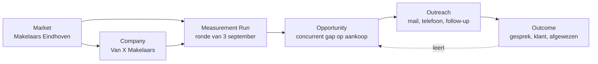
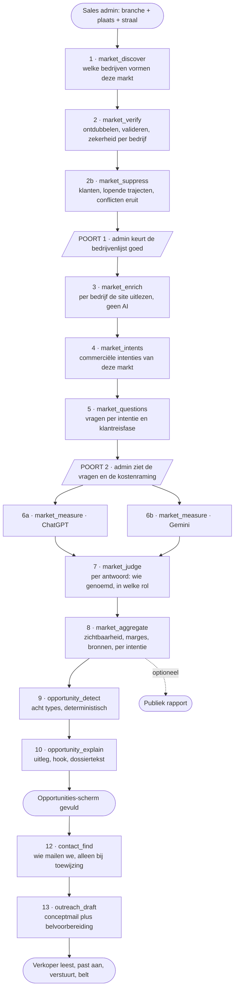

# GEO Prospect Engine: implementatieplan voor de Sales-module

**Status: bouwopdracht.** Dit document vervangt `acquisitie-module.md`, het eerdere bespreekstuk over
een publiek GEO-marktrapport met een mailfunctie ernaast. Dat concept is door New business
teruggestuurd met een fundamenteel andere opdracht, en die opdracht is hier volledig uitgewerkt tot
een implementatieplan.

**Wat er verandert.** Het oude plan bouwde een rapportgenerator. Dit plan bouwt een
**GEO Prospect Engine**: een intern systeem dat uit een markt automatisch de beste commerciële
kansen voor Outer Orbit identificeert, uitlegt waarom ze interessant zijn, het bewijs erbij levert
en de persoonlijke openingsmail voorbereidt. Het publieke rapport blijft bestaan, maar is
secundair geworden: bewijsmateriaal, geen product.

**De ene zin die alles stuurt:**

> Bouw geen GEO-rapportgenerator met een mailfunctie ernaast; bouw een GEO Prospect Engine die uit
> een markt automatisch de beste saleskansen identificeert, uitlegt waarom ze interessant zijn en
> daar vervolgens het bewijs en de persoonlijke openingsmail voor levert.

Het rapport is bewijs. De GEO-analyse is de motor. **De opportunity is het product.** De mail is de
opener. De salesmedewerker is de menselijke schakel. Het gesprek is het doel.

**Voor wie dit document is.** De engineers die het bouwen, en de New business managers die ermee
gaan werken. Hoofdstuk 1 tot en met 6 zijn voor beiden. Hoofdstuk 7 tot en met 16 zijn technisch.
Hoofdstuk 17 tot en met 24 zijn weer voor beiden.

**Peildatum: 24 augustus 2026.** Sprint 1 en 2 zijn gebouwd en staan op productie (migraties `0065`
tot en met `0067`). Alle kostencijfers over de bestaande pijplijn zijn nagerekend tegen de
kostenlogboeken op productie en komen uit `docs/architecture.md` §6; de kostencijfers over deze
module zelf zijn schattingen tot de eerste echte markt gedraaid heeft.

---

## Inhoud

| # | Hoofdstuk | Voor wie |
|---|---|---|
| 1 | Het uitgangspunt, en wat er verandert | iedereen |
| 2 | De redenering: waarom de opportunity het product is | iedereen |
| 3 | Wat ORBIT ENGINE vandaag al kan, en wat ontbreekt | iedereen |
| 4 | Toegang: de Sales-sectie en het rechtenmodel | iedereen |
| 5 | De vijf Sales-schermen | iedereen |
| 6 | Het domeinmodel: markt, bedrijf, meting, opportunity, outreach, uitkomst | iedereen |
| 7 | Datamodel en migraties | technisch |
| 8 | De pijplijn: dertien taken van markt tot dossier | technisch |
| 9 | Stap 1 in detail: de markt ontdekken zonder AI-vooroordeel | technisch |
| 10 | Stap 3 in detail: commerciële intentie meten, niet zichtbaarheid | technisch |
| 11 | Meten over meerdere engines | technisch |
| 12 | De acht opportunitytypes, met detectieregels | technisch |
| 13 | De GEO Opportunity Score | technisch |
| 14 | De sales hook: één reden, met bewijs | technisch |
| 15 | De bewijsketen: geen claim zonder bron | technisch |
| 16 | De openingsmail en het telefoongesprek | technisch |
| 17 | Statusmodel en de saleswerkstroom | iedereen |
| 18 | Meetbaarheid: de trechter en de KPI's | iedereen |
| 19 | De leerlus: van GEO-score naar Sales-score | iedereen |
| 20 | Het publieke rapport, secundair | iedereen |
| 21 | Kosten en budget | iedereen |
| 22 | Bouwvolgorde: zeven sprints met verificatiecriteria | iedereen |
| 23 | Learnings uit het onderzoek naar inspace.io | iedereen |
| 24 | Risico's, randvoorwaarden en openstaande beslissingen | iedereen |

---

## 1. Het uitgangspunt, en wat er verandert

### 1.1 De oude gedachte

```
branche + plaats  →  GEO-marktrapport  →  publieke pagina  →  persoonlijke mail  →  bellen
```

Daarin was het rapport het middelpunt. Alles wat het systeem deed, liep uit op een pagina, en de
mail hing er als bijproduct aan vast.

### 1.2 De nieuwe gedachte

```
branche + plaats
   → markt ontdekken
   → markt meten
   → GEO-opportunities identificeren
   → prospects prioriteren
   → commerciële reden bepalen
   → bewijs verzamelen
   → persoonlijke openingsmail voorbereiden
   → sales opvolgen
   → resultaat meten
```

De kernvraag die het systeem beantwoordt is niet "hoe zichtbaar is deze markt" maar:

> **Welke bedrijven in deze markt hebben nú de interessantste GEO-kans voor Outer Orbit, en waarom?**

Het systeem moet daarom per bedrijf kunnen bepalen wie interessant is, waarom, hoe groot de kans
lijkt, waar die kans precies zit, tegen welke concurrent het verschil zichtbaar is, welke concrete
observatie het beste verkoopargument vormt, welk bewijs daarvoor beschikbaar is, en hoe New business
dit bedrijf het beste kan benaderen.

### 1.3 Wat het eindresultaat wél en niet is

| Niet het eindresultaat | Wel het eindresultaat |
|---|---|
| Een ranglijst | Een gekwalificeerde sales opportunity |
| Een GEO-score | Een reden om vandaag te bellen, met bewijs |
| Een rapport | Een prospectdossier waar een verkoper mee de telefoon pakt |
| Een gegenereerde mail | Een gesprek |

### 1.4 Wat nadrukkelijk niet gebouwd wordt

Deze lijst is bindend. Een oplossing die hier tegenaan schuurt, is de verkeerde oplossing.

- Geen generieke AI-rapportgenerator.
- Geen dashboard vol cijfers zonder commerciële betekenis.
- Geen automatische cold-emailmachine, en ook geen verzending vanuit de app namens een medewerker.
  De medewerker verstuurt altijd zelf, vanuit zijn eigen mailbox. Zie 16.3, dit is een vaste regel.
- Geen lijst met bedrijven zonder prioritering.
- Geen ranglijst die alleen laat zien wie de AI al kent.
- Geen systeem dat uitsluitend naar ChatGPT kijkt.
- Geen claim zonder bewijs.
- Geen publiek rapport als eindproduct.
- Geen grote publieke contentmachine voordat de saleswerkstroom bewezen is.

---

## 2. De redenering: waarom de opportunity het product is

Drie functies, en alles wat de engine doet draagt bij aan één ervan. Werk dat aan geen van drieën
bijdraagt, hoort niet in deze module.

**1. Detecteren.** Waar zit een GEO-kans?
**2. Verklaren.** Waarom bestaat die kans?
**3. Activeren.** Wat moet sales nu met deze prospect doen?

Het onderscheid dat het vaakst misgaat, en dat daarom hard in de code moet zitten:

> **De laagste zichtbaarheid is niet automatisch de hoogste saleskans.**

Een bedrijf dat nul keer genoemd wordt kan een eenmanszaak zijn zonder budget, zonder website en
zonder ambitie. Een bedrijf dat marktleider is in zichtbaarheid kan een groot, professioneel bedrijf
zijn dat één specifieke, dure intentie mist en dat direct begrijpt wat dat kost. De tweede is
commercieel interessanter, en een systeem dat alleen op zichtbaarheid sorteert zet de eerste
bovenaan. Daarom scheiden we twee begrippen die vandaag door elkaar lopen:

| Begrip | Beantwoordt | Bestaat vandaag |
|---|---|---|
| **GEO Visibility Score** | Hoe zichtbaar is dit bedrijf in AI-antwoorden? | ja, per merk |
| **GEO Opportunity Score** | Hoe interessant is dit bedrijf vanuit salesperspectief? | nee, nieuw |

En de derde, die pas kan bestaan als er conversiedata is:

| **Sales Opportunity Score** | Hoe waarschijnlijk levert dit bedrijf een gesprek en een klant op? | nee, hoofdstuk 19 |

### 2.1 De "so what"-toets

Elke waarde die een salesmedewerker te zien krijgt, moet de vraag "en dus?" overleven. Dit is geen
stijladvies maar een acceptatiecriterium bij de oplevering van elk scherm.

| Niveau | Voorbeeld | Bruikbaar |
|---|---|---|
| Kaal cijfer | "37% zichtbaarheid" | nee |
| Vergelijking | "Jij 37%, je grootste concurrent 71%" | begin |
| Commerciële vertaling | "Bij 12 aankoopvragen wordt je concurrent aanbevolen en jij niet" | ja |
| Met bewijs en verklaring | "Dit zijn de drie vragen waar het verschil ontstaat, en dit zijn de bronnen waar de AI zijn aanbeveling op baseert" | de lat |

---

## 3. Wat ORBIT ENGINE vandaag al kan, en wat ontbreekt

### 3.1 Herbruikbaar, en dat is veel

| Bouwsteen | Waar | Wat de Sales-module ermee doet |
|---|---|---|
| Achtergrondwachtrij met dedupe, retries en kostenplafond per taak | `lib/jobs/` | Elke stap van de prospectpijplijn wordt een eigen jobtype |
| Enginelaag die het meten losmaakt van de leverancier | `lib/engines/` | ChatGPT en Gemini naast elkaar meten, met een idempotentiesleutel per engine |
| Crawler zonder AI, tot 150 pagina's, kost niets | `lib/pipeline/` | Per bedrijf de site uitlezen om te toetsen of een dienst echt bestaat |
| Merknaam-normalisatie en -matching | `lib/entities/` | Bij dertig bedrijven per markt belangrijker dan bij één merk |
| Onzekerheidsmarges | `lib/stats/` | Een verschil tussen twee bedrijven mag pas een claim heten als het buiten de marge valt |
| Positienormalisatie en het vangnet tegen verzonnen rollen | `lib/pipeline/` | Ongewijzigd overgenomen, zie hoofdstuk 15 |
| Maillaag via Resend, standaard uit | `lib/email/` | Alleen voor interne notificaties, niet voor de openingsmail zelf |
| Kostenlogboek per AI-aanroep | `lib/openai/` | Kosten per markt, per opportunity en per gesprek, zie hoofdstuk 18 |

De les daaruit: **dit is voor ongeveer zestig procent samenstelwerk op bestaande onderdelen.** Het
echt nieuwe zit in de marktontdekking (hoofdstuk 9), de opportunitydetectie (hoofdstuk 12), de
scoring (hoofdstuk 13) en de saleswerkstroom (hoofdstuk 17).

### 3.2 Wat er niet is

- Geen analyse over een markt, alleen over één merk.
- Geen rol tussen beheerder en klant. `staff_users` ziet vandaag alles.
- Geen enkel scherm buiten de ingelogde omgeving.
- Geen uitgaande mail naar iemand die nog geen relatie met ons heeft.
- Geen begrip van een commerciële kans, alleen van zichtbaarheid.
- Geen statusvoering op een bedrijf dat nog geen klant is.

---

## 4. Toegang: de Sales-sectie en het rechtenmodel

### 4.1 Wat er in de sidebar komt

Een nieuw hoofditem **Sales**, uitsluitend zichtbaar voor medewerkers van Outer Orbit. Klanten zien
het item niet, en wie het adres raadt krijgt "pagina bestaat niet", precies zoals de bestaande
interne schermen zich vandaag gedragen.

```
Sales
├── Overzicht      wat moet ik vandaag doen
├── Opportunities  de prioriteitenlijst, het belangrijkste scherm
├── Prospects      alle bedrijven, doorzoekbaar, met dossier
├── Markten        de onderzochte markten en hun status
└── Outreach       wat er verstuurd is en wat eruit kwam
```

De volgorde is niet willekeurig. **Opportunities staat boven Markten**, want sales werkt vanuit
kansen en niet vanuit rapporten. Wie de module opent moet binnen enkele seconden zien wie hij
vandaag moet bellen, niet welke markten er onderzocht zijn.

### 4.2 Drie rollen in plaats van twee

Vandaag kent de app twee soorten gebruiker: klant, en beheerder via `staff_users`. Dat is te grof:
een marktanalyse starten kost geld en kan tot een publieke pagina leiden, terwijl een
salesmedewerker wel de opportunities moet kunnen zien en bewerken.

| Rol | Ziet | Mag | Tabel |
|---|---|---|---|
| **Klant** | alleen het eigen merk | niets in Sales | `profiles.user_id` |
| **Sales** | de hele Sales-sectie | opportunities bekijken, toewijzen, status wijzigen, mails opstellen en versturen, notities maken | nieuw: `sales_users` |
| **Sales admin** | idem, plus de knoppen die geld kosten | een markt starten, een meting herhalen, een rapport publiceren of intrekken, gewichten van de score aanpassen | `sales_users.is_admin` |
| **Beheerder** | alles, ook de klantomgeving | alles | bestaand: `staff_users` |

Een beheerder is automatisch ook sales; andersom niet. Dat scheidt de twee werelden: een
salesmedewerker hoort niet ongevraagd in de dossiers van bestaande klanten te kunnen kijken.

**Implementatie.** Naar het patroon van `is_staff()`: een `security definer`-functie `is_sales()` met
vaste `search_path`, alleen aanroepbaar door `authenticated`, en per Sales-tabel een permissieve
`*_select_sales`-policy. Schrijven gaat nooit rechtstreeks vanaf de client, altijd via een API-route
met de service-role key en een expliciete controle op `is_sales()` of `is_sales_admin()`. Dat is
conventie 6 en die geldt hier onverkort.

### 4.3 De harde scheiding met de klantomgeving

Drie regels die in code afgedwongen worden en niet alleen in de UI:

1. Geen enkele Sales-route leest of schrijft in `profiles` of `analyses` van bestaande klanten, met
   één uitzondering: de conversie van een prospect naar een klant (hoofdstuk 17.4), die expliciet en
   geregistreerd verloopt.
2. Geen enkel klantscherm leest uit de Sales-tabellen. Een klant mag nooit kunnen zien dat hij ooit
   als prospect met een opportunityscore in het systeem heeft gestaan.
3. De broncodecontrole in `scripts/test-unit.ts`, die vandaag al afdwingt dat elke schrijfroute zijn
   ownership-check heeft, krijgt er een regel bij voor de Sales-routes.

---

## 5. De vijf Sales-schermen

Alle schermen volgen `docs/ux-design.md` en `docs/designsystem.md`, en alle tekst volgt
`docs/schrijfstijl.md`. Wat hieronder staat is de informatiehiërarchie en het gedrag, niet de
vormgeving.

### 5.1 Overzicht: wat moet ik vandaag doen

Het startscherm van een salesmedewerker. Geen marktcijfers, geen totalen over de hele database. Vier
blokken, van boven naar beneden:

1. **Mijn werk vandaag.** De opportunities die aan mij zijn toegewezen en waar een actie op wacht:
   nog niet benaderd, gemaild maar niet gebeld, follow-up vandaag verlopen. Met per regel de knop
   die de logische volgende stap is.
2. **Nieuw beschikbaar.** Opportunities die deze week uit een verse marktanalyse zijn gekomen en nog
   niemand toegewezen zijn. Dit is de plek waar iemand werk pakt.
3. **Wat er terugkomt.** Reacties op verstuurde mails, en herinneringen die zichzelf hebben
   afgevuurd.
4. **Mijn cijfers deze maand.** Verstuurd, gereageerd, gebeld, gesprek, klant. Klein, onderaan, en
   uitsluitend de eigen cijfers. Een leaderboard over collega's staat hier bewust niet.

### 5.2 Opportunities: het belangrijkste scherm

Een prioriteitenlijst, gesorteerd op GEO Opportunity Score, gegroepeerd in drie temperaturen. Voor
elke regel geldt: binnen twee seconden leesbaar wie het is, waarom hij interessant is, en of iemand
er al mee bezig is.

```
🔥 HOOG                                                     12 opportunities

  94   Van X Makelaars            Concurrent gap    Eindhoven   Nog niet benaderd
       Concurrent Y wordt 4x vaker genoemd bij aankoopmakelaar-vragen
       ChatGPT 3/40 · Gemini 2/40 · bewijs: 4 vragen

  89   Y Makelaars                Onzichtbaar       Eindhoven   Toegewezen · Jan
       0 van 40 commerciële vragen, terwijl het bedrijf aantoonbaar bestaat
       ChatGPT 0/40 · Gemini 0/40 · bewijs: 40 vragen

  84   Z Makelaars                Intent gap        Eindhoven   Gemaild · 3 dagen
       Zichtbaar bij algemene vragen, vrijwel afwezig bij "beste aankoopmakelaar"
       ChatGPT 18/40 · Gemini 11/40 · bewijs: 9 vragen

  91   Q Makelaars                Verlies           Eindhoven   Nog niet benaderd
       Gezakt van 18 naar 9 vermeldingen sinds de meting van juni
       ChatGPT 6/40 · Gemini 3/40 · bewijs: 2 rondes, 9 vragen

⚡ GEMIDDELD                                                 23 opportunities
❄ LAAG                                                     31 opportunities
```

**Filters** op markt, plaats, branche, opportunitytype, status, eigenaar en meetdatum. **Sorteren**
op score, op versheid of op status. **Bulkactie** om meerdere opportunities aan iemand toe te wijzen.

Wat er niet op staat: een percentage zichtbaarheid als losse kolom. Dat is precies de vanity metric
uit hoofdstuk 2, en wie hem wil zien klikt door naar het dossier.

### 5.3 Prospects: alle bedrijven, met dossier

De volledige lijst bedrijven over alle markten heen, doorzoekbaar op naam en domein. Een bedrijf kan
in meerdere markten voorkomen, en dit scherm is de plek waar dat zichtbaar wordt: één bedrijf, meerdere
metingen, meerdere opportunities in de tijd.

Klikken opent het **GEO Prospect Profile**, het mini-dossier. Dat is het scherm dat een verkoper
openhoudt tijdens het telefoongesprek, dus alles wat hij nodig kan hebben staat erop en niets anders:

```
Van X Makelaars                              vanxmakelaars.nl · Eindhoven

GEO OPPORTUNITY                              94 / 100 · Hoog
                                             Type: Concurrent gap · Confidence: hoog

WAAROM INTERESSANT
Van X Makelaars wordt bij 3 van de 40 onderzochte commerciële vragen genoemd.
Concurrent Y wordt bij 24 van dezelfde vragen genoemd. Het grootste verschil zit
bij aankoopgerelateerde vragen. De eigen website beschrijft aankoopbegeleiding
wel, dus het probleem is waarschijnlijk niet dat de dienst ontbreekt.

STERKSTE OPPORTUNITY          Aankoopmakelaar Eindhoven
DE CONCURRENT DIE HET VERSCHIL MAAKT   Y Makelaars

AI-ZICHTBAARHEID              ChatGPT  3 / 40      Gemini  2 / 40
                              marge ±5 procentpunt

GROOTSTE GATEN                Aankoopbegeleiding      0 van 9 vragen
                              Expats                  0 van 6 vragen
                              Starters                1 van 7 vragen

BELANGRIJKSTE BEWIJS          Vraag 7, 12, 18, 24  ›  antwoord bekijken

BRONNEN DIE DE AI GEBRUIKT    funda.nl (22x) · makelaarsvergelijker (14x)
                              eigen site van Y (9x) · eigen site van X (0x)

SALES HOOK
"Jullie bieden aankoopbegeleiding aan, maar AI noemt jullie nauwelijks wanneer
iemand specifiek naar een aankoopmakelaar in Eindhoven vraagt."

CONTACTPERSOON                M. de Vries, mede-eigenaar
                              m.devries@vanxmakelaars.nl · van de teampagina

OUTREACH                      Conceptmail  ›  openen en versturen
GESPREK                       Belvoorbereiding  ›  twee cijfers, drie bezwaren
OPENBAAR BEWIJS               orbitengine.nl/markt/makelaar-eindhoven

STATUS                        Nieuw   |   Notitie toevoegen   |   Toewijzen
```

Elke regel met een cijfer erin is doorklikbaar naar het onderliggende bewijs. Dat is geen extraatje
maar de kern van hoofdstuk 15.

### 5.4 Markten: de motorkamer

Voor de sales admin. Per markt: definitie, status, aantal gevonden bedrijven, aantal opportunities,
meetdatum, kosten, en de knoppen om te herhalen of te publiceren. Hier zit ook de poort waar de
gevonden bedrijvenlijst wordt goedgekeurd voordat er gemeten wordt (hoofdstuk 8).

Een markt heeft een leesbare naam ("Makelaars Eindhoven"), een definitie (branche plus plaats plus
straal) en een geschiedenis: elke meting is een aparte ronde, en de vorige rondes blijven staan. Dat
maakt verandering over tijd zichtbaar, en verandering is zelf een reden om te bellen.

### 5.5 Outreach: wat er verstuurd is en wat eruit kwam

Alle verstuurde mails, met status, reacties en opvolging. Twee functies: een verkoper ziet wat hij
heeft uitstaan, en het team ziet welke soorten hook het beste werken. Dat tweede voedt hoofdstuk 19.

**Dubbele benadering voorkomen is hier een harde eis.** Twee salesmedewerkers die dezelfde makelaar
mailen, is de fout die het hele idee onderuit haalt. Een bedrijf kan daarom maar één actieve
outreach tegelijk hebben, over alle markten heen, afgedwongen met een uniciteitsregel in de database
en niet alleen in de UI.

---

## 6. Het domeinmodel

Dit is het belangrijkste ontwerpprincipe van het hele plan, en het scheidt dit systeem van het oude.
**Denk niet in "rapport met bedrijven eronder".** Denk in zes entiteiten met een eigen levensduur:



| Entiteit | Leeft | Voorbeeld |
|---|---|---|
| **Market** | permanent, wordt herhaald gemeten | Makelaars Eindhoven |
| **Company** | permanent, kan in meerdere markten zitten | Van X Makelaars |
| **Measurement run** | een momentopname met een datum | de ronde van 3 september 2026 |
| **Opportunity** | hoort bij één bedrijf en één ronde, verandert per ronde | concurrent gap op aankoopintentie |
| **Outreach** | hoort bij één bedrijf, niet bij één ronde | de mail die Jan op 5 september stuurde |
| **Outcome** | het resultaat, en de leerbron | gesprek gevoerd, klant geworden |

Drie gevolgen die je in de code terugziet:

1. **Een bedrijf hangt niet aan een rapport.** Meet je dezelfde markt drie maanden later opnieuw,
   dan krijgt hetzelfde bedrijf een nieuwe meting en een nieuwe opportunity, maar het blijft
   hetzelfde bedrijf met dezelfde outreachgeschiedenis.
2. **Een bedrijf kan in meerdere markten voorkomen.** Een makelaar in Eindhoven die ook onder
   "aankoopmakelaar Brabant" valt, is één bedrijf met twee marktlidmaatschappen. Ontdubbelen gebeurt
   op domein, met naamnormalisatie als tweede signaal.
3. **Outreach hangt aan het bedrijf, niet aan de meting.** Anders benader je hetzelfde bedrijf
   opnieuw zodra je de markt hermeet, en dat is precies de fout uit 5.5.

---

## 7. Datamodel en migraties

Dertien tabellen, verdeeld over vijf migraties. Additief en idempotent, nooit `drop`, conform
`supabase/README.md`. Alle tabellen krijgen RLS aan met alleen een `select`-policy voor
`is_sales()`; schrijven loopt via de service-role key.

**⚠️ De migratienummers staan hier niet meer, op de twee gedraaide na.** Dat is een correctie van
24 augustus 2026, en de aanleiding was tweemaal hetzelfde probleem. Eerst gaf dit plan sprint 1 en
sprint 2 allebei nummer `0065`, wat niet kan zodra de eerste op productie heeft gedraaid. Daarna
bleek sprint 2 een tweede migratie nodig te hebben (`0067`, ontdekt door de ketentest), en schoof
alles opnieuw op.

Een plan dat nummers vooruit vastlegt, loopt daar gegarandeerd op vast: je weet vooraf niet hoeveel
migraties een sprint kost. **Eén feit heeft één eigenaar**, en de eigenaar van "welke migratie doet
wat" is [`supabase/README.md`](../../supabase/README.md). Dit document zegt alleen nog wát er nodig
is, en de index zegt welk nummer het geworden is.

De uitsluitingen uit 9.5 stonden bovendien in de migratie van sprint 5, terwijl sprint 2 ze
gebruikt; die zijn hieronder naar 7.1b verhuisd.

### 7.1 De rol, de markt en het bedrijf (sprint 1, gebouwd in `0065`)

**`sales_markets`**

| Kolom | Type | Waarvoor |
|---|---|---|
| `id` | uuid pk | |
| `slug` | text uniek | `makelaar-eindhoven`, ook het publieke adres |
| `label` | text | "Makelaars Eindhoven", wat sales leest |
| `industry` | text | de branche zoals ingevoerd |
| `location` | text | de plaats |
| `radius_km` | int | straal rond de plaats, standaard 15 |
| `country` | text | vast `NL` voorlopig |
| `status` | text | `concept`, `bedrijven_gevonden`, `wacht_op_goedkeuring`, `meet`, `klaar`, `mislukt` |
| `is_public` | bool | staat het publieke rapport aan, standaard `false` |
| `created_by` | uuid | wie hem startte |
| `cost_cents` | int | opgeteld uit het kostenlogboek |
| `archived_at` | timestamptz | conform `lib/archive.ts` |

**`sales_companies`**

| Kolom | Type | Waarvoor |
|---|---|---|
| `id` | uuid pk | |
| `domain` | text uniek | het ontdubbelsleutel, genormaliseerd zonder `www` |
| `name` | text | |
| `name_variants` | text[] | de schrijfwijzen waarop de meting telt |
| `city`, `address`, `phone`, `email` | text | zoals gevonden, mag leeg |
| `size_signal` | text | `zzp`, `klein`, `middel`, `groot`, `onbekend` |
| `crawl_summary` | jsonb | wat de crawler vond: diensten, pagina's, feiten |
| `crawled_at` | timestamptz | |
| `do_not_contact` | bool | zet een bedrijf permanent uit, zie 24.2 |
| `do_not_contact_reason` | text | |

**`sales_market_companies`**: de koppeltabel, met `market_id`, `company_id`, `discovery_sources`
(waar dit bedrijf vandaan kwam), `confidence` (hoe zeker weten we dat het in deze markt hoort),
`included` (heeft de admin het goedgekeurd), `is_prospect`, `excluded_reason`.

**`sales_users`**: `user_id`, `is_admin`, `note`, `created_at`. RLS aan en nul policies, naar het
patroon van `staff_users`. Plus de functies `is_sales()` en `is_sales_admin()`, allebei
`security definer` met een vaste `search_path` en alleen aanroepbaar door `authenticated`.

**Wat er bij het bouwen anders is gegaan dan hierboven staat, met de reden erbij.** Vier dingen, en
ze staan alle vier ook in `supabase/README.md` bij migratie `0065`.

1. **`domain` is nullable, met een gedeeltelijke unieke index.** Hierboven staat "text uniek", en
   dat blijft de bedoeling, maar een verplichte kolom zou elk bedrijf zonder website weggooien. Dat
   zijn precies de prospects die hoofdstuk 9 zoekt: aantoonbaar bestaand en volledig onzichtbaar.
   Ontdubbelen op domein gebeurt nu waar er een domein is, en op naam waar dat niet zo is.
2. **`included` heeft drie standen en geen twee.** `null` betekent "de admin heeft er nog niet naar
   gekeken", `false` betekent "eruit gehaald". Zonder dat onderscheid is een niet-beoordeelde lijst
   niet te scheiden van een afgekeurde, en dan kan poort 1 niet bestaan.
3. **`discovery_sources` is meervoud.** Een bedrijf uit drie onafhankelijke bronnen is zeker en een
   bedrijf dat alleen een model noemde is dat niet (9.1). Met één kolom is die zekerheid niet vast
   te leggen, alleen de laatste bron.
4. **`last_activity_at` en `anonymised_at` staan er meteen op.** Dat is de bewaartermijn uit 24.2,
   en de reden dat hij niet kan wachten is rekenkundig: een termijn die je later toevoegt kan niet
   terugrekenen over de periode dat hij ontbrak. De rekenkunde staat puur in `lib/sales/retention.ts`,
   het opruimen zelf komt in een latere sprint.

### 7.1b Uitsluitingen en verrijking (sprint 2, gebouwd in `0066` en `0067`)

**`sales_suppressions`**: de uitsluitingen uit 9.5. `company_id` of `market_id`, `kind`
(`klant`, `lopend_traject`, `concurrent_van_klant`, `do_not_contact`), `reason`, `related_profile_id`,
`created_at`, `expires_at`. Uitsluitingen worden bij elke ronde opnieuw geëvalueerd, want een markt
waar vandaag geen klant zit, kan er over drie maanden wel een hebben.

**⚠️ Deze tabel stond eerst in de migratie van sprint 5, en dat was een fout in de volgorde.** De
controle op uitsluitingen gebeurt vóórdat een opportunity zichtbaar wordt en niet pas bij het
versturen (9.5). Sprint 2 heeft hem dus nodig, drie sprints eerder dan waar hij stond.

**Wat er verder bij kwam.** Op de markt: `discovered_at`, `approved_at` en `approved_by` (poort 1
moet bewijsbaar zijn, niet alleen gebeurd), `failure_reason`, `conflict_note`, plus `discovery_json`
en `discovery_note`. Op het bedrijf: `crawl_status` met vier standen, `crawl_error` en `name_source`.
Op het lidmaatschap: `evidence_urls` en `discovery_note`. En `ai_calls.sales_market_id`, zonder welke
het plafond van tien euro per markt niet af te dwingen is.

**⚠️ `crawl_status` heeft vier standen en geen boolean**, en dat is conventie 3 met een prijskaartje:
"we hebben het niet geprobeerd", "het lukte niet" en "er is niets om te proberen" zijn drie
verschillende dingen. Alleen de tweede is een probleem dat iemand moet oplossen. De derde,
`geen_website`, is juist een interessante prospect (hoofdstuk 9), en die tussen de storingen laten
verdwijnen zou precies de bedrijven wegmoffelen waar deze module voor bestaat.

**En een tweede migratie die niemand had voorzien** (`0067`): de constraint `jobs_has_owner` uit
`0013` eiste dat elke taak aan een analyse of een merk hangt. Een Sales-taak hangt aan een markt, en
een markt is geen merk. Opgelost met een derde soort eigenaar en niet met een uitzondering op de
regel. Gevonden door de ketentest, bij de eerste keer dat de keten draaide.

### 7.2 Meting (sprint 3)

**`sales_runs`**: één rij per meetronde per markt. `market_id`, `started_at`, `finished_at`,
`engines` (welke engines meededen), `question_count`, `status`, `cost_cents`, `notes`.

**`sales_questions`**: de gestelde vragen. `run_id`, `text`, `intent_stage` (oriëntatie, vergelijken,
selecteren, contact), `intent_label` (de commerciële intentie, bijvoorbeeld `aankoopbegeleiding`),
`weight` (hoe zwaar deze intentie commercieel telt, zie 10.3), `source` (gegenereerd of handmatig).

**`sales_answers`**: één rij per vraag per engine. `question_id`, `engine`, `answer_text`,
`cited_sources` jsonb, `raw` jsonb (de volledige ruwe uitvoer, conventie 8), `measured_at`,
`cost_cents`.

**`sales_mentions`**: één rij per bedrijf per antwoord. `answer_id`, `company_id`, `mentioned` bool,
`mention_role` (mag alleen gevuld zijn als `mentioned` waar is, zie 15.2), `position` int,
`snippet` text. Dit is de tabel waar alles uit gerekend wordt.

### 7.3 Opportunity (sprint 4)

**`sales_opportunities`**

| Kolom | Type | Waarvoor |
|---|---|---|
| `id` | uuid pk | |
| `run_id`, `company_id`, `market_id` | uuid | |
| `type` | text | een van de acht uit hoofdstuk 12 |
| `score` | int 0-100 | de GEO Opportunity Score |
| `score_breakdown` | jsonb | elke component apart, zodat de score uitlegbaar blijft |
| `tier` | text | `hoog`, `gemiddeld`, `laag` |
| `confidence` | text | `hoog`, `middel`, `laag`, afgeleid uit bewijsomvang en marges |
| `why_text` | text | de zakelijke uitleg, drie tot vijf zinnen |
| `hook_type`, `hook_text` | text | de ene commerciële haak |
| `rival_company_id` | uuid | de concurrent die het verschil maakt, mag leeg |
| `top_intent_labels` | text[] | waar de gaten zitten |
| `evidence` | jsonb | verwijzingen naar vraag, antwoord, engine, bron |
| `superseded_by` | uuid | wijst naar de opportunity uit een latere ronde |

**`sales_evidence`**: expliciete koppelingen tussen een opportunity en de vragen en antwoorden die
haar dragen, zodat doorklikken een join is en geen zoektocht door een jsonb-veld.

### 7.4 Outreach, contactpersonen en uitkomst (sprint 5)

**`sales_outreach`**: `company_id`, `opportunity_id`, `owner_user_id`, `status`, `subject`,
`body_draft`, `body_sent`, `sent_at`, `sent_via`, `reply_at`, `reply_sentiment`, `call_at`,
`meeting_at`, `outcome`, `outcome_at`, `lost_reason`, `notes`. Met een gedeeltelijke uniciteitsindex
die maar één actieve outreach per bedrijf toestaat.

**`sales_contacts`**: de gevonden contactpersonen. `company_id`, `name`, `role`, `email`,
`email_kind` (`gevonden` of `afgeleid`), `phone`, `source_url`, `confidence`, `verified_by_user_id`,
`verified_at`. Een rij met `email_kind = afgeleid` en zonder `verified_at` mag nooit een ontvanger
zijn; dat is een controle in code en niet alleen in de UI (9.4).

**`sales_send_stats`**: per gebruiker per dag het aantal verstuurde mails, bounces, klachten en
afmeldingen, voor het plafond uit 16.6.

**`sales_events`**: het logboek. Elke statuswijziging, toewijzing en notitie als aparte rij met
`actor_user_id` en tijdstip. Dit is de bron voor de trechter in hoofdstuk 18 en voor de leerlus in
hoofdstuk 19. Zonder deze tabel is achteraf niet te reconstrueren wat er gebeurd is, en dan is de
hele meetbaarheidsbelofte leeg.

---

## 8. De pijplijn: dertien taken van markt tot dossier

Elke stap is een eigen jobtype in de bestaande wachtrij, conform conventie 7: één taak is hooguit
één zware AI-aanroep. De sales admin kan het scherm sluiten; de keten loopt door op de server.



### 8.1 De twee poorten

**Poort 1, na de bedrijvenlijst.** De duurste fout die dit systeem kan maken is een verkeerd
afgebakende markt. Vijftien bedrijven doormeten waarvan er vier in een andere plaats zitten kost geld
en levert een gesprek op dat begint met een correctie. De admin ziet de lijst met per bedrijf de
zekerheid en de vindplaats, en vinkt weg wat er niet in hoort.

**Poort 2, voor de meting.** De vragenlijst plus een kostenraming. Dit spiegelt de goedkeuringspoort
die vandaag vóór elke klantmeting zit, en om dezelfde reden: geen kosten zonder akkoord, en de
vragen bepalen alles wat erna komt.

### 8.2 Wat er gebeurt als een stap faalt

Hetzelfde als in de rest van de app: de keten loopt door, de mislukte stap wordt vastgelegd, en het
resultaat toont wat er ontbreekt in plaats van te doen alsof het compleet is. Valt Gemini weg, dan
gaat de ronde door op ChatGPT alleen, zichtbaar op elk scherm dat de uitkomst toont, en de
opportunitytypes die twee engines nodig hebben worden dan niet gedetecteerd in plaats van geraden.

### 8.2b Wat pas draait bij toewijzing

Twee stappen draaien bewust niet voor de hele markt maar alleen voor opportunities die een
salesmedewerker daadwerkelijk oppakt: het zoeken van de contactpersoon (9.4) en het schrijven van de
conceptmail plus de belvoorbereiding (16.2 en 16.5). Voor dertig bedrijven een contactpersoon
uitzoeken terwijl er acht benaderd worden, is werk en geld dat niemand gebruikt. Dat maakt de
opportunitydetectie goedkoop en de outreach precies zo duur als het aantal gesprekken dat je echt
voert.

### 8.3 Idempotentie

Elke stap controleert of zijn resultaat al bestaat vóór een dure aanroep, conform conventie 9. De
idempotentiesleutel bevat de engine, zodat een tweede engine toevoegen aan een bestaande ronde niet
de eerste opnieuw laat draaien.

---

## 9. De markt ontdekken, de contactpersoon vinden en uitsluiten wie er niet in hoort

**Dit is de stap waar het oude plan het zwakst was, en hij is cruciaal.**

Als we alleen de bedrijven verzamelen die ChatGPT en Gemini noemen, missen we precies de bedrijven
met het grootste GEO-probleem. Het systeem zou dan per definitie blind zijn voor zijn eigen beste
prospects. De marktinventarisatie moet daarom **onafhankelijk van de AI-meting** tot stand komen.

### 9.1 Meerdere bronnen, met herkomst per bedrijf

| Bron | Wat het oplevert | Kosten |
|---|---|---|
| Kaartendienst op branche plus plaats plus straal | de ruggengraat: naam, adres, website, telefoon | per aanroep, laag |
| Handelsregister op SBI-code plus vestigingsplaats | bedrijven die wel bestaan maar nauwelijks online zijn | per aanroep, laag |
| Brancheverenigingen en vergelijkingsplatforms | de spelers die de markt zelf erkent | crawl, gratis |
| Websearch met een onderzoeksmodel | de rest, en de controle op de andere drie | AI, laag |
| De AI-meting zelf, achteraf | bedrijven die genoemd worden maar in geen enkele bron zaten | valt onder de meting |

Elk bedrijf krijgt `discovery_sources` (meervoud) en `confidence`. Een bedrijf uit drie
onafhankelijke bronnen is zeker; een bedrijf dat alleen een model noemde is dat niet, en die twijfel
hoort zichtbaar te zijn bij poort 1.

**⚠️ Gebouwd zijn de derde en de vierde rij, en niet meer dan dat** (besluit 24 augustus 2026, zie
24.4 punt 1). Het onderzoeksmodel levert bedrijven én de overzichtspagina's waar die markt op staat;
onze eigen crawler haalt die pagina's daarna op en leest eruit naar welke bedrijven ze linken. Dat
tweede is de enige bron die niet door een model heen is gegaan, en het is gratis.

Wees eerlijk over wat dat betekent voor de zekerheid: met twee bronnen is `hoog` in de praktijk
onbereikbaar, en dat is niet erg zolang je weet waarom. `laag` betekent nu "alleen het model noemde
dit", en dat is precies de rij die aandacht vraagt bij poort 1.

**De laatste regel in die tabel is een vangnet dat er echt in moet.** Noemt de AI tijdens de meting
een bedrijf dat in geen enkele bron zat, dan is dat op zichzelf informatie: ofwel onze inventarisatie
was incompleet, ofwel de AI verzint een naam. Beide gevallen worden vastgelegd en aan de admin
getoond, geen van beide wordt stil weggegooid.

### 9.2 Wanneer hoort een bedrijf in de markt

Drie toetsen, en alle drie moeten kloppen:

1. **Geografisch.** Vestiging binnen de straal, of aantoonbaar werkzaam in het gebied.
2. **Inhoudelijk.** De website beschrijft de dienst die de markt definieert. Een makelaar die
   uitsluitend bedrijfsmatig vastgoed doet, hoort niet in "makelaars particulier Eindhoven".
3. **Commercieel.** Het is een bedrijf dat een klant zou kunnen zijn. Een landelijk platform is geen
   prospect maar een bron, en hoort als concurrent in de meting mee te tellen zonder als prospect te
   verschijnen. Dat onderscheid komt terug als een vlag op het marktlidmaatschap.

### 9.3 Ontdubbelen

Op genormaliseerd domein als eerste sleutel, met naamnormalisatie uit `lib/entities/` als tweede.
Twee vestigingen van dezelfde keten op hetzelfde domein zijn één bedrijf; twee bedrijven met bijna
dezelfde naam op verschillende domeinen zijn er twee. Bij twijfel gaat het naar poort 1 in plaats van
dat de code kiest, want een verkeerd samengevoegd bedrijf levert een mail op die naar de verkeerde
vestiging gaat.

### 9.4 De contactpersoon: zonder naam geen persoonlijke mail

De marktontdekking levert bedrijven op, geen mensen. Maar de hele module draait om een **persoonlijk**
eerste contact, en een mail aan `info@` is dat niet. Deze stap is daarom geen bijzaak: hij staat
tussen de opportunity en de outreach in, en zonder hem stopt de keten één stap voor de finish.

**Wat de stap zoekt**, in deze volgorde van betrouwbaarheid:

| Bron | Levert | Betrouwbaarheid |
|---|---|---|
| De eigen website: over ons, team, contact | naam, functie, vaak een direct adres | hoog |
| Handelsregister: bestuurder of eigenaar | naam en functie, zelden een adres | hoog voor de naam |
| Zakelijke netwerken en vakmedia | wie de marketing of de commercie doet | middel |
| Afleiding uit het patroon van bekende adressen op het domein | een waarschijnlijk adres | laag |

**Drie regels die hard in code moeten.**

1. **Een afgeleid adres is geen adres.** Een gok op `voornaam@domein.nl` mag opgeslagen worden met
   het label "afgeleid", maar er gaat geen mail naartoe zonder dat een mens hem heeft bevestigd. Een
   mail die stuitert kost je niets, maar een mail bij de verkeerde persoon kost je het bedrijf.
2. **Liever geen contact dan de verkeerde.** Vindt de stap niemand met voldoende zekerheid, dan
   krijgt de opportunity de status "contact ontbreekt" en verschijnt hij in een aparte lijst voor
   handmatig uitzoekwerk. Hij verdwijnt niet stil, en hij wordt ook niet stiekem naar het algemene
   adres gestuurd. Dat is conventie 3: onbekend is een betere waarde dan een verkeerde.
3. **De juiste rol, niet zomaar een naam.** Bij een makelaarskantoor is dat de eigenaar of de
   commercieel verantwoordelijke, niet de administratief medewerker die toevallig op de teampagina
   staat. De stap legt daarom de functie vast, en de score voor "contact gevonden" telt alleen als de
   rol past.

**Privacy.** Namen en functies van medewerkers zijn persoonsgegevens, ook als ze publiek op een
website staan. Ze worden uitsluitend vastgelegd voor dit ene doel, verschijnen nooit op een publieke
pagina, en verdwijnen mee met de opruimtermijn uit 24.2. De vindplaats wordt per veld bewaard, zodat
bij een vraag van betrokkene te zeggen is waar het vandaan komt.

**Waar dit landt.** Een eigen tabel `sales_contacts` (7.4) en een eigen taak in de pijplijn, die pas
draait voor opportunities die daadwerkelijk zijn toegewezen. Voor negenentwintig bedrijven met een
lage score een contactpersoon uitzoeken is weggegooid werk, net als bij de conceptmails.

### 9.5 Uitsluitingen: wie er nooit in een prospectlijst mag staan

Vier soorten bedrijven horen niet in een lijst die benaderd wordt, en de controle daarop gebeurt
**voordat** er een opportunity zichtbaar wordt, niet pas bij het versturen.

| Uitsluiting | Waarom | Hoe |
|---|---|---|
| **Bestaande klanten** | pijnlijk en amateuristisch | match op domein tegen de merkprofielen in de klantomgeving |
| **Lopende trajecten** | dubbele benadering vanuit twee kanten van het bedrijf | match tegen openstaande outreach en tegen merken die al klaarstaan voor een demogesprek |
| **Directe concurrenten van een bestaande klant** | zie hieronder | match op markt: zit er een klant van ons in dezelfde markt, dan gaat de hele markt op de conflictlijst |
| **`do_not_contact`** | afgemeld, of verzocht om verwijdering | vlag op het bedrijf, permanent, over alle markten heen |

**De derde is de belangrijkste en de minst voor de hand liggende.** Als wij Van X Makelaars in
Eindhoven helpen zichtbaar te worden in AI-antwoorden, kunnen we niet tegelijk zijn directe buurman
verkopen dat hij Van X moet inhalen. Dat is geen smaakkwestie: het is een reden voor die klant om
op te zeggen, en in een kleine markt hoort hij het. Het gaat bovendien lijnrecht in tegen wat wij
verkopen, want wij beloven een klant dat wij aan zíjn zichtbaarheid werken.

**Hoe streng.** Dat is een commerciële keuze en geen technische. Drie standen, en de keuze hoort
gemaakt te zijn vóór de eerste mail:

1. **Hele markt op slot.** Zit er één klant in de markt, dan wordt daar niemand benaderd. Het
   veiligst, en het duurst.
2. **Alleen de directe concurrenten.** De bedrijven die in de meting structureel tegenover onze klant
   staan, worden uitgesloten; de rest van de markt niet.
3. **Per geval, met een expliciete goedkeuring** van de eigenaar van de klantrelatie, vastgelegd bij
   de opportunity.

Mijn advies is stand 2 met een zichtbare waarschuwing bij elke opportunity in een markt waar een
klant zit, zodat de verkoper weet dat hij in gevoelig gebied werkt.

**Zichtbaar, niet stil.** Een uitgesloten bedrijf verdwijnt niet uit het systeem. Het staat in de
markt met de reden van uitsluiting erbij, want anders komt het bij de volgende meetronde gewoon
weer boven als nieuwe kans.

---

## 10. Stap 3 in detail: commerciële intentie meten, niet zichtbaarheid

Een lijst willekeurige prompts levert een cijfer op waar niemand iets aan heeft. De vragen moeten de
**commerciële intenties van de markt** representeren, en per vraag moet vastliggen welke intentie
hij meet en hoe zwaar die telt.

### 10.1 Twee assen

**As 1, de klantreisfase:**

```
Oriëntatie  →  Vergelijken  →  Selecteren  →  Contact opnemen
```

**As 2, de commerciële intentie.** Voor "makelaars Eindhoven" bijvoorbeeld: verkoopbegeleiding,
aankoopbegeleiding, taxatie, expats, starters, nieuwbouw, huur. Deze lijst wordt per markt door een
onderzoeksstap voorgesteld en door de admin bij poort 2 bijgesteld.

Het kruis van die twee assen bepaalt de vragen. Bijvoorbeeld veertig vragen over zeven intenties en
vier fases, met meer gewicht op de fases waar de koopbeslissing valt.

### 10.2 Waarom dit het verschil maakt

Zonder intentielabel weet je alleen dát een bedrijf niet genoemd wordt. Met intentielabel weet je
wáár, en dat is precies het verschil tussen een cijfer en een verkoopargument:

| Zonder | Met |
|---|---|
| "Je scoort 18 van 40" | "Je scoort goed bij algemene vragen, maar bij de negen vragen over aankoopbegeleiding word je nul keer genoemd" |

Het intentielabel is ook de sleutel onder opportunitytype 3 (hoofdstuk 12) en onder de hele
hookselectie. **Zonder deze laag werkt de rest van dit plan niet.**

### 10.3 Gewicht per intentie

Niet elke intentie is evenveel waard. Een vraag die eindigt in een opdracht van duizenden euro's
telt zwaarder dan een oriënterende vraag. Het gewicht wordt bepaald door drie dingen: de fase in de
klantreis, een schatting van de commerciële waarde van de intentie, en hoe vaak de intentie
voorkomt.

**Wees hier eerlijk over de onzekerheid.** Echte zoekvolumes zijn in ORBIT ENGINE bewust niet
gebouwd. Elke frequentieschatting is dus een schatting, en die hoort als schatting gelabeld te
worden, zowel in de database als op elk scherm waar hij verschijnt. Een verzonnen precies getal in
een verkoopmail is niet te herstellen als de prospect het narekent.

---

## 11. Meten over meerdere engines

De bestaande enginelaag wordt hergebruikt, met beide sleutels actief. Het doel is **niet** de claim
dat twee engines wetenschappelijk onafhankelijk bewijs vormen. Het doel is een rijker beeld.

```
ChatGPT: 28/40        is interessanter dan        GEO-score: 50%
Gemini:  12/40
```

Het verschil tussen engines is zelf een commerciële aanwijzing. Wordt een bedrijf goed gezien door
ChatGPT en nauwelijks door Gemini, dan wijst dat op verschillen in bronnen, in entiteitssignalen of
in externe autoriteit, en dat is een concreet gesprek. Dat is opportunitytype 4.

**Drie regels.**

1. Dezelfde vragen naar beide engines, zodat het verschil aan de engine ligt en niet aan de vraag.
2. Elke meting slaat op met welke engine, op welk moment en met welke instellingen hij gedaan is.
3. Valt een engine weg, dan is dat zichtbaar op elk scherm dat de uitkomst toont, en de types die
   twee engines nodig hebben worden niet gedetecteerd in plaats van geraden.

---

## 12. De acht opportunitytypes, met detectieregels

Dit is het hart van de module. Detectie is **deterministisch**: het gebeurt in een pure module die
zonder database en zonder API-sleutel getest kan worden, conform conventie 2. Het model schrijft
later alleen de uitleg, en verzint nooit de conclusie zelf.

Alle drempels hieronder zijn een startpunt en horen na de eerste markt gekalibreerd te worden.
Ze staan als constanten bij elkaar in één bestand, niet verspreid door de code.

### Type 1 · Onzichtbaar

**Wanneer:** het bedrijf is met hoge zekerheid onderdeel van de markt, en wordt bij minder dan vijf
procent van de vragen genoemd, over alle engines heen.
**Waarom interessant:** het contrast tussen bestaan en gezien worden.
**Bewijs:** alle vragen waarin het niet voorkomt, plus de vindplaatsen waaruit blijkt dat het bedrijf
echt bestaat.
**Valkuil:** een eenmanszaak zonder website is onzichtbaar én geen prospect. Daarom weegt het
bedrijfssignaal mee in de score, niet in de detectie.

### Type 2 · Concurrent gap

**Wanneer:** het bedrijf wordt genoemd, maar één specifieke concurrent wordt minstens twee keer zo
vaak genoemd, en dat verschil valt buiten de onzekerheidsmarge.
**Waarom interessant:** een naam maakt het persoonlijk. "Je concurrent" is abstract, "Y Makelaars" is
een gesprek.
**Bewijs:** de vragen waarin de concurrent wel en het bedrijf niet genoemd wordt.
**Regel:** kies één concurrent, de sterkste, niet een lijstje.

### Type 3 · Intent gap

**Wanneer:** het bedrijf zit boven het marktgemiddelde bij de ene intentie en ver eronder bij een
andere, terwijl de eigen website die tweede dienst wel beschrijft.
**Waarom interessant:** dit is de scherpste haak die er is, want het bedrijf weet zelf dat het die
dienst levert. Het probleem is aantoonbaar niet dat de dienst ontbreekt.
**Bewijs:** de vragen per intentie, plus de pagina op de eigen site die de dienst beschrijft.
**Voorwaarde:** vereist de crawl uit stap 3 en de intentielabels uit stap 5.

### Type 4 · Engine gap

**Wanneer:** het verschil in zichtbaarheid tussen twee engines is groter dan twintig procentpunt en
valt buiten de marge.
**Waarom interessant:** het wijst op een concreet, oplosbaar verschil in bronnen of signalen.
**Bewijs:** dezelfde vragen, twee antwoorden, met de aangehaalde bronnen erbij.
**Voorwaarde:** beide engines hebben daadwerkelijk gemeten in deze ronde.

### Type 5 · Information gap

**Wanneer:** de AI noemt het bedrijf, maar zegt er iets bij dat aantoonbaar afwijkt van wat de eigen
website zegt: een verouderde dienst, een verkeerde plaats, een niet meer bestaand aanbod.
**Waarom interessant:** dit is de haak met de meeste urgentie. Er staat nú iets onjuists over het
bedrijf in een antwoord dat klanten lezen.
**Bewijs:** het antwoordfragment naast het websitefragment.
**Regel:** alleen bij een aantoonbaar verschil met een gecrawld feit. Een vermoeden is geen
information gap, en een model dat "dit lijkt verouderd" zegt is geen bewijs.

### Type 6 · Source gap

**Wanneer:** de bronnen die de AI in deze markt structureel aanhaalt, noemen het bedrijf nauwelijks
of niet, terwijl ze de concurrenten wel noemen.
**Waarom interessant:** het verlegt het gesprek van de eigen website naar het speelveld eromheen, en
dat is vaak nieuwe informatie voor de ondernemer.
**Bewijs:** de brondomeinen met hun frequentie, en de aan- of afwezigheid van het bedrijf daarin.

### Type 7 · Strong position, weak spot

**Wanneer:** het bedrijf staat in de top drie van de markt, maar heeft minstens één intentie waar het
onder het marktgemiddelde zit, of een duidelijke engine gap.
**Waarom interessant:** ook een winnaar heeft een reden om te praten, en een marktleider die zijn
positie kwijtraakt is commercieel de meest waardevolle klant die er is.
**Bewijs:** de sterke positie naast de zwakke plek.
**Toon:** dit type vraagt een andere mail dan type 1. Zie hoofdstuk 16.

### Type 8 · Verlies

**Wanneer:** het bedrijf zat in een vorige meetronde van dezelfde markt hoger dan nu, en de daling
valt buiten de gecombineerde onzekerheidsmarge van beide rondes.
**Waarom interessant:** dit is het sterkste verkoopmoment dat er bestaat. "Je bent onzichtbaar" is
een toestand waar een ondernemer al jaren mee leeft zonder het te weten. "Je bent sinds juni gezakt
van achttien naar negen" is een gebeurtenis, hij is recent, en hij roept meteen de vraag op wat er
veranderd is. Urgentie hoef je er niet bij te verzinnen.
**Bewijs:** de twee metingen naast elkaar, met de vragen waarop het verschil ontstond, en waar
mogelijk de concurrent die de plek innam.
**Voorwaarde:** minstens twee meetrondes van dezelfde markt, met dezelfde vragen. Dat betekent dat
dit type pas bestaat vanaf de tweede ronde, en dat is meteen de reden om markten structureel te
hermeten in plaats van eenmalig te meten.

**Wat dit met de module doet.** Zonder dit type is een marktanalyse een eenmalige oogst: je haalt er
acht kansen uit en daarna is die markt leeg. Met dit type levert elke hermeting een nieuwe lichting
belaanleidingen op uit dezelfde markt, zonder nieuwe marktontdekking en tegen alleen de meetkosten.
Dat verandert de economie van de hele module, en het is de reden dat het domeinmodel meetrondes als
aparte entiteit behandelt (hoofdstuk 6).

**Twee vangnetten.** Een daling die binnen de marge valt is geen daling, en dat is precies de fout
die een verkoper voor schut zet. En een daling die alleen bij één engine zichtbaar is terwijl de
andere gelijk bleef, is een engine gap en geen verlies. Beide controles zijn deterministisch en
getest.

### 12.1 Eén bedrijf, meerdere types

Een bedrijf kan aan meerdere types voldoen. Het systeem legt ze allemaal vast, maar kiest er één als
**primair type**, en dat is het type dat de hook bepaalt. De keuze gaat op bewijssterkte eerst en op
commerciële scherpte daarna, in de vaste volgorde: verlies, information gap, intent gap, concurrent
gap, source gap, engine gap, onzichtbaar, strong position. Die volgorde staat in code en is testbaar.

**Verlies staat bewust bovenaan.** Een aantoonbare, recente achteruitgang verslaat elke statische
observatie, ook als die statische observatie op meer vragen rust. Urgentie wint van omvang.

---

## 13. De GEO Opportunity Score

Eén getal van 0 tot 100, opgebouwd uit componenten die elk apart worden opgeslagen. **De score is
nooit een modeluitvoer.** Hij wordt gerekend, zodat hij uitlegbaar, testbaar en aanpasbaar is.

### 13.1 De componenten

| Component | Weegt | Waarom |
|---|---|---|
| **Kansgrootte** | 25 | Hoeveel zichtbaarheid valt er te winnen, gewogen naar de commerciële waarde van de gemiste intenties |
| **Recente beweging** | +10 bonus | Een aantoonbare daling sinds de vorige ronde verhoogt de score, want urgentie maakt een gesprek waarschijnlijker. Alleen als er twee rondes zijn en de daling buiten de marge valt |
| **Bewijssterkte** | 20 | Hoeveel vragen dragen de conclusie, en valt het verschil buiten de marge |
| **Commerciële relevantie** | 20 | Is dit een bedrijf dat klant kan worden: omvang, professionaliteit van de site, aanwezigheid van een dienstenaanbod |
| **Scherpte van de haak** | 15 | Type 5 en 3 zijn scherper dan type 1, want ze zijn specifiek en verifieerbaar |
| **Verbeterbaarheid** | 10 | Kunnen wij dit plausibel oplossen: bestaat de dienst al, is er content om op te bouwen, staat de site technisch open voor AI-crawlers |
| **Concurrentiedruk** | 10 | Een zichtbaar verschil met een genoemde concurrent verkoopt beter dan een abstract gat |

**Aftrek** in plaats van optelling voor: geen website, geen vindbare contactgegevens, `do_not_contact`
gezet, of eerder benaderd en afgewezen binnen twaalf maanden. Die laatste zet de score op nul in
plaats van hem te verlagen.

### 13.2 Wat de score bewust niet doet

- **Niet sorteren op laagste zichtbaarheid.** Dat is hoofdstuk 2 en het is de fout die het systeem
  onbruikbaar zou maken.
- **Niet vertrouwen op één signaal.** Een bedrijf met een enorme kans maar zonder website is geen
  prospect.
- **Niet doen alsof het precies is.** Naast de score staat een `confidence`, en bij lage confidence
  toont het scherm dat ook. Onbekend is een betere waarde dan een verkeerde, conventie 3.

### 13.3 Kalibratie

De gewichten staan in één bestand als constanten en zijn door een sales admin aanpasbaar zonder
deploy. Na de eerste markt gebeurt het volgende: New business kijkt naar de top tien en de bodem
tien en zegt per bedrijf of hij het eens is. Elke afwijking is een kalibratiepunt. Dit is geen
optionele stap maar het verificatiecriterium van sprint 3 (hoofdstuk 22).

---

## 14. De sales hook: één reden, met bewijs

Per prospect kiest het systeem **één** primaire commerciële haak. Niet vijf. Niet een algemene
samenvatting. Eén beste reden om contact op te nemen, in de vorm:

```
Hook type    Concurrent gap
Hook         Concurrent Y wordt vier keer vaker genoemd bij vragen over
             aankoopbegeleiding in Eindhoven.
Evidence     Vraag 7, 12, 18, 24
Confidence   Hoog
```

**Hoe de hook tot stand komt.** Het primaire type uit 12.1 bepaalt de vorm; de meetdata vult hem;
een model schrijft er één leesbare zin van. Het model kiest dus niet wat de haak is, het formuleert
alleen. Dat verschil is het hele punt van conventie 1: een promptinstructie is een intentie, code is
een garantie.

**De deterministische controle achteraf.** Voordat een hook opgeslagen wordt, controleert code of
elk getal in de zin voorkomt in de onderliggende meetdata. Klopt een getal niet, dan wordt de hook
verworpen en opnieuw gegenereerd, en na twee mislukte pogingen valt hij terug op een sjabloonzin die
alleen gecontroleerde waarden bevat. Dit is hetzelfde patroon als de claimvalidator die vandaag in de
contentpijplijn zit.

---

## 15. De bewijsketen: geen claim zonder bron

**Geen bewijs is geen claim.** Dat is de regel, en hij is absoluut.

### 15.1 Wat elke opportunity moet kunnen tonen

Een salesmedewerker die op "Concurrent Y wordt vaker genoemd" klikt, komt uit bij: de specifieke
vraag, het volledige AI-antwoord, welke bedrijven daarin genoemd zijn, welke bronnen de AI aanhaalde,
welke engine het was, de meetdatum, de relevante score en de onzekerheidsmarge.

Dat is geen luxe. Het is wat een verkoper nodig heeft op het moment dat een prospect zegt "dat kan
niet kloppen". En het is wat een prospect nodig heeft om ons te geloven.

### 15.2 De vangnetten die uit de bestaande code komen

Twee dingen zijn bij de klantmeting al een keer misgegaan en horen hier onverkort te gelden.

1. **Geen rol zonder vermelding.** Het model vulde ondanks een expliciete instructie bij 10 van 27
   niet-genoemde merken tóch een rol in, omdat structured output bij twijfel de eerste enum-waarde
   kiest. Het vangnet `mention_role = mentioned ? role : null` ving dat af. Bij een publieke pagina
   en bij een verkoopmail staat zo'n fout naar buiten, dus dit vangnet zit op `sales_mentions` en is
   getest.
2. **Verschillen binnen de marge zijn geen verschillen.** Dertig of veertig vragen leveren geen exact
   percentage op. Een claim dat de ene het beter doet dan de andere mag alleen als het verschil buiten
   de gecombineerde marge valt. Dat is een pure functie in `lib/stats/`, en de opportunitydetectie
   roept hem aan in plaats van zelf te vergelijken.

### 15.3 Alles bewaren

Elke AI-aanroep slaat zijn volledige ruwe uitvoer op naast de uitgesplitste kolommen, inclusief de
gegenereerde hooks en mails. Bij een acquisitiemail wil je maanden later kunnen zien wat er precies
verstuurd is, en waarop dat gebaseerd was.

---

## 16. De openingsmail en het telefoongesprek

De mail is een **output van het dossier**, niet het product. Hij mag geen enkele bewering bevatten
die niet uit het dossier komt.

### 16.1 Het verschil dat telt

| Waardeloos | Interessant |
|---|---|
| "Ik zag dat jullie actief zijn in Eindhoven en wilde jullie graag helpen met AI." | "We hebben 40 vragen gesteld aan ChatGPT en Gemini over makelaars in Eindhoven. Jullie worden bij 3 daarvan genoemd, terwijl Y Makelaars bij 24 vragen wordt aanbevolen. Vooral bij aankoopgerelateerde vragen zien we een opvallend verschil." |

### 16.2 De vorm

1. Een onderwerpregel die over hen gaat, niet over ons en niet over AI in het algemeen.
2. De observatie uit de hook, met het cijfer en de naam van de concurrent erin. Dit is de zin waarop
   de mail staat of valt.
3. De link naar het publieke bewijs, als de markt gepubliceerd is.
4. Eén zin over wat dit betekent, zakelijk, zonder dreiging.
5. Een vraag met een tijdsduur erin. Niet "plan een demo", maar "tien minuten deze week".
6. Ondertekend door de salesmedewerker zelf.

Wat er niet in hoort: GEO uitleggen, Outer Orbit presenteren, features opsommen, een lange pitch,
superlatieven, "ik zag dat jullie", of een vaag compliment over de website.

**Per hooktype een eigen toon.** Een onzichtbaar bedrijf krijgt een contrast. Een marktleider krijgt
een kwetsbaarheid. Een information gap krijgt urgentie. Dezelfde mail voor alle acht types is een
sjabloon met variabelen, en dat ruikt een ondernemer.

### 16.3 De medewerker verstuurt de mail altijd zelf

**Dit is een vaste regel en geen ontwerpoptie.** De openingsmail wordt altijd door de
salesmedewerker zelf verzonden, vanuit zijn eigen mailbox, onder zijn eigen naam. ORBIT ENGINE
verstuurt hem nooit, ook niet namens hem, ook niet met zijn adres als afzender, ook niet als het
technisch beter uitkomt.

```
ORBIT ENGINE genereert een concept
   → de salesmedewerker leest het
   → past aan waar nodig
   → verstuurt het zelf vanuit zijn eigen mailbox
   → meldt met één klik in de app dat hij verstuurd is
```

**Vier redenen waarom dit zo blijft.**

1. **Het gesprek hoort bij een mens.** De ontvanger krijgt een bericht van M. de Vries en niet van
   een systeem, en degene die hem daarna belt is dezelfde persoon. Dat is precies het verschil met
   de honderd geautomatiseerde berichten die hij die week ook krijgt.
2. **De reacties komen op de goede plek.** Antwoorden landen in de mailbox van de verkoper, in de
   conversatie waar ze horen, en niet in een systeempostbus die niemand leest.
3. **Er ligt altijd een menselijke lezing tussen.** Een concept dat niemand las kan niet verstuurd
   worden, want er is geen route die dat kan. Dat is de sterkste garantie tegen een verkeerde of
   verzonnen bewering in het eerste contact.
4. **Het beschermt het maildomein.** Verzending in bulk vanuit één systeem is precies het patroon
   waar spamfilters op letten. Zie 16.6.

**Wat de app dus wél doet:** het concept klaarzetten, het laten bewerken, het met één handeling
klaarmaken om te versturen (kopiëren of een voorgevuld concept openen in de eigen mailclient), en
registreren dat het verstuurd is. **Wat de app nooit doet:** zelf een verbinding maken met een
mailserver om dit bericht te versturen.

**De enige verbetering die hier later nog in past** is gemak, geen automatisering: een koppeling die
het concept als klaarliggend concept in de Gmail- of Outlook-map van de medewerker zet, zodat hij
alleen nog op verzenden hoeft te drukken. Ook dan drukt hij zelf. Dat is een verbetering voor later
en geen voorwaarde vooraf.

### 16.4 Twee harde eisen

- **Nooit automatisch versturen, en nooit vanuit de app.** Er bestaat geen knop, geen instelling en
  geen cron die een openingsmail de deur uit doet. De bestaande maillaag (`lib/email/`) wordt in deze
  module uitsluitend gebruikt voor interne berichten aan collega's, zoals een herinnering aan een
  follow-up. Nooit voor een bericht aan een prospect.
- **Afmelden en herkenbare afzender.** Zakelijke mail naar een bedrijfsadres mag, maar niet zonder
  duidelijke afzender en een manier om er vanaf te komen. Wie afmeldt krijgt `do_not_contact` op zijn
  bedrijf, over alle markten heen, permanent.

### 16.5 De gespreksvoorbereiding: het belangrijkste dat na de mail komt

De mail is de opener, **het telefoongesprek is het doel**. Toch is dat gesprek vandaag het minst
ondersteunde deel van de keten, terwijl al het materiaal er ligt. Per opportunity genereert de engine
daarom een korte gespreksvoorbereiding, die de verkoper openhoudt terwijl hij belt.

Vier blokken, samen niet langer dan één scherm:

1. **De twee cijfers die je paraat moet hebben.** Niet zeven. De twee waarop het gesprek draait,
   bijvoorbeeld "3 van de 40" en "concurrent Y bij 24".
2. **Drie openingszinnen**, afgestemd op wat er gebeurd is: hij heeft niet gereageerd, hij heeft
   gereageerd met interesse, of hij heeft gereageerd met scepsis. Dat zijn drie verschillende
   gesprekken en één openingszin dekt ze niet.
3. **De drie bezwaren die bij dit hooktype horen, met het antwoord erop.** Bij een onzichtbaar
   bedrijf: "wij krijgen onze klanten via mond-tot-mondreclame". Bij een marktleider: "wij staan
   toch goed". Bij een information gap: "dat kan niet kloppen". Het antwoord verwijst altijd naar
   het bewijs, nooit naar een verkoopargument.
4. **Wat je nooit moet zeggen bij dit bedrijf.** De grens van wat de meting draagt. Weten we niet
   hoeveel omzet dit misloopt, dan zeg je dat niet, ook niet als het gesprek erom vraagt.

**Kosten en moment.** Dit is één goedkope aanroep op een dossier dat al bestaat, en hij draait pas
bij toewijzing van de opportunity. De hele voorbereiding valt onder dezelfde bewijsregel als de
mail: elk getal erin wordt tegen de meetdata gecontroleerd voordat het opgeslagen wordt.

**Terugkoppeling.** Na het gesprek legt de verkoper in twee klikken vast welk bezwaar hij echt kreeg.
Dat is de goedkoopste leerbron die het systeem heeft, en het voedt hoofdstuk 19 sneller dan
conversiecijfers dat kunnen.

### 16.6 Verzendreputatie: bescherm het domein van Outer Orbit

Koude mail vanuit de eigen mailbox van een verkoper zet het maildomein van Outer Orbit op het spel.
Gaan er straks honderd berichten per week uit vanaf hetzelfde domein waarop ook de klantcommunicatie
en de facturatie lopen, dan kan één golf spamklachten dat hele domein afknijpen. Dan bereiken ook je
offertes en je factuurmails hun bestemming niet meer, en dat merk je pas als het al weken misgaat.

**Dit moet geregeld zijn vóórdat het volume omhoog gaat, niet erna.** Vijf maatregelen:

1. **Een plafond per persoon per dag.** Omdat de medewerker zelf verstuurt (16.3), kan de app het
   versturen niet tegenhouden, maar wel de aanvoer: boven het plafond maakt ORBIT ENGINE geen nieuwe
   concepten meer klaar en zegt erbij waarom. Begin laag, bijvoorbeeld twintig per persoon per dag,
   en verhoog pas als de cijfers uit 18.1 laten zien dat er nauwelijks stuiterende adressen en
   klachten zijn.
2. **Geen mail naar een afgeleid adres**, zie 9.4. Elke bounce telt mee in je reputatie, en een
   gegokt adres bouncet vaak.
3. **Meet wat er terugkomt.** Bounces, klachten en afmeldingen worden geregistreerd op het bedrijf en
   opgeteld per week. Loopt het op, dan gaat het plafond automatisch omlaag.
4. **Overweeg een apart subdomein** voor acquisitie, gescheiden van het domein waarop klanten en
   facturen lopen. Dat kost wat inrichting en het scheelt in het ergste geval je hele bedrijfsmail.
   De verkoper blijft afzender met zijn eigen naam.
5. **Zorg dat de techniek klopt**: een correct ingestelde afzender, een herkenbare handtekening met
   bedrijfsgegevens, en een afmeldmogelijkheid die werkt. Zie 16.4.

**Wie beslist dit.** Punt 4 is de enige die een keuze buiten de app vraagt en die hoort bij de
eigenaar te liggen, niet bij engineering. De rest wordt gewoon gebouwd.

---

## 17. Statusmodel en de saleswerkstroom

### 17.1 De statussen

```
nieuw → toegewezen → gemaild → gereageerd → gebeld → gesprek → gekwalificeerd → klant
                                                                              ↘ afgewezen
                                                                              ↘ niet nu
```

| Status | Betekent | Wie zet hem |
|---|---|---|
| `nieuw` | opportunity bestaat, niemand is eigenaar | het systeem |
| `toegewezen` | een salesmedewerker heeft hem opgepakt | sales |
| `gemaild` | de openingsmail is verstuurd | sales, met één klik |
| `gereageerd` | er kwam antwoord, met een sentiment erbij | sales |
| `gebeld` | telefonisch contact geweest | sales |
| `gesprek` | een echt gesprek gevoerd, de eerste KPI die telt | sales |
| `gekwalificeerd` | dit wordt waarschijnlijk een klant | sales |
| `klant` | getekend, en gekoppeld aan een merkprofiel | sales admin |
| `afgewezen` | nee, met een reden uit een vaste lijst | sales |
| `niet nu` | later terugkomen, met een datum | sales |

De reden bij `afgewezen` is verplicht en komt uit een korte lijst: geen budget, geen interesse in
GEO, werkt al met een bureau, te klein, verkeerde persoon, geen reactie na drie pogingen. Vrije tekst
mag erbij maar vervangt de categorie niet, want zonder categorie is hoofdstuk 19 onmogelijk.

### 17.2 Acties vanuit elk scherm

Vanuit de lijst en vanuit het dossier: bekijken, toewijzen, conceptmail openen, mail aanpassen,
verstuurd melden, status wijzigen, notitie toevoegen, follow-up plannen, kwalificeren, afwijzen,
converteren naar klant. Het principe: **vanuit de analyse direct naar actie**, zonder een ander
scherm te hoeven zoeken.

### 17.3 Follow-up

Een geplande follow-up zet een datum en verschijnt op de vervaldag op het Overzicht van de eigenaar.
Dit gebruikt de bestaande cron en de bestaande maillaag voor de interne herinnering. Geen nieuwe
infrastructuur.

### 17.4 Van prospect naar klant

Dit is de enige plek waar de Sales-module de klantomgeving raakt, en het gebeurt expliciet. De sales
admin drukt op "converteren naar klant". Dan gebeurt er dit: er wordt een merkprofiel aangemaakt met
webadres, bedrijfsnaam en de naamvarianten die al in `sales_companies` staan, de bestaande
onboardingpijplijn start, en de opportunity wordt gemarkeerd als geconverteerd met een verwijzing
naar het profiel.

Dat de naamvarianten al bekend zijn is geen detail: dat is precies het veld waar een verkeerde
invulling later een te lage score oplevert, en de Sales-module heeft ze al geverifieerd tijdens de
marktontdekking.

---

## 18. Meetbaarheid: de trechter en de KPI's

**Dit is verplicht vanaf dag één, niet later.** ORBIT ENGINE is een product dat draait om meten. Een
eigen acquisitiemodule die op gevoel werkt, is een productfout en niet alleen een gemis.

### 18.1 De trechter

```
markten onderzocht
  → bedrijven gevonden
    → opportunities gevonden
      → opportunities geselecteerd
        → mails opgesteld
          → mails verstuurd
            → reacties
              → gesprekken
                → gekwalificeerde opportunities
                  → klanten
                    → omzet
```

Elke overgang is te reconstrueren uit `sales_events`, met datum en persoon. Zo ziet een maandcijfer
eruit:

```
10 markten
312 bedrijven
 67 opportunities
 54 mails verstuurd
 14 reacties
  9 gesprekken
  3 klanten
```

Dat is oneindig veel waardevoller dan "we hebben een mooi GEO-dashboard gebouwd".

### 18.2 De KPI's

**Primair: gekwalificeerde gesprekken.** Hoeveel relevante gesprekken levert de engine op. Alles
daarboven in de trechter is een tussenstap, alles daaronder hangt ook van de verkoper af.

**Daarna:** responspercentage, gesprekspercentage, kwalificatiepercentage, conversiepercentage,
acquisitiekosten per klant, omzet per markt, omzet per prospect, en omzet per euro API-kosten.

Die laatste is de enige die de technische kosten in het juiste perspectief zet:

> Een analyse van 10 euro die één klant van 5.000 euro oplevert, is een goede analyse. Of hij nou
> 8,73 of 11,40 kostte is dan een voetnoot.

### 18.3 Uitsplitsen waar het iets oplevert

De cijfers moeten uitgesplitst kunnen worden naar hooktype, opportunitytype, branche, plaats,
bedrijfsomvang en salesmedewerker. Dat is niet om te rapporteren maar om te leren, en dat is
hoofdstuk 19.

---

## 19. De leerlus: van GEO-score naar Sales-score

De GEO Opportunity Score is een **aanname** over wat commercieel interessant is. Zodra er
conversiedata is, kan die aanname getoetst worden.

Wat er waarschijnlijk uit gaat komen, en waar we vandaag nog niets van weten:

- reageren onzichtbare bedrijven vaker dan marktleiders, of juist minder;
- werkt een information gap beter dan een concurrent gap;
- converteren lokale bedrijven beter dan landelijke;
- welke branches reageren en welke niet;
- vanaf welke bedrijfsomvang het gesprek de moeite waard is.

**De architectuureis van vandaag** is dat dit later mogelijk moet zijn zonder herbouw. Concreet:

1. Elke opportunity bewaart zijn volledige `score_breakdown`, niet alleen het eindcijfer. Zonder de
   componenten is achteraf niet te achterhalen welk signaal voorspelde.
2. Elke uitkomst is gekoppeld aan de opportunity die eraan voorafging, met de score zoals die op dat
   moment was.
3. De gewichten staan in data, niet in code, zodat ze aangepast kunnen worden op basis van wat er
   blijkt.

Dan kan er later een **Sales Opportunity Score** naast komen te staan: dezelfde signalen, maar
gewogen op basis van wat historisch werkte in plaats van op basis van wat wij dachten. Dat hoeft nu
niet gebouwd te worden. Het mag alleen niet onmogelijk gemaakt worden.

---

## 20. Het publieke rapport, secundair

Het publieke rapport blijft bestaan, maar het is niet langer de sales-interface. Het heeft drie
functies, in deze volgorde:

1. **Bewijs voor een prospect.** De verkoper zegt "kijk zelf", en de prospect hoeft geen account.
2. **Publieke content en distributie.**
3. **GEO-asset voor Outer Orbit zelf.** Als onze eigen pagina over makelaars in Eindhoven genoemd
   wordt in AI-antwoorden over die markt, is dat het sterkste verkoopargument dat bestaat: de pagina
   die je leest is het bewijs van wat wij doen.

**Wat er verandert ten opzichte van het oude plan.** De prospect hoeft het hele marktrapport niet te
lezen; hij komt binnen via een mail die al vertelt wat er aan de hand is. Het rapport is de controle,
niet de introductie. Vanuit het prospectdossier klikt de verkoper door naar `orbitengine.nl/markt/…`.

**Bouw nog geen contentmachine.** Honderden branche-maal-plaatspagina's zijn interessant, maar
secundair. Eerst moet bewezen zijn dat deze machine gesprekken oplevert. Wel geldt vanaf de eerste
publieke pagina de eis uit hoofdstuk 23: adresstructuur en onderlinge verwijzingen liggen meteen
goed, want die achteraf repareren op honderden pagina's is duur.

**De publicatiebeslissing per markt.** `is_public` staat standaard uit. Publiceren is een expliciete
handeling van een sales admin, en intrekken kan altijd. Een bedrijf dat vraagt om verwijdering wordt
verwijderd, zonder discussie, en krijgt tegelijk `do_not_contact`.

---

## 21. Kosten en budget

**Tot 10 euro API-kosten per marktanalyse.** Dat is ongeveer twaalf keer het budget van een gewone
klantmeetronde, en dat verandert wat er mogelijk is: dit hoeft geen uitgeklede meting te zijn.

Ter vergelijking, nagerekend op productie: een klantmeetronde van 30 vragen kost gemiddeld $0,855,
waarvan ongeveer 95% in het stellen van de vraag mét websearch zit. Een profielonderzoek kost
eenmalig ongeveer $0,25.

### 21.1 De kostenknop is het aantal vragen, niet het aantal bedrijven

**Dit corrigeert een aanname die er eerder in stond en die verkeerd was.** De rekening van een
meetronde loopt via de vragen: je stelt een vraag mét websearch aan een engine, en dat is de dure
handeling. Het beoordelen van het antwoord gebeurt daarna in één keer voor alle bedrijven tegelijk.
Twintig bedrijven meer in dezelfde markt kost dus vrijwel niets extra.

Daar volgen twee ontwerpregels uit, en ze gaan tegen de intuïtie in:

1. **Neem de hele markt mee.** Snijden in het aantal bedrijven levert nauwelijks besparing op, en het
   snijdt juist in de onzichtbare bedrijven, precies de prospects die je zoekt. Een markt afkappen op
   "de vijftien bekendste" bouwt hetzelfde AI-vooroordeel in dat hoofdstuk 9 nou juist wegneemt.
2. **Wil je goedkoper, snijd dan in vragen of in engines.** Veertig vragen op twee engines is de
   duurste stand. Dertig vragen, of één engine voor een verkennende ronde en twee voor een markt die
   ertoe doet, is de knop die werkelijk scheelt.

Wat wél meeschaalt met het aantal bedrijven zijn de goedkope stappen: de crawl per bedrijf, die
niets kost omdat er geen model aan te pas komt, en de beoordeling, die iets groeit met het aantal
namen dat per antwoord gecontroleerd wordt.

### 21.2 Voorgestelde verdeling

Uitgangspunt: één markt, de volledige markt aan bedrijven, 40 vragen, twee engines.

| Post | Indicatie |
|---|---|
| Markt ontdekken en verifiëren | €0,75 |
| Bedrijven verrijken via de crawler | €0,00, geen AI |
| Intenties en vragen opstellen | €0,25 |
| Meten met ChatGPT, 40 vragen met websearch | €2,75 |
| Meten met Gemini, 40 vragen | €2,75 |
| Beoordelen per antwoord | €0,40 |
| Opportunities verklaren en hooks schrijven | €1,00 |
| Contactpersonen zoeken, alleen bij toewijzing | €0,40 |
| Conceptmails en belvoorbereiding, alleen bij toewijzing | €1,25 |
| Publiek rapport schrijven, alleen bij publicatie | €0,35 |
| Marge voor herhalingen en mislukte stappen | rest |

### 21.3 Drie remmen

1. **Een hard plafond per markt**, naar het model van het bestaande plafond per merk en het
   dagplafond over alles heen. Loopt het budget op, dan valt een stap weg en wordt dát vastgelegd.
2. **Contactpersonen en mails pas bij toewijzing.** Voor bedrijven met een lage score een
   contactpersoon uitzoeken en een mail schrijven die niemand verstuurt, is weggegooid geld. Beide
   gebeuren bij het toewijzen, niet bij het detecteren. Zie 8.2b.
3. **Een goedkope ontwikkelstand.** Dezelfde schakelaar die vandaag websearch uitzet, werkt hier
   ook. De meting is dan niet representatief, en dat staat er zichtbaar bij.

---

## 22. Bouwvolgorde: zeven sprints met verificatiecriteria

Zeven sprints. Elke sprint levert zelfstandig iets bruikbaars op, en is pas af als het verificatiecriterium tegen
echte data is aangetoond. Gebouwd is niet geverifieerd, conventie 10.

| Sprint | Wat erin zit | Migratie | Verificatiecriterium |
|---|---|---|---|
| **1. Fundament** ✅ | De rol sales en sales admin, de Sales-sectie in de sidebar, lege schermen, `sales_markets` en `sales_companies`, markt aanmaken | `0065` | Een salesmedewerker ziet Sales, een klant krijgt "pagina bestaat niet", en een markt kan aangemaakt worden |
| **2. Ontdekken** ✅ | Marktontdekking uit de gratis bronnen, ontdubbelen, de uitsluitingen uit 9.5, poort 1, de crawlverrijking | `0066` en `0067` | New business kijkt naar de gevonden lijst voor één echte markt en zegt of hij klopt. Minstens 80% van de bedrijven die zij zelf kennen zit erin |
| **3. Meten** | Intenties, vragen, poort 2, meting op beide engines, beoordelen, aggregatie | eigen migratie | De zichtbaarheidscijfers zijn met de hand na te rekenen uit de opgeslagen antwoorden, en een tweede meting van dezelfde markt geeft geen wild ander beeld |
| **4. Opportunities** | De acht types (verlies pas actief vanaf de tweede ronde), de score, de hook, het bewijs, het prospectdossier, het Opportunities-scherm | eigen migratie | New business beoordeelt de top tien en de bodem tien en is het met minstens acht van de tien eens. Elke oneens is een kalibratiepunt en wordt verwerkt |
| **5. Outreach** | Contactpersonen zoeken, conceptmails per hooktype, de belvoorbereiding, de verzendplafonds uit 16.6, de werkstroom, statussen, toewijzing, `sales_events`, de trechtercijfers | eigen migratie | Een salesmedewerker leest tien conceptmails en zegt van minstens acht: deze zou ik versturen. Daarna: de eerste echte mails gaan uit |
| **6. Publiceren** | De publieke route, het rapport, de adresstructuur, verwijderprocedure | eigen migratie | Het rapport staat online, een prospect heeft de link geopend, en er is geen verzoek tot verwijdering geweest dat we niet konden honoreren |
| **7. Hermeten** | De tweede ronde op de pilotmarkt, opportunitytype 8 actief, de vergelijking tussen rondes op elk scherm | geen | Er komen belaanleidingen uit de verandering zelf, en New business bevestigt dat een daling een beter gesprek oplevert dan een statische observatie |

### 22.1 De pilot

Sprint 2 tot en met 5 draaien op **één markt**, bijvoorbeeld "Makelaars Eindhoven". Pas als daar
gesprekken uit komen, wordt opgeschaald. Wat de pilot moet uitwijzen:

- klopt de marktdefinitie;
- klopt de meting;
- zijn de opportunities commercieel interessant;
- zijn de hooks goed;
- zou sales de mails versturen;
- reageren prospects;
- ontstaan er gesprekken;
- ontstaan er klanten.

**Opschalen naar tientallen markten gebeurt pas als de antwoorden op de eerste zes ja zijn.**

### 22.2 Teststrategie

Conform de werkwijze in `CLAUDE.md`: elke wijziging die een uitkomst beïnvloedt krijgt een test in
`scripts/test-unit.ts`, elke wijziging in de samenhang tussen taken een scenario in
`scripts/test-chain.ts`.

Concreet voor deze module:

- **Unit**, zonder database en zonder API-sleutel: de opportunitydetectie per type met vaste
  meetdata, de score en al zijn componenten, de keuze van het primaire type, de hookvalidator die
  getallen tegen de data controleert, de marge-vergelijking, de ontdubbeling van bedrijven.
- **Chain**, tegen echte Postgres zonder netwerk: de hele keten van markt tot dossier, het gedrag als
  een engine wegvalt, idempotentie bij een tweede start, poort 1 en poort 2, en de conversie van
  prospect naar klant.
- **Broncodecontrole**: elke Sales-schrijfroute heeft een rechtencontrole, en geen enkel klantscherm
  importeert uit de Sales-laag.

Vóór elke commit: `npx tsc --noEmit`, `npm run test:unit`, `npm run test:chain`, `npm run build`.
Alle vier groen.

---

## 23. Learnings uit het onderzoek naar inspace.io

Onderzocht op 23 augustus 2026. InSpace verkoopt een vergelijkbaar product aan een overlappende markt
vanuit Eindhoven, en ons verkoopmodel is al van hen overgenomen. Deze punten zijn inhoud voor de
bouw, geen achtergrond.

**Wat zij doen.** Gratis tools zonder account als bovenkant van de trechter. Honderden
landingspagina's volgens een matrix van CMS maal branche maal type maal taal. Bewijs met naam en
cijfer: 24 gedocumenteerde cases, "vertrouwd door 400+ bedrijven". Eén conversieactie met een lage
variant: "een sessie van 15 of 45 minuten, wanneer het jou uitkomt". Prijzen gewoon op de site.
Inhoudelijk gezag als aparte laag, geschreven door de mensen die het product bouwen. Een verhaal dat
begint bij een verandering in de wereld en niet bij het product. De menselijke laag als
verkoopargument naast de autonomie. En gescheiden rollen voor acquisitie en klantbehoud, per taal en
regio.

**Wat wij overnemen, met het gevolg voor deze module:**

| # | Les | Gevolg voor de bouw |
|---|---|---|
| A | Denk in de matrix, niet in één rapport | De adresstructuur en de onderlinge verwijzingen tussen markten liggen vanaf de eerste publieke pagina goed. Sprint 6 |
| B | Laat het werk zichzelf bewijzen | De publieke pagina voldoet aan de GEO-eisen die wij aan klantcontent stellen, en wordt na drie maanden met onze eigen meting gemeten. Wordt hij niet genoemd, dan is dat een probleem met het product |
| C | Een gratis zelfcontrole als instap | Interessant, maar hun scan is gratis omdat een crawl niets kost en onze meting geld kost. Alleen als goedkope variant met dagplafond, en pas ná sprint 6 |
| D | Het gesprek in tijd uitdrukken | Vaste regel in de schrijfinstructie van de mail: de afsluitende vraag noemt altijd een korte tijdsduur. Hoofdstuk 16 |
| E | Het blok oud tegenover nieuw | Vast onderdeel van de publieke pagina, zodat een ondernemer in vijftien seconden snapt wat er verandert |
| F | De omvang van de vraag erbij zetten | Mag, maar zichtbaar als schatting met de methode erbij. Echte zoekvolumes zijn bewust niet gebouwd. Hoofdstuk 10.3 |
| G | **Wij hebben nog geen klantcases** | Zie hieronder |

### 23.1 Punt G: het gat dat we niet kunnen wegontwerpen

InSpace koppelt elk probleem aan een gedocumenteerd resultaat met naam en cijfer. Wij hebben dat
niet. Onze prospectdossiers kunnen straks scherp laten zien dát een bedrijf onzichtbaar is, maar we
hebben geen enkel bewijs dat wij dat oplossen. Dat is geen ontwerpkeuze die je anders kunt maken, het
is een tekort dat alleen met tijd te vullen is. Drie gevolgen, en alle drie zijn bindend:

1. **Verzin niets.** Geen voorbeeldcase, geen "tot 3x meer zichtbaarheid", geen percentage zonder
   meting eronder. De hele geloofwaardigheid van deze module hangt aan het feit dat elk getal
   nagerekend kan worden. Eén verzonnen cijfer maakt de rest ook verdacht.
2. **Bouw de plek er wel in.** Zowel het prospectdossier als de publieke pagina krijgen een blok
   "wat het oplevert" dat in de eerste versie de methode beschrijft in plaats van resultaten: hoe wij
   meten, en dat wij ná publicatie hermeten met een controlegroep. De belofte van bewijs is zelf een
   argument, en die is waar.
3. **Maak de eerste case een doel van de module.** De eerste klant die via deze engine binnenkomt en
   waarbij we ná publicatie een gemeten stijging laten zien, vult dit gat voor alle volgende
   prospects. Dat is een reden om bij die eerste klanten extra streng te zijn op de effectmeting.

### 23.2 Waar wij verder gaan dan hun draaiboek

InSpace publiceert nergens een pagina die andere, met naam genoemde bedrijven beoordeelt. Hun
publieke materiaal gaat over henzelf en over eigen klanten die toestemming gaven. Wij zijn van plan
een ranglijst te publiceren met bedrijfsnamen die daar niet om gevraagd hebben.

Dat is geen reden om het niet te doen, maar er is geen voorbeeld om ons op te beroepen. Het maakt
beslissing 2 in hoofdstuk 24 zwaarder dan hij eruitziet, en die beslissing hoort genomen te zijn
vóór sprint 6 begint. **Het goede nieuws van dit nieuwe plan:** omdat het publieke rapport secundair
is geworden, kan sprint 1 tot en met 5 volledig draaien zonder dat er ook maar één bedrijfsnaam
publiek staat. De hele saleswerkstroom is te bewijzen voordat die knoop doorgehakt wordt.

---

## 24. Risico's, randvoorwaarden en openstaande beslissingen

### 24.1 Randvoorwaarden die vastliggen

Deze komen uit de bestaande architectuur en staan niet ter discussie:

- **De openingsmail wordt altijd door de salesmedewerker zelf verzonden, vanuit zijn eigen mailbox.**
  De app genereert, de mens verstuurt. Er komt geen verzendroute in die dit kan omzeilen. Zie 16.3.
- Schrijven gaat nooit rechtstreeks vanaf de client. Altijd via een API-route met service-role key en
  een expliciete rechtencontrole.
- Onbekend is een betere waarde dan een verkeerde. Geen gok in een ranglijst, geen rol zonder
  vermelding, geen claim binnen de marge.
- Een promptinstructie is een intentie, code is een garantie. Elke regel over wat er in een hook of
  mail mag staan, krijgt een deterministische controle.
- Eén taak is hooguit één zware AI-aanroep.
- Alles bewaren, inclusief de gegenereerde hooks en mails.
- Idempotentie: twee keer starten kost niet twee keer geld.
- Migraties additief en idempotent, nooit `drop`, via de Supabase-MCP-tool, met de index in
  `supabase/README.md` bijgewerkt.
- De schrijfstijl geldt overal, inclusief de regel over gedachtestreepjes. Voor een product dat
  content schrijft die klanten publiceren, is een acquisitiemail die naar AI ruikt een productfout.

### 24.2 Privacy en juridisch

- **Bedrijfsgegevens, geen persoonsgegevens.** Naam, adres, domein en telefoonnummer van een bedrijf
  zijn openbare bedrijfsinformatie. Namen en directe e-mailadressen van medewerkers worden alleen
  vastgelegd als ze publiek vindbaar zijn, uitsluitend voor dit ene doel, met de vindplaats per veld
  erbij, en ze verschijnen nooit op een publieke pagina. Zie 9.4.
- **`do_not_contact` is absoluut.** Eén vlag op het bedrijf, geldig over alle markten, en de engine
  genereert er geen mail meer voor. Een afmelding zet hem automatisch.
- **Bewaartermijn.** Prospects die na twaalf maanden nergens toe geleid hebben, worden opgeruimd of
  geanonimiseerd. Dit hoort in de eerste migratie ontworpen te zijn, niet later bedacht.
- **Een verwijderverzoek wordt gehonoreerd.** Zonder discussie, en meteen.

### 24.3 De risico's, eerlijk benoemd

| Risico | Hoe erg | Wat we ertegen doen |
|---|---|---|
| De marktafbakening klopt niet | hoog, want alles erna is dan verkeerd | Meerdere bronnen, zekerheid per bedrijf, poort 1, en een verificatiecriterium in sprint 2 dat New business zelf toetst |
| De opportunityscore rangschikt verkeerd | hoog, want dan verspilt sales zijn tijd | Deterministisch, uitlegbaar, met een kalibratieronde als voorwaarde om sprint 4 af te ronden |
| De mails ruiken naar sjabloon | hoog, want dan verbrandt de naam vóór het telefoontje | Per hooktype een eigen toon, elk cijfer gecontroleerd tegen de data, en een menselijke lezing vóór verzending |
| Een publieke pagina levert een boze reactie op | middel | Publicatie is een aparte, expliciete stap, standaard uit, en intrekken kan altijd |
| Een verzonnen bewering in een mail | hoog, en niet te herstellen | Geen bewijs is geen claim, met een deterministische validator ervoor |
| We benaderen de concurrent van een bestaande klant | hoog, kost je die klant | De uitsluitingen uit 9.5, geëvalueerd bij elke ronde, met een zichtbare waarschuwing in markten waar een klant zit |
| Het maildomein van Outer Orbit raakt beschadigd | hoog, en het treft ook facturen en klantmail | Plafond per persoon per dag, geen mail naar afgeleide adressen, bounces en klachten meten, en de afweging over een apart subdomein. Zie 16.6 |
| De mail komt bij de verkeerde persoon aan | middel tot hoog | Een afgeleid adres wordt nooit ontvanger zonder menselijke bevestiging. Liever geen contact dan de verkeerde. Zie 9.4 |
| De kosten lopen op zonder resultaat | middel | Plafond per markt, mails pas bij toewijzing, en de trechtercijfers vanaf dag één |

### 24.4 Openstaande beslissingen

Deze horen genomen te zijn vóór de sprint waarin ze knellen.

1. **Besloten op 24 augustus 2026: eerst de gratis bronnen.** Van de vier bronnen uit 9.1 zijn er
   twee gebouwd, en allebei zonder abonnement: een onderzoeksmodel dat het web doorzoekt, en de
   overzichtspagina's die dat model aanwijst, daarna door onze eigen crawler uitgelezen. Het
   kaartenregister en het handelsregister kosten geld per opvraging en staan nog uit.

   **Wat dat wél en niet oplost.** Het lost het AI-vooroordeel gedeeltelijk op: een ledenlijst van
   een branchevereniging linkt naar zijn leden, ook naar de leden die geen model ooit noemt, en dat
   is aantoonbaar zo (de ketentest heeft er een bedrijf in zitten dat alleen op de bronpagina staat).
   Wat het niet oplost: een bedrijf dat op geen enkele lijst staat én geen website heeft, vinden we
   nu niet. Dat hoort bij poort 1 gezegd te worden en staat in de kanttekening bij de markt.

   **Wanneer de betaalde bronnen alsnog nodig zijn:** zodra sprint 2 zijn verificatiecriterium niet
   haalt, dus zodra New business bij de eerste echte markt zegt dat er te veel bedrijven ontbreken
   die zij zelf kennen. Dan is de vraag niet meer "willen we betalen" maar "wat kost het om het niet
   te doen".
2. **Komen bedrijven die nul keer genoemd worden op de publieke pagina?** Nodig vóór sprint 6. Zie
   23.2: er is geen precedent, en het is de scherpste haak én het grootste risico.
3. **Hoe streng zijn we met de concurrenten van bestaande klanten?** Hele markt op slot, alleen de
   directe concurrenten, of per geval met goedkeuring van de eigenaar van de klantrelatie. Mijn
   advies staat in 9.5. Nodig vóór de eerste mail, dus vóór sprint 5.
4. **Wie krijgt de rol sales admin**, en hoeveel mensen zijn dat? **Blokkeert sprint 1 niet meer.**
   Een beheerder is automatisch ook sales admin (§4.2), dus de eigenaar kan de module openen zonder
   dat er ook maar één rij in `sales_users` staat. De vraag knelt pas bij de eerste
   salesmedewerker die géén beheerder is, en dus vóór sprint 5.
5. **Besloten, staat niet meer open.** De mail wordt altijd door de medewerker zelf verzonden vanuit
   zijn eigen mailbox (16.3). Wat nog open staat is alleen gemak: blijft het kopiëren naar de eigen
   client, of komt er later een koppeling die het concept in Gmail of Outlook klaarzet? Dat mag na
   sprint 5 beslist worden en verandert niets aan de regel zelf.
6. **Hoe vaak hermeten we een markt?** Dit is geen planningsdetail meer maar een productkeuze,
   want opportunitytype 8 bestaat alleen bij herhaling. Elke hermeting levert nieuwe belaanleidingen
   uit een markt die je al kent, tegen alleen de meetkosten. Mijn advies is maandelijks voor markten
   waar een traject loopt en per kwartaal voor de rest. Nodig vóór sprint 7.
7. **Gaat acquisitiemail vanaf een apart subdomein?** De enige beslissing uit 16.6 die buiten de app
   ligt en bij de eigenaar hoort. Nodig vóór het volume omhoog gaat.

---

## 25. Wanneer is dit af

Deze module is af als een New business manager 's ochtends de Sales-sectie opent, binnen tien
seconden ziet welke drie bedrijven hij vandaag moet bellen, per bedrijf in één zin kan uitleggen
waarom hij belt, weet wie hij aan de lijn krijgt, dat kan onderbouwen met een vraag en een antwoord
die hij ter plekke laat zien, de mail die klaarstaat zonder aarzeling zou versturen omdat er niets
in staat dat hij niet kan waarmaken, en na het versturen een voorbereiding openhoudt met de twee
cijfers en de drie bezwaren die bij dit gesprek horen.

En het is pas geslaagd als daar gesprekken uit komen. Niet als het dashboard mooi is.
